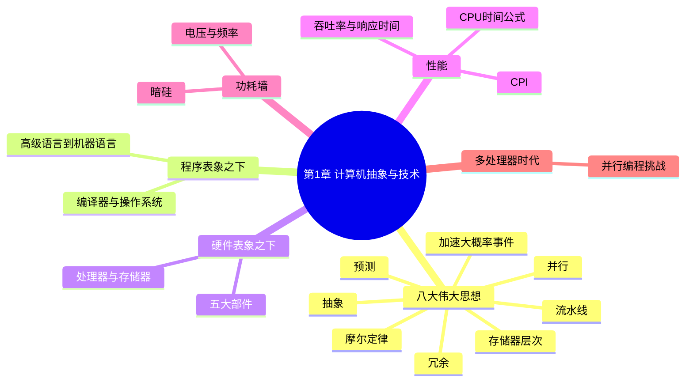

# 第 1 章 计算机抽象与技术

> **一句话导读**:这一章带你站在山顶俯瞰整本书的地图——计算机是怎么分层的、硬件由哪些部件组成、以及"性能"到底怎么衡量。本章没有复杂电路,是全书中"性价比最高"的一章。
>
> **对应教材**:第 1 章「计算机抽象与技术(Computer Abstractions and Technology)」

---

## 一、本章思维导图

```
第1章 计算机抽象与技术
│
├── 1.1 八大伟大思想(贯穿全书的主线!)
│   ├── 面向摩尔定律的设计 → 设计要有前瞻性
│   ├── 抽象简化设计 → 分层!每层只需知道接口
│   ├── 加速大概率事件 → 把最常发生的事做到最快
│   ├── 通过并行提高性能 → 同时干多件事
│   ├── 通过流水线提高性能 → 像工厂流水线一样重叠执行
│   ├── 通过预测提高性能 → 猜对了就赚到
│   ├── 存储器层次结构 → 快的贵、慢的便宜,分层搭配
│   └── 通过冗余提高可靠性 → 备胎思维
│
├── 1.2 程序表象之下(软件分层)
│   ├── 高级语言 → 汇编语言 → 机器语言 → 硬件
│   ├── 系统软件:编译器、汇编器、操作系统
│   └── 抽象:接口(interface)隐藏实现细节
│
├── 1.3 硬件表象之下(硬件组成)
│   ├── 五大经典部件:输入/输出/存储器/运算器/控制器
│   ├── 显示器、触摸屏(输入+输出)
│   ├── 处理器:数据通路 + 控制器
│   ├── 存储器:DRAM(内存)、cache(缓存)
│   ├── 数据存储:磁盘、闪存
│   └── 通信:局域网、广域网
│
├── 1.4 集成电路与制造
│   ├── 晶体管、硅片、晶圆(wafer)、芯片(die)
│   ├── 芯片成本 = 晶圆成本 ÷ (每晶圆芯片数 × 成品率)
│   └── 摩尔定律:晶体管数每 18~24 个月翻倍
│
├── 1.5 性能(本章的计算核心)
│   ├── 响应时间(个人用户) vs 吞吐率(数据中心)
│   ├── CPU时间 = 指令数 × CPI × 时钟周期
│   ├── 相对性能:"A 是 B 的 n 倍快"
│   ├── 时钟频率 vs 时钟周期(互为倒数)
│   ├── MIPS 指标及其缺陷
│   └── SPEC 基准测试
│
├── 1.6 功耗墙
│   ├── 动态功耗 ∝ 容性负载 × 电压² × 频率
│   ├── Dennard 缩放定律的终结
│   └── 暗硅:芯片上不能同时开机的部分
│
├── 1.7 沧海巨变:从单处理器到多处理器
│   ├── 为什么:功耗墙 + 指令级并行挖尽
│   ├── 挑战:并行编程困难(预告 Amdahl 定律)
│   └── 与八大伟大思想的呼应
│
└── 1.8 谬误与陷阱(考试常客)
    ├── 峰值性能 ≠ 实际性能
    ├── 不能只比时钟频率(还要比 CPI)
    └── 只用执行时间的一部分作比较会失真
```

### Mermaid 版(可渲染)



---

## 二、学习目标

学完本章,你应该能回答:

1. 计算机系统从高级语言到硬件分哪几层?每层的"接口"是什么?
2. 八大伟大思想分别是什么?各举一个生活化例子。
3. 硬件五大经典部件是哪五个?
4. 为什么"响应时间"和"吞吐率"是两回事?
5. 会算:**CPU 执行时间 = 指令数 × CPI × 时钟周期** 及其变式。
6. 为什么说 MIPS 指标有缺陷?为什么不能只比主频?
7. 什么是摩尔定律、功耗墙、暗硅?
8. 为什么处理器行业从"提高单核主频"转向"堆多核"?

---

## 三、核心名词先混个脸熟

| 名词 | 一句话 |
|---|---|
| 指令集架构(ISA) | 软件与硬件之间的"合同",规定指令、寄存器等 |
| 抽象(abstraction) | 只暴露接口、隐藏内部细节的分层方法 |
| 编译器(compiler) | 把高级语言翻译成汇编/机器语言的程序 |
| 汇编器(assembler) | 把汇编语言翻译成机器码的程序 |
| 操作系统(OS) | 管理硬件资源、给程序提供服务的软件 |
| 晶体管(transistor) | 芯片上的电子开关,计算机的基本元件 |
| 晶圆(wafer) | 制造芯片用的圆形硅片 |
| 响应时间(response time) | 完成一个任务所需的时间 |
| 吞吐率(throughput) | 单位时间内完成的任务数量 |
| 时钟周期(clock cycle) | CPU 心跳一次的时间 |
| CPI | 每条指令平均消耗的时钟周期数 |
| MIPS | 每秒百万条指令,一种性能指标 |
| SPEC | 权威的基准测试(benchmark)套件 |
| 摩尔定律(Moore's Law) | 晶体管数量每 18~24 个月翻倍 |
| 暗硅(dark silicon) | 因功耗限制无法同时工作的芯片区域 |

---

## 四、分节精讲

### 1.1 八大伟大思想 —— 全书的"暗线"

这八条思想不是背完就扔的考点,而是**贯穿全书每章的灵魂**。后面每学一个新概念,都可以回头问一句:"这是八大思想里的哪一条?"(如第 4 章流水线=第 5 条,第 5 章 cache=第 7 条。)

1. **面向摩尔定律的设计(Design for Moore's Law)**
   - 摩尔定律:芯片上的晶体管数量大约每 18~24 个月翻一番。
   - 含义:设计硬件时要预见到几年后资源会翻好几倍,设计要有前瞻性。
   - 💡 大白话:买电脑时按"两年后的需求"来配,而不是按今天的需求。

2. **抽象简化设计(Use Abstraction to Simplify Design)**
   - 抽象=分层,每层只和上下层通过"接口"打交道,内部细节被隐藏。
   - 例子:你开车不用知道发动机怎么工作(接口:方向盘、油门);程序员不用知道 CPU 电路怎么布线(接口:指令集)。
   - ❓ 为什么抽象能简化设计?因为人脑一次只能处理有限复杂度;分层后每层只需关注自己的事,出问题也好定位。

3. **加速大概率事件(Make the Common Case Fast)**
   - 把资源投在最常发生的操作上。
   - 例子:加减法比乘除法常用 → 早期 CPU 上加减法比乘法快得多;cache 就是"大概率事件=访问最近用过的数据"。

4. **通过并行提高性能(Performance via Parallelism)**
   - 并行=同时做多件事。大到多核处理器,小到一条指令内部的多位加法同时算。
   - 例子:搬 100 箱货,10 个人一起搬比 1 个人快。

5. **通过流水线提高性能(Performance via Pipelining)**
   - 流水线把一件大事拆成多个小步骤,前后任务重叠执行。
   - 💡 大白话:洗车流水线——车 A 在冲洗时,车 B 同时在擦干。每一辆车还是花同样时间,但"出车速度"大大加快。
   - 第 4 章的主角。

6. **通过预测提高性能(Performance via Prediction)**
   - 提前猜测,猜对了就省时间,猜错了再纠正。
   - 例子:分支预测(猜程序往哪走)、cache 预取(提前把可能要用的数据取来)。

7. **存储器层次结构(Hierarchy of Memories)**
   - 又快又大的存储器不存在(快=贵)。解决:金字塔式分层——最顶层小、快、贵(寄存器、cache),底层大、慢、便宜(内存、硬盘),让常用数据待在高层。
   - 第 5 章的主角。

8. **通过冗余提高可靠性(Dependability via Redundancy)**
   - 关键部件做备份,坏了有替换。
   - 例子:飞机多个发动机、RAID 磁盘阵列、服务器双电源。

### 1.2 程序表象之下:软件怎么分层

**四层结构(自上而下):**

```
高级语言(C、Java、Python)
   ↓ 编译器(compiler)
汇编语言(面向特定指令集的助记符)
   ↓ 汇编器(assembler)
机器语言(二进制 0/1,CPU 真正执行的东西)
   ↓ 硬件直接执行
硬件(处理器、存储器、I/O)
```

关键点:

- **指令集架构(ISA, Instruction Set Architecture)**:汇编层与硬件层之间的"合同"。它规定:有哪些指令、哪些寄存器、内存如何编址。MIPS 就是一种 ISA(第 2 章全面学习)。
- 同一份高级语言代码,可以编译给不同 ISA 的机器(所以 C 程序既能跑在 MIPS 上也能跑在 x86 上);而汇编语言是"绑死"在某一种 ISA 上的。
- 💡 大白话:ISA 就像 USB 接口标准——只要双方都遵守标准,任何充电头配任何手机线都能用。

**系统软件(system software)**:为用户程序提供服务的软件,核心是:
- **操作系统(OS)**:管理硬件资源(CPU、内存、外设),提供文件、网络等抽象。
- **编译器(compiler)**:高级语言 → 汇编语言(或直接到机器码)。
- **汇编器(assembler)**:汇编语言 → 机器码(详见第 2 章 2.13 节)。
- **加载器/链接器(loader/linker)**:把多个目标文件拼成可执行程序。

### 1.3 硬件表象之下:五大经典部件

任何计算机都逃不出这五件(称为计算机的经典组成):

| 部件 | 作用 | 你熟悉的对应物 |
|---|---|---|
| 输入设备(input) | 把外界信息送进机器 | 键盘、鼠标、触摸屏 |
| 输出设备(output) | 把结果呈现给外界 | 显示器、打印机 |
| 存储器(memory) | 存数据和程序 | 内存条(DRAM)、硬盘、cache |
| 运算器(datapath,数据通路) | 执行算术/逻辑运算 | CPU 内部的 ALU |
| 控制器(control) | 指挥其他部件按序工作 | CPU 内部的控制器 |

⚠️ 易错点:运算器在本书中常被称为**数据通路(datapath)**,它包含寄存器组和 ALU 等;控制器(control)则根据指令产生控制信号。**"处理器(CPU)= 数据通路 + 控制器"**,考试爱考这个等式。第 4 章会解剖这两部分。

**几个硬件术语:**

- **CPU(中央处理器)**:执行指令的部件 = 数据通路 + 控制器。
- **内存(main memory,主存)**:通常指 DRAM,掉电丢失(易失);CPU 正在跑的程序和数据都在这里。
- **辅助存储器(secondary memory)**:磁盘、闪存(SSD),掉电不丢(非易失)。
- **cache(缓存)**:位于 CPU 和主存之间的小而快的存储器(第 5 章)。
- **I/O 设备**:输入输出设备的总称,通过总线/接口与 CPU、内存相连。

### 1.4 集成电路:芯片是怎么造出来的

**制造链条**:硅锭 → 切成薄片 → **晶圆(wafer)** → 光刻刻出电路 → 切成一个个 **芯片(die)** → 封装测试。

**芯片成本公式(常考计算题):**

```
每个芯片成本 = 晶圆成本 ÷ (每晶圆芯片数 × 成品率)
```

- 每晶圆芯片数 ≈ 晶圆面积 ÷ 芯片面积(忽略边缘损耗)
- 成品率(yield)= 合格芯片的比例。芯片越大,缺陷命中它的概率越高,成品率越低。
- 所以:芯片面积越大 → 每晶圆芯片数越少 + 成品率越低 → 成本暴涨。这是芯片不能无限做大的经济原因。

**摩尔定律**:1965 年戈登·摩尔提出,芯片上晶体管数量约每 18~24 个月翻倍。几十年里,它既是"预言"也是行业的目标:大家都按这个速度迭代,掉队就被淘汰。

📌 考点提示:摩尔定律说的是**晶体管数量/集成度**翻倍,不是性能翻倍、不是主频翻倍——虽然历史上性能也随之增长,但概念要分清。

### 1.5 性能:本章的计算核心 ★

#### 1.5.1 两个角度:响应时间 vs 吞吐率

- **响应时间(response time)/ 执行时间(execution time)**:完成**一个**任务要多久。个人用户最关心——"我的游戏加载要几秒?"
- **吞吐率(throughput)**:单位时间完成**多少**任务。数据中心最关心——"这个服务器每秒能处理多少请求?"

⚠️ 易错点:两者可能背道而驰。例:给洗车店再加 10 个工位,单辆车洗得更慢(响应时间变差),但每天洗的车总数变多(吞吐率提升)。

#### 1.5.2 相对性能:"n 倍快"

> "A 是 B 的 n 倍快" ⟺ 性能A ÷ 性能B = n ⟺ 执行时间B ÷ 执行时间A = n

关键:**性能与执行时间互为倒数**。所以"快 n 倍"必须用**执行时间之比**来算,而不是直接比频率或 MIPS。

💡 大白话:甲跑 100 米用 10 秒,乙用 20 秒。甲的时间是乙的一半,所以甲快 2 倍——用时间比,别用别的数比。

#### 1.5.3 时钟:CPU 的心跳

- **时钟周期(clock cycle time,记为 T)**:CPU 每"心跳"一次的时间,单位秒。
- **时钟频率(clock rate)= 1 / T**,单位 Hz。3 GHz 主频 ⟺ 时钟周期 ≈ 0.333 ns(纳秒)。
- 注意单位换算:1 GHz = 10⁹ Hz,1 ns = 10⁻⁹ s。**频率与周期互为倒数,频率越大周期越小**。

#### 1.5.4 核心公式:CPU 执行时间

```
CPU执行时间 = CPU时钟周期数 × 时钟周期时间
           = CPU时钟周期数 ÷ 时钟频率

CPU时钟周期数 = 指令数(IC)× CPI

∴  CPU执行时间 = 指令数 × CPI × 时钟周期时间
```

- **指令数(IC, Instruction Count)**:程序一共执行多少条指令。由**程序和编译器+ISA**决定。
- **CPI(Cycles Per Instruction)**:平均每条指令消耗几个时钟周期。由**处理器设计和 ISA**决定。
- **时钟周期**:由**硬件工艺和设计**决定。

📌 这是全书最重要的公式之一,考试几乎必考。记住"三个因子各由谁决定"这张表,选择题常考。

**例题(必须会做)**:
> 程序 P 有 10⁹ 条指令,在 2 GHz 的 CPU 上运行,平均 CPI = 2。求执行时间。
>
> 解:执行时间 = 10⁹ × 2 ÷ (2×10⁹) = 1 秒。

**变式**:同样程序在 CPU A(4 GHz,CPI=1)和 CPU B(2 GHz,CPI=0.8)上,哪个快?
> A:时间 = IC × 1 / 4×10⁹ = 0.25×IC /10⁹
> B:时间 = IC × 0.8 / 2×10⁹ = 0.4×IC /10⁹ → A 更快。可见主频低但 CPI 更低也可能更快,**不能只看主频**。

#### 1.5.5 MIPS 指标及其缺陷

```
MIPS = 指令数 ÷ (执行时间 × 10⁶)   [百万条指令每秒]
```

它等效于 频率 ÷ (CPI × 10⁶)。缺陷:

1. **不同指令集之间不可比**:RISC 机器完成同一任务指令数多,CISC 指令数少,直接比 MIPS 不公平。
2. **同一台机器上不同程序 MIPS 不同**:MIPS 是"程序相关"的,不是机器的固有属性。
3. **MIPS 可能和执行时间相反**:CPI 高的机器配高主频可能 MIPS 更高,但实际执行时间更长。

📌 考点提示:"为什么 MIPS 不是好的性能指标"是经典简答题,答上述三条即可。

#### 1.5.6 SPEC 基准测试

- 用一组**真实程序**(编译器、数据库、游戏引擎等)跑分,取几何平均,给出**标准化分数(SPECratio)**:分数高者性能好。
- 分数是"相对一台参考机器"的比值,可以直接说"这台机器 SPEC 分数是那台的 2 倍"。

### 1.6 功耗墙:为什么 CPU 不能一直变快

**动态功耗公式(常考):**

```
动态功耗 ∝ 1/2 × 容性负载 × 电压² × 开关频率
```

三个参数都能优化,但**电压²是平方项**,最"致命":
- 历史上每代工艺把电压降低,从而在频率上升的同时控制功耗——这被称为 **Dennard 缩放定律**。
- 但电压已降到接近物理极限(约 1V),**Dennard 缩放定律失效** → 频率再往上加,功耗爆炸、散热跟不上 → **功耗墙(power wall)**。
- 结果:**暗硅(dark silicon)**——芯片上很大一块区域因功耗限制不能同时工作,只能轮流开机。

💡 大白话:CPU 像一间教室,以前每学期都能把"电压"这个空调温度调低一点,于是风扇(频率)可以越转越快。现在温度调到最低了,风扇再快教室就热炸——只能另想办法(多开几间教室=多核)。

### 1.7 沧海巨变:从单处理器到多处理器

- **转折原因**:① 功耗墙挡住主频路线;② 单核内部的指令级并行(ILP)已被挖尽,再堆硬件收益甚微。
- **新方向**:多核处理器(multicore)——把多个处理器核放进一个芯片,靠**显式并行**(程序自己拆分任务)提速。
- **代价**:并行编程远比串行编程难,不是所有程序都能并行。
- 📌 **Amdahl 定律**(本章预告,第 6 章详解):若程序只有 P 部分可并行,则无论多少核,加速比上限 = 1/(1−P)。比如一半代码串行,加速比最多 2 倍。

### 1.8 谬误与陷阱

1. **谬误:峰值性能(peak performance)就是实际性能。** 峰值是"所有部件满负荷"的理论值;真实程序受 cache 缺失、分支、依赖等影响,实际性能常只有峰值的一小部分。
2. **谬误:只看时钟频率选 CPU。** 主频高但 CPI 高的机器可能更慢(见 1.5.4 变式)——要综合"频率 × 每周期能干的活"。
3. **陷阱:只用执行时间的一部分做比较。** 比如只比"CPU 时间"而忽略 I/O 时间,或把开机加载时间摊薄到大量任务上,结论都会失真。
4. **陷阱:忽视 Amdahl 定律。** 并行部分再快,串行部分不解决,整体加速有天花板(第 6 章详解)。

---

## 五、名词解释汇总表

| 名词 | 英文 | 解释 |
|---|---|---|
| 指令集架构 | Instruction Set Architecture (ISA) | 软硬件之间的接口契约:规定指令、寄存器、内存编址 |
| 抽象 | Abstraction | 通过分层隐藏内部细节,只暴露接口 |
| 汇编器 | Assembler | 将汇编语言翻译为机器码的程序 |
| 编译器 | Compiler | 将高级语言翻译为汇编/机器语言的程序 |
| 操作系统 | Operating System | 管理硬件资源、提供程序接口的系统软件 |
| 数据通路 | Datapath | 处理器中执行运算的部分(ALU、寄存器等) |
| 控制器 | Control | 产生控制信号、指挥数据通路工作的部件 |
| 晶体管 | Transistor | 芯片上的基本开关元件 |
| 晶圆 | Wafer | 制造芯片的圆形硅片,被切割成多块芯片(die) |
| 成品率 | Yield | 晶圆上合格芯片的比例 |
| 响应时间 | Response time | 单个任务从开始到完成的时间 |
| 吞吐率 | Throughput | 单位时间内完成的任务总数 |
| 时钟周期 | Clock cycle | CPU 基本节拍的时间长度 |
| 时钟频率 | Clock rate | 时钟周期的倒数,如 2 GHz |
| CPI | Cycles Per Instruction | 平均每条指令所需的时钟周期数 |
| 指令数 | Instruction Count | 程序执行的指令总条数 |
| MIPS | Million Instructions Per Second | 每秒百万条指令,一种有缺陷的性能指标 |
| 基准测试 | Benchmark | 用于评测性能的典型程序套件,如 SPEC |
| 摩尔定律 | Moore's Law | 芯片晶体管数每 18~24 个月翻倍 |
| 功耗墙 | Power Wall | 因功耗/散热限制无法继续提高主频的障碍 |
| 暗硅 | Dark Silicon | 芯片上因功耗限制无法同时工作的区域 |
| 多核处理器 | Multicore processor | 集成多个处理器核的芯片 |
| 系统软件 | System software | 为程序提供服务、管理硬件的软件(OS 等) |

---

## 六、公式速查

| 公式 | 说明 |
|---|---|
| 时钟频率 = 1 / 时钟周期 | 互为倒数 |
| CPU执行时间 = CPU时钟周期数 × 时钟周期 | 基本式 |
| CPU时钟周期数 = 指令数 × CPI | 拆分式 |
| **CPU执行时间 = 指令数 × CPI × 时钟周期** | 核心公式 |
| 性能X ÷ 性能Y = 执行时间Y ÷ 执行时间X | "n 倍快" |
| MIPS = 指令数 ÷ (执行时间 × 10⁶) | 每秒百万指令 |
| 芯片成本 = 晶圆成本 ÷ (每晶圆芯片数 × 成品率) | 制造成本 |
| 动态功耗 ∝ 容性负载 × 电压² × 开关频率 | 功耗墙 |
| 加速比上限 = 1 / (1 − P)(Amdahl,预告) | P=可并行比例 |

---

## 七、易混淆概念对比

| 对比 | 区别一句话 |
|---|---|
| 响应时间 vs 吞吐率 | 一个任务多久(个人视角)vs 单位时间多少任务(系统视角) |
| 时钟周期 vs 时钟频率 | 互为倒数:周期是时间(秒),频率是速率(Hz) |
| 性能 vs 执行时间 | 互为倒数:执行时间越短,性能越高 |
| 编译 vs 汇编 | 编译器处理高级语言;汇编器处理汇编语言 |
| CPU vs 数据通路 | CPU = 数据通路 + 控制器,数据通路只是其中一部分 |
| 主存(DRAM) vs 辅助存储(磁盘) | 前者易失、快、贵;后者非易失、慢、便宜 |
| MIPS vs CPI | MIPS 是速率指标(越大越好但有缺陷);CPI 是平均周期数(越小越好) |
| 摩尔定律 vs Dennard 缩放 | 前者:晶体管数翻倍;后者:同功耗下频率可提升(已失效) |

---

## 八、自测题

1. (简答)计算机系统从高级语言到硬件的四层分别是什么?每两层之间的"翻译者"是谁?
2. (填空)CPU = ________ + ________。
3. (计算)程序 P 指令数 2×10⁹ 条,CPI=1.5,时钟频率 3 GHz,求执行时间。
4. (计算)机器 A 运行程序 X 需 8 秒,机器 B 需 10 秒。A 比 B 快多少倍?
5. (计算)CPI=2,主频 3 GHz 的机器,MIPS 指标是多少?
6. (简答)为什么 MIPS 不是可靠的性能指标?至少说两条。
7. (简答)什么是功耗墙?它如何导致了多核时代的到来?
8. (判断)摩尔定律说 CPU 主频每 18 个月翻倍。(对/错,并说明)
9. (简答)八大伟大思想中,第 4 章"流水线"和第 5 章"cache"分别对应哪两条思想?
10. (计算)晶圆成本 5000 元,每晶圆可切 400 个芯片,成品率 0.8,求单芯片成本。

### 参考答案

1. 高级语言→(编译器)→汇编语言→(汇编器)→机器语言→硬件。操作系统也属于横跨各层的系统软件。
2. 数据通路(datapath)+ 控制器(control)。
3. T = 2×10⁹ × 1.5 ÷ (3×10⁹) = 1 秒。
4. 性能A/性能B = 时间B/时间A = 10/8 = 1.25,即 A 比 B 快 1.25 倍。
5. MIPS = 频率/(CPI×10⁶) = 3×10⁹/(2×10⁶) = 1500 MIPS。
6. ① 不同 ISA 间不可比(指令数口径不同);② 同一机器跑不同程序 MIPS 不同(程序相关);③ MIPS 高不代表执行时间短。
7. 动态功耗 ∝ 电压²×频率,Dennard 缩放失效后主频无法继续提高(散热跟不上),于是行业转向在芯片内堆多个核心,靠并行提升性能。
8. 错。摩尔定律说的是**晶体管数量**翻倍,不是主频。
9. 流水线=第 5 条"通过流水线提高性能";cache=第 7 条"存储器层次结构"。
10. 5000 ÷ (400 × 0.8) = 15.625 元。

---

## 九、本章小结

- 计算机 = 分层抽象的艺术:上层只用接口,不关心下层细节。
- 八大伟大思想是全书的灵魂,后面每章都在践行它们。
- 性能评价记住一条主线:**CPU时间 = 指令数 × CPI × 时钟周期**,以及"性能与时间互为倒数"。
- 历史转折:功耗墙终结了主频竞赛,计算机进入多核时代。

**下一章** → [02-第2章-指令-计算机的语言.md](02-第2章-指令-计算机的语言.md):开始学习 MIPS 指令集,这是全书最重要的一章。
