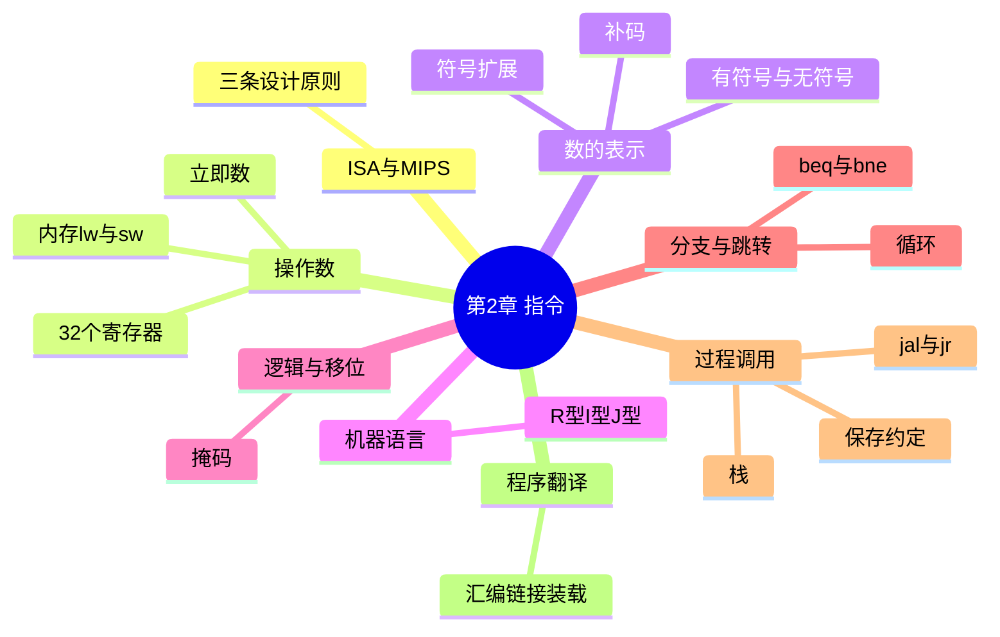

# 第 2 章 指令:计算机的语言

> **一句话导读**:这一章教你"说计算机的母语"——MIPS 汇编。学完你会明白:高级语言里的一行代码,在 CPU 眼里是怎样一堆 0 和 1。这是**全书最重要的一章**,第 3、4、5 章全都建立在它之上。
>
> **对应教材**:第 2 章「指令:计算机的语言(Instructions: Language of the Computer)」

---

## 一、本章思维导图

```
第2章 指令:计算机的语言
│
├── 2.1 指令集架构(ISA)与 MIPS
│   ├── ISA = 软硬件之间的"合同"
│   ├── MIPS:经典 RISC 架构
│   └── 三条设计原则(贯穿全章!)
│       ├── 原则1:简单源于规整
│       ├── 原则2:越小越快
│       └── 原则3:加速大概率事件
│
├── 2.2 算术运算:add / sub(三操作数,全是寄存器)
├── 2.3 操作数
│   ├── 寄存器:32 个 32 位寄存器($zero、$s0-$s7、$t0-$t9……)
│   ├── 寄存器溢出:变量太多 → 存回内存
│   └── 对齐限制:字必须存在 4 的倍数地址
│
├── 2.4 内存操作数:lw / sw(基址寻址:寄存器 + 偏移量)
│   ├── 字节寻址、字地址相差 4
│   └── 大端 / 小端
├── 2.5 立即数:addi(16 位,要符号扩展)
│
├── 2.6 有符号与无符号数
│   ├── 原码/反码/补码(补码 = 反码 + 1)
│   ├── 符号扩展(sign extension)
│   └── slt / slti(有符号) vs sltu / sltiu(无符号)
│
├── 2.7 机器语言:三种指令格式
│   ├── R 型:op rs rt rd shamt funct(寄存器运算)
│   ├── I 型:op rs rt immediate(访存/立即数/分支)
│   └── J 型:op address(跳转)
│
├── 2.8 逻辑运算:and / or / nor / sll / srl / sra(掩码!)
├── 2.9 分支与循环:beq / bne(PC 相对寻址)、case 跳转表
├── 2.10 过程调用 ★
│   ├── jal(跳转并保存返回地址)/ jr $ra
│   ├── 栈与栈帧($sp)
│   ├── 寄存器约定:调用者保存 vs 被调用者保存
│   └── 叶子过程 vs 非叶子过程
│
├── 2.11 五种寻址方式总结
├── 2.12 并行与同步:ll / sc 原子交换
├── 2.13 程序的一生:编译 → 汇编(符号表/目标文件)
│                        → 链接(重定位)→ 装载 → 动态链接库
├── 2.14 32 位立即数:lui + ori;伪指令(move、li、la)
├── 2.15 实战:C 排序程序 + 数组与指针
├── 2.16 其他架构:ARMv7、x86(对比理解)
└── 2.17 谬误与陷阱
```

### Mermaid 版(可渲染)



---

## 二、学习目标

学完本章,你应该能:

1. 说出 MIPS 三条设计原则,并各举一个指令设计上的体现。
2. 默写 32 个寄存器的用途($t、$s、$a、$v、$sp、$ra……)。
3. 会写:算术、访存、分支、循环、过程调用的 MIPS 汇编程序。
4. 会做:十进制 ↔ 二进制 ↔ 补码 ↔ 十六进制转换;符号扩展。
5. 会拆:给定机器码(十六进制)反汇编出汇编指令;反之把汇编翻译成机器码。
6. 理解 R/I/J 三种指令格式各字段含义,记住常用 opcode/funct 值。
7. 能解释:调用者保存 vs 被调用者保存寄存器;为什么需要栈。
8. 能描述:一个 C 程序从编译到装载的全过程。

---

## 三、核心名词先混个脸熟

| 名词 | 一句话 |
|---|---|
| 指令集架构(ISA) | 软件与硬件之间的"合同"(指令、寄存器、编址) |
| 助记符(mnemonic) | 指令的可读名字,如 add、lw |
| 寄存器(register) | CPU 内部的小而快的存储单元 |
| 字(word) | MIPS 中为 32 位(4 字节)的数据单位 |
| 立即数(immediate) | 直接写在指令里的常数 |
| 符号扩展(sign extension) | 把短的有符号数补长,补符号位 |
| 补码(two's complement) | 计算机中表示负数的标准方法 |
| 大小端(endianness) | 多字节数据在内存中的字节排列顺序 |
| 寻址方式(addressing mode) | 指令计算操作数地址的方式 |
| 程序计数器(PC) | 指向下一条待执行指令的寄存器 |
| 栈(stack) | 后进先出的内存区域,过程调用用它 |
| 栈指针($sp) | 指向栈顶的寄存器 |
| 调用者保存(caller-saved) | $t 寄存器:子程序可随意用,用了不负责恢复 |
| 被调用者保存(callee-saved) | $s 寄存器:子程序用了必须恢复原值 |
| 伪指令(pseudoinstruction) | 汇编器"扩展"的指令,硬件并不存在 |
| 目标文件(object file) | 汇编/编译产物,含机器码+符号表 |
| 链接器(linker) | 把多个目标文件拼成可执行文件 |
| 动态链接库(DLL) | 运行时才链接进来的共享代码库 |

---

## 四、分节精讲

### 2.1 指令集架构与 MIPS

**指令集架构(ISA, Instruction Set Architecture)** 是硬件与底层软件之间的接口契约,规定了:哪些指令、哪些寄存器、内存如何编址、数据如何表示。MIPS 与 x86、ARM 一样,都是一种 ISA。

- MIPS 是 **RISC(精简指令集)** 的典范:指令数量少、格式规整、每条指令做一件小事。
- 对比 x86 是 **CISC(复杂指令集)**:指令多而复杂、长度不固定。
- 💡 大白话:ISA 是"合同",微架构(第 4 章)是"合同的具体履行方式"。同一份 MIPS 程序可以在任何遵守 MIPS 合同的 CPU 上跑,不管内部实现如何。

**三条设计原则(全章乃至全书反复出现,必须背熟):**

1. **简单源于规整(Simplicity favors regularity)** —— 所有算术指令都是"三操作数、全是寄存器"的固定格式 → 硬件实现简单。
2. **越小越快(Smaller is faster)** —— 寄存器只有 32 个,比几百万个内存单元少得多 → 访问寄存器比访问内存快得多(呼应八大思想第 2、3 条)。
3. **加速大概率事件(Make the common case fast)** —— 常数 0 太常用 → 专门设 $zero;立即数常用 → 设 addi。

### 2.2 硬件操作:加法和减法

MIPS 算术指令的固定套路:**一条指令,一个运算,三个操作数,全是寄存器**。

```asm
add $t0, $s1, $s2     # $t0 = $s1 + $s2
sub $t0, $s1, $s2     # $t0 = $s1 - $s2
```

对应 C 语句 `a = b + c + d;` 需要两条指令(先加两个,再加第三个)。

💡 大白话:MIPS 的算术指令像"只有三个槽的机器":两个原料入口、一个成品出口。所以 `a = b + c + d` 这种三个数相加,必须分两次做:`a = (b + c) + d`。

⚠️ 易错点:MIPS 算术指令**不能直接操作内存里的数**,操作数必须先在寄存器里。要想对内存变量做加法,必须先用 lw 取进来(见 2.4)。

### 2.3 操作数:寄存器

**32 个 32 位寄存器**,每个都是 4 字节大小。寄存器比内存快得多,所以尽量让数据待在寄存器里(原则 2)。

**MIPS 寄存器约定(必须背,考试和写代码都要用):**

| 名字 | 编号 | 用途 | 保存责任 |
|---|---|---|---|
| `$zero` | 0 | 常数 0(读它永远得 0) | 无 |
| `$at` | 1 | 汇编器保留(伪指令用) | 汇编器 |
| `$v0-$v1` | 2-3 | 函数返回值 | 调用者保存 |
| `$a0-$a3` | 4-7 | 函数参数(第 1~4 个) | 调用者保存 |
| `$t0-$t7` | 8-15 | 临时变量 | 调用者保存 |
| `$s0-$s7` | 16-23 | 保存变量(跨调用存活) | **被调用者保存** |
| `$t8-$t9` | 24-25 | 临时变量 | 调用者保存 |
| `$k0-$k1` | 26-27 | 操作系统保留 | OS |
| `$gp` | 28 | 全局指针 | 被调用者保存 |
| `$sp` | 29 | 栈指针 | 被调用者保存 |
| `$fp` | 30 | 帧指针 | 被调用者保存 |
| `$ra` | 31 | 返回地址(jal 写入) | 被调用者保存 |

记忆口诀:**s = saved(存钱要自己负责),t = temporary(用完就扔)**。

- **寄存器溢出(register spilling)**:变量比寄存器还多时,编译器把"不常用"的变量暂存回内存,用到时再取。
- **对齐限制(alignment restriction)**:MIPS 要求 `lw/sw` 的地址必须是 **4 的倍数**(字对齐)。地址不整除 4 → 运行报错。

### 2.4 内存操作数:lw 和 sw

寄存器只有 32 个,放不下大量数据 → 数据住内存,用时搬运到寄存器。MIPS 是"存取型"(load-store)架构:**内存只能通过 lw/sw 访问,算术指令不碰内存**。

```asm
lw $t0, 32($s3)      # $t0 = Memory[$s3 + 32](取字)
sw $t0, 48($s3)      # Memory[$s3 + 48] = $t0(存字)
```

- 这种"**寄存器 + 偏移量(常数)**"的形式叫**基址寻址(base addressing)**。$s3 是基地址,32 是偏移量(字节数)。
- 内存**按字节编址**,但每个字 4 字节 → 相邻字地址差 4。
- 对应 C 代码:设 $s3 是数组 A 的基址,则 `A[8]` 就是 `lw $t0, 32($s3)`(第 8 个元素,偏移 8×4=32)。

💡 大白话:内存像一个大公寓楼,每个字节是一个房间,每 4 个房间一套公寓(一个字)。lw 是"从公寓取货",sw 是"把货放进公寓"。房间号(地址)必须从每套公寓的"开头"开始(对齐)。

**大小端(endianness)**:一个字 4 字节,在内存里按什么顺序排?

- **大端(big-endian)**:高位字节放低地址(人读数字的习惯:"高位数写左边")。
- **小端(little-endian)**:低位字节放低地址(x86 就是这个)。
- ⚠️ 易错点:两个字节序的机器之间传数据,字节序不同会读出"倒过来"的数。MIPS 可配置,教材默认大端。

### 2.5 立即数:addi

常数太常用,不可能每次都先 lw 到寄存器(原则 3)→ 直接把常数写进指令:

```asm
addi $s3, $s3, 4      # $s3 = $s3 + 4
```

- 立即数只有 **16 位**(且是**有符号数**,范围 −32768 ~ +32767),用时要**符号扩展**到 32 位。
- `$zero` 配合 addi 可以"造"常数:`addi $t0, $zero, 5` 就是 $t0 = 5。

### 2.6 有符号与无符号数 ★

#### 2.6.1 二进制与十六进制

- 二进制每 4 位对应 1 个十六进制位:`0x8E6 = 1000 1110 0110`。
- 十六进制是机器码的"速记符号",考试必考转换。

#### 2.6.2 负数的表示:原码 → 反码 → 补码

- **原码**:最高位是符号位(0 正 1 负),其余位是绝对值。
- **反码**:负数把绝对值按位取反。
- **补码(two's complement)**:负数 = 反码 + 1(即:按位取反再加 1)。
- 计算机**只用补码**表示有符号数。为什么?补码让"加法和减法共用一套电路":`a - b = a + (-b)`,符号位可以直接参与运算。
- 公式:一个 n 位补码 x,最高位权值是 **−2^(n−1)**。如 8 位 1111 1101 = −128 + 64+32+16+8+4+1 = −3。
- 8 位有符号范围:**−128 ~ +127**;无符号范围:**0 ~ 255**。n 位即 −2^(n−1) ~ 2^(n−1)−1。
- 💡 大白话:补码就像里程表倒拨:从 0 往回拨 1 格,显示的是 999…9。最高位的"1"既是符号又是数值,天生就能用加法器做减法。

#### 2.6.3 符号扩展(sign extension)

把短的有符号数变长(如 16 位立即数 → 32 位):**把符号位复制到所有新增的高位**。

- 例:16 位的 −3 = 0xFFFD,扩展成 32 位 = 0xFFFFFFFD(复制了 16 个 1)。数值不变!
- 正数扩展:补 0。例:0x0005 → 0x00000005。
- ⚠️ 易错点:`lbu`(无符号取字节)用**零扩展**(补 0);`lb`(有符号取字节)用**符号扩展**。用错指令,128~255 的字节会被读成负数。

#### 2.6.4 有符号 vs 无符号指令

| 指令 | 含义 | 比较方式 |
|---|---|---|
| `slt $t0, $s1, $s2` | $s1 < $s2 ? 1 : 0 | **有符号**(补码比较) |
| `sltu $t0, $s1, $s2` | 同上 | **无符号**(按位值比较) |
| `slti` / `sltiu` | 与立即数比较 | 有符号 / 无符号 |

⚠️ 易错点(全书最经典陷阱之一):`1111 1111` 有符号读作 −1,无符号读作 255。所以**同一组位,有符号比较和无符号比较结果可能相反**。数组下标这种"非负数"要用 sltu(见 2.9.3 边界检查)。

### 2.7 机器语言:指令的表示 ★

汇编是给人看的,机器只认 0/1。MIPS 全部指令统一 **32 位长**,分三种格式(**原则 1:简单源于规整**的极致体现):

#### R 型(寄存器型,算术/逻辑运算用)

```
opcode(6)  rs(5)  rt(5)  rd(5)  shamt(5)  funct(6)
31-26      25-21  20-16  15-11  10-6      5-0
```

- `opcode`=0,具体运算由 `funct` 决定(所以 R 型有两个"操作码字段")。
- `rs`=第一源寄存器,`rt`=第二源寄存器,`rd`=目的寄存器,`shamt`=移位量。

#### I 型(立即数型,访存/立即数/分支用)

```
opcode(6)  rs(5)  rt(5)  constant/address(16)
```

- `lw/sw/addi` 用 `rs+rt+立即数`;`beq/bne` 用 `rs+rt+偏移量`。

#### J 型(跳转型)

```
opcode(6)  address(26)
```

**常用 opcode / funct 值(必须背):**

| 指令 | 类型 | opcode | funct |
|---|---|---|---|
| add | R | 0 | 32 |
| sub | R | 0 | 34 |
| and / or / nor | R | 0 | 36 / 37 / 39 |
| slt | R | 0 | 42 |
| sll / srl / sra | R | 0 | 0 / 2 / 3 |
| jr | R | 0 | 8 |
| j | J | 2 | — |
| jal | J | 3 | — |
| beq | I | 4 | — |
| bne | I | 5 | — |
| addi | I | 8 | — |
| andi / ori | I | 12 / 13 | — |
| slti | I | 10 | — |
| lw | I | 35 | — |
| sw | I | 43 | — |

**手工汇编示例(必会):**

> 把 `add $t0, $s1, $s2` 翻译成机器码。
>
> op=0, rs=$s1=17, rt=$s2=18, rd=$t0=8, shamt=0, funct=32
> 二进制:000000 10001 10010 01000 00000 100000
> 十六进制:**0x02324020**

> 把 `lw $t0, 32($s3)` 翻译成机器码。
>
> op=35, rs=$s3=19, rt=$t0=8, imm=32
> 二进制:100011 10011 01000 0000000000100000
> 十六进制:**0x8E680020**

> 反汇编 `0x01A95020`。
>
> 二进制:000000 01101 01001 01010 00000 100000
> op=0、funct=32 → add;rs=$t5, rt=$t1, rd=$t2
> 结果:**add $t2, $t5, $t1**

### 2.8 逻辑运算与移位

```asm
and $t0, $t1, $t2    # 按位与
or  $t0, $t1, $t2    # 按位或
nor $t0, $t1, $t2    # 按位或非(或之后取反)
sll $t0, $t1, 4      # 逻辑左移 4 位(低位补 0)
srl $t0, $t1, 4      # 逻辑右移 4 位(高位补 0)
sra $t0, $t1, 4      # 算术右移 4 位(高位补符号位)
andi/ori              # 立即数版本(注意:立即数按"零扩展"处理)
```

- **掩码(mask)**:用 and 把不关心的位清零。例:取最低字节:`andi $t0, $t1, 0xFF`。
- 用 ori 把某位置 1;用 nor + $zero 可实现"非"。
- ⚠️ 易错点:`sll` 左移 1 位 = ×2(无符号);`sra` 右移 1 位 = ÷2(有符号,向负无穷取整);`srl` 右移对负数会变成正数(因为补 0)。**逻辑右移 vs 算术右移**是常考对比。

### 2.9 分支:程序的"岔路口"

#### 2.9.1 beq / bne

```asm
beq $s1, $s2, L      # 若 $s1 == $s2,跳到 L
bne $s1, $s2, L      # 若 $s1 != $s2,跳到 L
```

- 只有"相等/不等"两种比较;其他比较(<、>)用 `slt + beq/bne` 组合实现(汇编器提供伪指令 blt 等)。
- **PC 相对寻址**:目标地址 = **(PC + 4) + 偏移量×4**。因为所有 MIPS 指令都是 4 字节,偏移量按"指令条数"存,可跳 ±2^15 条指令范围。
- 💡 大白话:分支像"如果…就往前/往后翻几页书"。偏移量存的是"页数差",不是绝对页码,这样代码搬到任何位置都能跑。

#### 2.9.2 循环:while / for

C 的 `while (A[i] == k) i++;` 翻译骨架:

```asm
Loop:  sll  $t1, $s3, 2     # $t1 = i × 4(字节偏移)
       add  $t1, $t1, $s6   # $t1 = A 的基址 + 偏移
       lw   $t0, 0($t1)     # 取 A[i]
       bne  $t0, $s5, Exit  # A[i] != k → 退出
       addi $s3, $s3, 1     # i++
       j    Loop            # 回去
Exit:  ...
```

⚠️ 易错点:数组元素字节偏移 = 下标 × 4,忘了乘 4 是最常见的新手错误。

#### 2.9.3 边界检查(经典考点)

C 代码 `if (a < 0 || a >= length) error();`——数组下标 a 是**无符号数**,必须用 `sltu`,否则负数(如 0xFFFFFFFE)会被当成"巨大正数"而漏检:

```asm
sltu $t0, $a0, $s1     # $t0 = (a < length) ? 1 : 0   ← 无符号!
beq  $t0, $zero, Error # 若 a >= length(无符号)→ 报错
```

📌 考点提示:"为什么这里用 sltu 而不是 slt"几乎是必考题,答案:下标按无符号数对待,负数会变成极大正数,slt 会误判。

#### 2.9.4 case/switch:跳转表

`case k` 语句:内存里放一张**跳转表(jump address table)**,每一项存一个分支代码的地址。程序用 k 算偏移 → `lw` 取出目标地址 → `jr` 跳过去。用一次 lw + jr 代替一长串 beq 判断(原则 3:加速大概率事件)。

### 2.10 过程调用 ★(本章最难点)

#### 2.10.1 核心思想

过程(函数)调用要做六件事(书的顺序):
1. 调用者把**参数**放进 `$a0-$a3`;
2. 调用者执行 `jal`:把 **PC+4 存入 $ra**,然后跳到被调过程;
3. 被调过程**开栈帧**:`addi $sp, $sp, -n`;
4. 被调过程执行时,若用到 `$s` 寄存器(或还要再调用别人),先把旧值**压栈保存**;
5. 被调过程把**返回值**放进 `$v0`;
6. 被调过程恢复现场、弹栈,`jr $ra` 返回。

#### 2.10.2 栈(stack)与栈帧(stack frame)

- 栈:内存里一段**后进先出**的区域,**从高地址向低地址生长**。`$sp` 总指向栈顶。
- 压栈 = `$sp` 减,再 sw;弹栈 = lw,再 `$sp` 加。
- 栈帧:一次过程调用在栈上占的一小块空间,用来放返回地址、局部变量、被保存的寄存器。

💡 大白话:栈像一摞盘子。函数调用=放一个新盘子上去($sp 往下移),返回=把盘子拿走($sp 往上移)。最新放的盘子永远在最上面——所以嵌套调用和递归天然能用栈处理。

#### 2.10.3 调用者保存 vs 被调用者保存 ★

- **调用者保存(caller-saved)**:`$t0-$t9`、`$a0-$a3`、`$v0-$v1`、`$ra`。规则:**调用者**若在乎它们的值,调用前必须自己保存。
- **被调用者保存(callee-saved)**:`$s0-$s7`、`$sp`、`$fp`、`$gp`。规则:**被调用者**若要用它们,必须先保存旧值,返回前恢复。
- 为什么分两类?如果所有寄存器都要保存,每次调用都太浪费;约定好"谁负责",就能省去不必要的保存(原则 3)。
- ❓ 为什么 $ra 算调用者保存?因为 jal 会覆盖 $ra。调用者若之后还要用当前 $ra(比如还会继续往下走),就得先存好。对 $t 同理:调用者无法保证子程序不动 $t,只能自己保护。

#### 2.10.4 叶子过程 vs 非叶子过程

- **叶子过程(leaf procedure)**:不调用任何其他过程 → 不用保存 $ra 和 $s,最省事。
- **非叶子过程**:会调用别人 → **必须**保存 $ra(否则 jal 会覆盖它)以及用到的 $s。

**非叶子过程标准模板(务必背下来,考试默写):**

```asm
proc:
    addi $sp, $sp, -8      # 开 8 字节栈帧
    sw   $ra, 4($sp)       # 保存返回地址
    sw   $s0, 0($sp)       # 保存将用到的 $s0
    ...                    # 过程体(可随意调用其他过程)
    lw   $s0, 0($sp)       # 恢复 $s0
    lw   $ra, 4($sp)       # 恢复返回地址
    addi $sp, $sp, 8       # 弹栈
    jr   $ra               # 返回
```

**完整例子——阶乘递归过程(理解递归+栈的绝佳案例):**

```asm
fact:                       # int fact(int n)  参数在 $a0
    addi $sp, $sp, -8
    sw   $ra, 4($sp)
    sw   $a0, 0($sp)
    slti $t0, $a0, 1        # n < 1 ?
    beq  $t0, $zero, L1     # 否 → 递归
    addi $v0, $zero, 1      # 是 → 返回 1
    addi $sp, $sp, 8
    jr   $ra
L1:
    addi $a0, $a0, -1       # n-1
    jal  fact               # 递归调用 fact(n-1)
    lw   $a0, 0($sp)        # 取回 n
    lw   $ra, 4($sp)
    addi $sp, $sp, 8
    mul  $v0, $a0, $v0      # $v0 = n × fact(n-1)
    jr   $ra
```

### 2.11 五种寻址方式总结 ★(常考列表题)

| 寻址方式 | 格式 | 使用指令 |
|---|---|---|
| 1. 立即数寻址(immediate) | 操作数就在指令里 | addi、andi、ori |
| 2. 寄存器寻址(register) | 操作数在寄存器 | add、sub、and 等 R 型 |
| 3. 基址寻址(base) | 内存地址 = 寄存器 + 偏移量 | lw、sw |
| 4. PC 相对寻址(PC-relative) | 地址 = PC+4 + 偏移×4 | beq、bne |
| 5. 伪直接寻址(pseudodirect) | 地址 = (PC+4 高 4 位)‖(26 位地址×4) | j、jal |

💡 大白话:指令里放不下 32 位完整地址(指令总共才 32 位),所以:分支用"相对跳"(离我多远),跳转用"拼接"(高 4 位借用 PC,低 26 位×4)。

### 2.12 并行与同步:原子交换

多处理器时代(第 6 章),两个核同时改一个内存变量会冲突。解决:硬件提供**原子操作**——`ll`(load linked,关联加载)+ `sc`(store conditional,条件存储):

```asm
try: add  $t0, $zero, $s4    # $t0 = 新值
     ll   $t1, 0($s1)        # 关联读取旧值
     sc   $t0, 0($s1)        # 尝试存回;成功 $t0=1,失败 $t0=0
     beq  $t0, $zero, try    # 失败(有人抢先改过)→ 重试
```

- `sc` 的语义:**自 ll 之后若该地址没被别人改过,写入成功并返回 1;否则不写,返回 0**。
- 这是"**原子交换(atomic exchange)**"的教科书实现,也是第 6 章锁(lock)的硬件基础。

### 2.13 程序的一生:编译 → 汇编 → 链接 → 装载 ★

```
C源文件 → [编译器] → 汇编文件 → [汇编器] → 目标文件 → [链接器] → 可执行文件 → [装载器] → 内存运行
```

1. **编译(compile)**:C → 汇编(中间也可能先优化)。
2. **汇编(assemble)**:
   - 把助记符翻译成机器码;把**伪指令**展开成真实指令;
   - 产生**目标文件(object file)**:机器码 + 数据 + **符号表(symbol table,记录"名字→地址"的标签表)** + **重定位信息**。
3. **链接(link)**:把多个目标文件(你的代码 + 库函数代码)拼成一个可执行文件,解决跨文件的符号引用(**重定位 relocation**:给标签填上最终地址)。
4. **装载(load)**:操作系统把可执行文件读进内存,设置 PC,开跑。

**内存布局(可执行文件装载后):**

```
高地址 0x7FFF FFFC: 栈(向下生长)
                ↓
        (动态数据/堆,向上生长)
        静态数据(全局变量)
        正文(text,机器指令,从 0x0040 0000 起)
低地址 0x0000 0000: 保留区
```

- **动态链接库(DLL)**:不在链接时并入,而在**程序运行时才链接**进来的库(如 Windows 的 .dll)。优点:多个程序共享一份代码,节省内存;库更新不用重链接程序。

### 2.14 32 位立即数与伪指令

- 16 位立即数不够用(如把 32 位地址放进寄存器):**lui(load upper immediate)+ ori** 两步:

```asm
lui $t0, 0x1001        # $t0 高 16 位 = 0x1001,低 16 位清零
ori $t0, $t0, 0x0008   # $t0 低 16 位 = 0x0008 → $t0 = 0x10010008
```

- **伪指令(pseudoinstruction)**:汇编器提供的"方便指令",硬件并不存在,汇编时被展开。常见:`move $t0,$t1` → `add $t0,$zero,$t1`;`li $t0,5` → `addi`;`la $t0,label` → `lui+ori`;`blt` → `slt+bne`。
- ⚠️ 易错点:伪指令会**占用 $at** 寄存器(所以 $at 是"汇编器保留"),考试常问"move 是真指令还是伪指令"。

### 2.15 实战:C 排序程序与数组指针

**用"数组下标"写**(把 i 存在 $s0,$s1 这类寄存器,偏移用 i×4):

```asm
# void sort(int v[], int n);  $a0=v 基址, $a1=n
sort:
    addi $sp, $sp, -20        # 非叶子:保存现场
    sw   $ra, 16($sp)
    sw   $s3, 12($sp)         # i
    sw   $s2, 8($sp)          # j
    sw   $s1, 4($sp)          # v(基址)
    sw   $s0, 0($sp)          # n
    add  $s1, $a0, $zero      # 存参数
    add  $s0, $a1, $zero
for1:
    slt  $t0, $s3, $s0        # i < n ?
    beq  $t0, $zero, exit1
    addi $s2, $s3, -1         # j = i - 1
for2:
    slti $t0, $s2, 0          # j >= 0 ?
    bne  $t0, $zero, exit2
    sll  $t1, $s2, 2          # j×4
    add  $t2, $s1, $t1        # &v[j]
    lw   $t3, 0($t2)          # v[j]
    lw   $t4, 4($t2)          # v[j+1]
    slt  $t0, $t4, $t3        # v[j+1] < v[j] ?
    beq  $t0, $zero, exit2
    sw   $t4, 0($t2)          # 交换
    sw   $t3, 4($t2)
    addi $s2, $s2, -1         # j--
    j    for2
exit2:
    addi $s3, $s3, 1          # i++
    j    for1
exit1:
    lw   $s0, 0($sp)          # 恢复现场
    lw   $s1, 4($sp)
    lw   $s2, 8($sp)
    lw   $s3, 12($sp)
    lw   $ra, 16($sp)
    addi $sp, $sp, 20
    jr   $ra
```

**"数组 vs 指针"对比**:用指针版本可以省掉每次 `sll; add` 算地址(直接对地址自增 4),指令数更少。结论:现代编译器会做这类优化,所以**用高级语言写清晰代码,让编译器去优化**才是正道。

📌 考点提示:会默写"保存/恢复现场"的完整骨架 + 能解释为什么 sort 必须保存 $s0-$s3 和 $ra。

### 2.16 其他架构:ARMv7 与 x86(了解即可)

- **ARMv7**:与 MIPS 同为 RISC,差异举例:① 支持**条件执行**(几乎每条指令都能带"如果…才执行"的条件,省掉小分支);② 没有专门的除法指令(软件实现)。手机/嵌入式霸主。
- **x86**:CISC 代表。指令长度 1~17 字节可变;允许"内存到内存"运算(不需要 load-store);能兼容 40 年前的 8086 代码(这是历史包袱也是生态优势)。x86 内部把复杂指令拆成类 RISC 微操作(第 4 章),所以性能上两种哲学殊途同归。

### 2.17 谬误与陷阱(考试简答题素材)

1. **谬误:指令越强大性能越高。** x86 的"强大"指令并不多见于真实程序,还拖累流水线;RISC 简单规整反而高效。
2. **谬误:用汇编语言编程能获得最高性能。** 现代编译器生成代码常优于手写汇编,且可移植、可维护。真正的性能在于算法和数据结构。
3. **陷阱:字节序不同导致数据交换出错**(网络传数据、读二进制文件)。
4. **陷阱:伪指令不是硬件指令**,真正的指令集里没有 move、li、blt。
5. **陷阱:立即数有符号**:`addi $t0, $t1, -1` 合法;但 `ori $t0, $t1, 0xFFFF` 里的立即数是按**零扩展**的,别指望它是"负一"。
6. **陷阱:忘了 lw/sw 的偏移量是字节数**(数组下标要 ×4)。

---

## 五、MIPS 指令速查表(全书核心,建议打印)

| 类别 | 指令 | 功能 | 格式 |
|---|---|---|---|
| 算术 | `add rd, rs, rt` | rd = rs + rt(有符号,溢出报错) | R |
| 算术 | `sub rd, rs, rt` | rd = rs − rt | R |
| 算术 | `addi rt, rs, imm` | rt = rs + imm(符号扩展) | I |
| 算术 | `addiu rt, rs, imm` | 无符号版,不报溢出 | I |
| 算术 | `addu` / `subu` | 不检测溢出版 | R |
| 算术 | `mul rd, rs, rt` | 低 32 位乘法 | R |
| 算术 | `mult rs, rt` | 积存到 Hi/Lo 寄存器 | R |
| 算术 | `div rs, rt` | 商入 Lo,余数入 Hi | R |
| 算术 | `mfhi` / `mflo` | 从 Hi / Lo 取数到寄存器 | R |
| 逻辑 | `and` / `or` / `nor` | 按位与/或/或非 | R |
| 逻辑 | `andi rt, rs, imm` | 按位与立即数(零扩展) | I |
| 逻辑 | `ori rt, rs, imm` | 按位或立即数(零扩展) | I |
| 移位 | `sll` / `srl` / `sra` | 左移 / 逻辑右移 / 算术右移 | R |
| 访存 | `lw rt, off(rs)` | 取字 | I |
| 访存 | `sw rt, off(rs)` | 存字 | I |
| 访存 | `lb` / `lbu` / `sb` | 字节存取(有符号/无符号取) | I |
| 访存 | `lh` / `lhu` / `sh` | 半字存取 | I |
| 访存 | `lui rt, imm` | 高 16 位装载,低 16 位清零 | I |
| 比较 | `slt` / `sltu` / `slti` / `sltiu` | 小于则置 1(有符号/无符号) | R/I |
| 分支 | `beq rs, rt, label` | 相等则跳(PC 相对) | I |
| 分支 | `bne rs, rt, label` | 不等则跳 | I |
| 跳转 | `j label` | 无条件跳(伪直接) | J |
| 跳转 | `jal label` | 跳转并把 PC+4 存入 $ra | J |
| 跳转 | `jr rs` | 跳到寄存器地址(返回用 jr $ra) | R |
| 同步 | `ll` / `sc` | 关联加载 / 条件存储(原子操作) | I |
| 常用伪指令 | `move`、`li`、`la`、`blt`、`bgt`、`ble`、`bge` | 汇编器展开,硬件不存在 | — |

---

## 六、名词解释汇总表

| 名词 | 英文 | 解释 |
|---|---|---|
| 指令集架构 | ISA | 软硬件接口契约:指令、寄存器、编址、数据表示 |
| 助记符 | mnemonic | 指令的可读名字,如 add、lw |
| 寄存器 | register | CPU 内 32 个 32 位存储单元 |
| 寄存器溢出 | register spilling | 变量多于寄存器时暂存回内存 |
| 字 | word | 32 位(4 字节)数据单位 |
| 对齐限制 | alignment restriction | 字地址必须是 4 的倍数 |
| 基址寻址 | base addressing | 内存地址 = 寄存器 + 偏移量 |
| 立即数 | immediate | 嵌在指令里的 16 位常数 |
| 补码 | two's complement | 负数表示法:反码 + 1 |
| 符号扩展 | sign extension | 补符号位把短数变长 |
| 大端/小端 | big/little endian | 字节在内存中的排列顺序 |
| 掩码 | mask | 用与运算选择性清零的位模式 |
| 程序计数器 | PC | 存放下一条指令地址 |
| 分支延迟槽 | branch delay slot | 分支指令后紧跟的指令(老 MIPS 特性,了解) |
| 跳转表 | jump address table | 存分支目标地址的表,实现 switch |
| 栈 | stack | 后进先出内存区,过程调用用 |
| 栈帧 | stack frame | 一次调用在栈上占用的区域 |
| 调用者保存 | caller-saved | $t、$a、$v、$ra:调用者负责保护 |
| 被调用者保存 | callee-saved | $s、$sp、$fp:被调用者负责保护 |
| 叶子过程 | leaf procedure | 不调用其他过程的过程 |
| 伪指令 | pseudoinstruction | 汇编器扩展指令,硬件不存在 |
| 符号表 | symbol table | 目标文件中"标签→地址"表 |
| 重定位 | relocation | 链接时为符号填入最终地址 |
| 动态链接库 | DLL | 运行时才链接的共享库 |

---

## 七、易混淆概念对比

| 对比 | 区别一句话 |
|---|---|
| add vs addu | 前者溢出即报错,后者不检查 |
| addi vs addiu | 立即数都符号扩展;区别在溢出检测 |
| slt vs sltu | 有符号比较 vs 无符号比较 |
| lb vs lbu | 符号扩展 vs 零扩展 |
| srl vs sra | 逻辑右移补 0 vs 算术右移补符号位(负数÷2 用 sra) |
| j vs jal | 后者会保存返回地址到 $ra |
| jr $ra vs j | 前者目标在寄存器(动态返回),后者目标固定 |
| beq 偏移量 vs lw 偏移量 | 前者单位是"指令条数"×4;后者单位是字节 |
| $t vs $s | 临时(调用者保存)vs 长期保存(被调用者保存) |
| 汇编器 vs 编译器 | 处理汇编语言 vs 处理高级语言 |
| 链接器 vs 装载器 | 生成可执行文件 vs 把程序读入内存运行 |
| 真指令 vs 伪指令 | 硬件实现 vs 汇编器展开 |
| 大端 vs 小端 | 高位字节在低地址 vs 低位字节在低地址 |

---

## 八、自测题

1. (写代码)用 MIPS 实现 C 语句 `f = (g + h) - (i + j);`(f→$s0,g→$s1,h→$s2,i→$s3,j→$s4)。
2. (写代码)设数组 A 基址在 $s3,变量 h 在 $s2,实现 `A[12] = h + A[8];`。
3. (机器码)把 `add $t0, $s1, $s2` 翻译成十六进制机器码。
4. (机器码)把 `lw $t0, 32($s3)` 翻译成十六进制机器码。
5. (反汇编)机器码 `0x01A95020` 是什么指令?
6. (数制)−13 的 8 位补码是多少?16 位补码 0xFFFB 符号扩展成 32 位是多少?
7. (分支)beq 指令在地址 0x00400010,目标是 0x00400020,求 16 位偏移量字段的值。
8. (循环)写出"计算数组前 n 项和"的 MIPS 循环(基址 $a0,n 在 $a1,结果放 $v0)。
9. (简答)为什么 sort 过程必须保存 $s0-$s3?它要不要保存 $t0?为什么?
10. (简答)什么是伪指令?举两个例子。伪指令由谁展开?
11. (简答)调用者保存与被调用者保存寄存器各有哪些?为什么要这样分工?
12. (简答)一个 C 程序从源码到运行,经过哪些步骤?各产生什么?

### 参考答案

1. `add $t0, $s1, $s2`  / `add $t1, $s3, $s4` / `sub $s0, $t0, $t1`
2. `lw $t0, 32($s3)` / `add $t0, $s2, $t0` / `sw $t0, 48($s3)`
3. 0x02324020(拆法见 2.7 节)
4. 0x8E680020
5. op=0、funct=32 → add;rs=13($t5),rt=9($t1),rd=10($t2) → `add $t2, $t5, $t1`
6. −13 = 1111 0011(13=0000 1101,取反 1111 0010,加 1);0xFFFB → 0xFFFFFFFB
7. 目标 − (PC+4) = 0x20 − 0x14 = 0xC = 12 字节 = 3 条指令 → 偏移量 = 3
8.
```asm
    add  $v0, $zero, $zero   # sum = 0
    add  $t0, $zero, $zero   # i = 0
Loop:
    slt  $t1, $t0, $a1       # i < n ?
    beq  $t1, $zero, Exit
    sll  $t2, $t0, 2         # i×4
    add  $t2, $a0, $t2       # &A[i]
    lw   $t3, 0($t2)
    add  $v0, $v0, $t3
    addi $t0, $t0, 1
    j    Loop
Exit:
```
9. $s 是被调用者保存寄存器:sort 用了 $s0-$s3,按约定必须先保存旧值、返回前恢复,否则调用者的数据被破坏。$t0 是临时寄存器,调用者保存——sort 不需要保存它(反正调用者不指望 $t0 跨调用存活)。
10. 伪指令是汇编器提供的"方便指令",硬件并不直接实现,由**汇编器**在汇编时展开成一条或多条真实指令。例:`move $t0,$t1` → `add $t0,$zero,$t1`;`li $t0,5` → `addi $t0,$zero,5`。
11. 调用者保存:$t0-$t9、$a0-$a3、$v0-$v1、$ra;被调用者保存:$s0-$s7、$sp、$fp、$gp。分工原因:避免每次调用都保存全部寄存器(加速大概率事件)——临时值由"在乎它的人"(调用者)保护,长期值由"使用它的人"(被调用者)保护。
12. 编译(C→汇编)→ 汇编(→目标文件,含机器码+符号表,展开伪指令)→ 链接(多目标文件+库 → 可执行文件,完成重定位)→ 装载(OS 读入内存,设 PC,开始执行)。运行期还可能有动态链接。

---

## 九、本章小结

- MIPS 的哲学:**简单规整**(固定 32 位、三种格式)、**越小越快**(寄存器)、**加速大概率事件**(立即数、$zero)。
- 一条主线:**C 语句 → 寄存器/内存操作 → 汇编指令 → 32 位机器码**,来回都要会。
- 一块硬骨头:**过程调用**(栈 + jal/jr + 保存约定)——把模板默写 10 遍就通了。
- 一个习惯:装 **MARS/SPIM 模拟器**把每道题的代码跑一遍,这章就活了。

**下一章** → [03-第3章-计算机的算术运算.md](03-第3章-计算机的算术运算.md):计算机怎么实现乘除法和浮点数。
