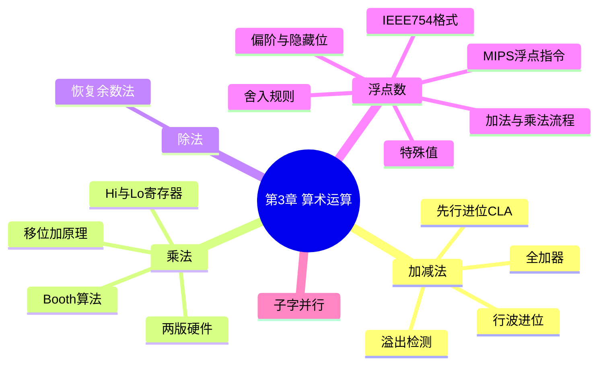

# 第 3 章 计算机的算术运算

> **一句话导读**:计算机里没有"手算",只有加法器。这一章告诉你:减法、乘法、除法、小数(浮点数)如何全部归结为"移位 + 加法",以及浮点误差从哪来。
>
> **对应教材**:第 3 章「计算机的算术运算(Arithmetic for Computers)」

---

## 一、本章思维导图

```
第3章 计算机的算术运算
│
├── 3.1 加法
│   ├── 半加器(两位相加,不管进位)/ 全加器(带上进位)
│   ├── 行波进位加法器(ripple carry):慢在进位"串行传递"
│   ├── 先行进位(CLA):并行算进位,快
│   └── 减法 = 加补码(a − b = a + (−b))
│
├── 3.2 溢出(overflow)
│   ├── 定义:结果超出表示范围
│   ├── 判定:正+正→负,负+负→正(看符号!)
│   └── addu/subu 不检测;add/sub 检测
│
├── 3.3 乘法
│   ├── 手算原理:逐位"移位+加"
│   ├── 第一版硬件:64位ALU、被乘数左移
│   ├── 优化版:32位ALU、积与乘数右移(省一半硬件)
│   ├── 有符号乘法:Booth 算法(把连续 1 打包)
│   └── MIPS:mult → Hi/Lo;mfhi/mflo;mul(取低32位)
│
├── 3.4 除法
│   ├── 恢复余数法:减了不行再加回来
│   ├── 硬件:除数右移、余数左移
│   ├── 有符号:商符号 = 两符号异或;余数随被除数
│   └── MIPS:div → Lo=商、Hi=余数;除以零是陷阱
│
├── 3.5 浮点数(IEEE 754)★本章核心
│   ├── 格式:(-1)^S × (1.Frac) × 2^(Exp−Bias)
│   ├── 单精度:S(1)Exp(8)Frac(23),Bias=127
│   ├── 双精度:S(1)Exp(11)Frac(52),Bias=1023
│   ├── 隐藏位:小数点前的 1 不存,白赚一位精度
│   ├── 特殊值:±0、±∞、NaN、非规格化数
│   └── 溢出/下溢
│
├── 3.6 浮点运算
│   ├── 加法四步:对齐指数→有效数相加→规格化→舍入
│   ├── 乘法三步:指数相加→有效数相乘→规格化+舍入
│   ├── 舍入:保护位/舍入位/粘贴位;就近舍入到偶数
│   └── 精度陷阱:加法不满足结合律!
│
├── 3.7 MIPS 浮点指令
│   ├── 寄存器:$f0-$f31(双精度用偶数对)
│   ├── lwc1/swc1、add.s/add.d、c.eq.s/bc1t
│   └── 例子:浮点矩阵乘法
│
├── 3.8 子字并行(SIMD within a register)
│   └── 一个宽寄存器装多个小数,同时算
│
└── 3.9 谬误与陷阱
    ├── 左移 ≠ 有符号乘(溢出时)
    ├── 浮点结合律不成立
    └── 用浮点数做精确计算(如钱)会出错
```

### Mermaid 版(可渲染)



---

## 二、学习目标

1. 理解全加器、行波进位、先行进位,会算加法器的"门延迟"。
2. 会判定补码加减是否溢出(三种方法至少会一种)。
3. 能手算 MIPS 乘法器(优化版)的逐步过程(移位+加)。
4. 理解恢复余数除法。
5. **会做十进制 ↔ IEEE 754 单/双精度互转**(必考)。
6. 会说清偏阶、隐藏位、非规格化数、NaN 的含义。
7. 能手算浮点加法(对齐、相加、规格化、舍入)。
8. 理解舍入规则和"浮点加法不满足结合律"。
9. 会写简单的 MIPS 浮点程序。
10. 知道什么是子字并行。

---

## 三、核心名词先混个脸熟

| 名词 | 一句话 |
|---|---|
| 全加器(full adder) | 三位相加(两个输入+进位入),输出和+进位出 |
| 行波进位(ripple carry) | 进位像波浪一样逐位传,慢 |
| 先行进位(CLA) | 进位并行计算,快 |
| 溢出(overflow) | 结果超出表示范围,符号错乱 |
| 被乘数/乘数/积 | 乘法三要素(multiplicand/multiplier/product) |
| Hi / Lo | 存放乘除法结果的专用寄存器 |
| Booth 算法 | 把连续 1 打包,减少加法次数的乘法优化 |
| 恢复余数法(restoring) | 除法:先减,不够再加回来 |
| IEEE 754 | 浮点数的国际标准格式 |
| 偏阶(bias) | 指数存的是"指数+偏移量",保证全正 |
| 隐藏位(hidden bit) | 规格化数小数点前的 1,不存储 |
| 规格化数(normalized) | 形式为 1.xxx×2^e 的数 |
| 非规格化数(denormalized) | 指数全 0 时表示的超小数 |
| NaN | Not a Number,如 0/0 的结果 |
| 保护位/舍入位/粘贴位 | 舍入用的三个额外精度位 |
| 就近舍入到偶数 | round to nearest even,IEEE 默认舍入方式 |
| 子字并行 | 一个宽寄存器同时算多个窄数据 |

---

## 四、分节精讲

### 3.1 加法:一切运算的基石

**半加器(half adder)**:两个 1 位数相加,输出"和"与"进位",不考虑来自低位的进位。
**全加器(full adder)**:输入两个数位 + 低位进位(CarryIn),输出和 + 向高位的进位(CarryOut)。**n 位加法 = n 个全加器串联**。

**行波进位加法器(ripple carry adder)**:第 i 位的 CarryOut 作为第 i+1 位的 CarryIn,进位一位一位"波"过去。每位 2 级门延迟 → n 位要 **2n 级延迟**,n 越大越慢。

**先行进位加法器(CLA, carry lookahead)**:把进位展开成公式,所有位的进位**并行**算出 → 延迟约 **O(log n)**(或用 2 级逻辑的"两级逻辑"看:延迟与位数几乎无关)。代价:电路更复杂。

💡 大白话:行波进位像"击鼓传花"——第 100 位的进位要等前 99 位传完;先行进位像"群发消息"——每个进位同时算出来。快,但要用更多电路(原则:用空间换时间)。

### 3.2 减法与溢出 ★

**减法 = 加补码**:`a − b = a + (~b + 1)`,硬件只要加法器 + 求反电路,不用单独减法器。

**溢出(overflow)**:结果超出 n 位补码的表示范围(如 8 位:−128~+127)。判定方法(会一种即可):

1. **符号法(最直观)**:正 + 正 = 负,或 负 + 负 = 正 → 溢出。(一正一负相加**永不会溢出**)
2. **进位法**:最高数值位的进位 ≠ 符号位的进位 → 溢出。
3. 公式:`溢出 = (~a.s & ~b.s & r.s) | (a.s & b.s & ~r.s)`(a.s、b.s、r.s 为符号位)。

例(4 位):`0111 + 0001 = 1000` → 7+1 = −8?错!正+正得负 → **溢出**。
`1111 + 1111 = 1110` → −1 + −1 = −2 → 负+负得负,正常,**无溢出**。

- MIPS:`add`/`sub`/`addi` 溢出即报错;`addu`/`subu`/`addiu` **不检测**(编译器常用 addu 处理 C 的无符号数)。
- ❓ 为什么需要"不检测溢出"的版本?因为有些语言的语义规定无符号运算"回绕"(溢出取模),如 C 的 unsigned 加法——这时溢出是特性不是错误。

### 3.3 乘法:移位 + 加

**手算原理**:十进制里 123×456 = 123×6 + 123×50 + 123×400;二进制更简单——乘数每位只有 0 或 1,所以**乘法 = 一连串"移位 + 条件加法"**。

**第一版硬件**(直观但浪费):64 位被乘数寄存器(左移)+ 64 位 ALU + 32 位乘数寄存器 + 64 位积寄存器。每步:看乘数最低位,是 1 就"积 += 被乘数";然后被乘数左移、乘数右移。

**优化版**(教材例子,考试手算用这个):
- 用 32 位 ALU;**被乘数不动**;**积和乘数共用 64 位寄存器向右移**(低 32 位放乘数,高 32 位做累加)。
- 每一步:看乘数最低位(积寄存器的第 0 位)→ 是 1 就"积的高 32 位 += 被乘数" → 整个 64 位积寄存器**右移**一位。
- 乘法结果 32×32 位最多 64 位,所以需要 Hi/Lo 一对寄存器存。

**教科书标准手算示例(0010 × 0011,被乘数 0010,乘数 0011):**

| 迭代 | 步骤 | 积寄存器(高32位+乘数) |
|---|---|---|
| 0 | 初值 | 0000 0011 |
| 1 | 最低位=1 → 加被乘数 | 0010 0011 |
| 1 | 右移 | 0001 0001 |
| 2 | 最低位=1 → 加被乘数 | 0011 0001 |
| 2 | 右移 | 0001 1000 |
| 3 | 最低位=0 → 不加 | 0001 1000 |
| 3 | 右移 | 0000 1100 |
| 4 | 最低位=0 → 不加 | 0000 1100 |
| 4 | 右移 | **0000 0110** = 6 ✓ |

**有符号乘法:Booth 算法**(旁注,知道思想即可):把乘数里"连续的 1"(如 011110 = 100000 − 000010)打包成"一次加、一次减",减少加法次数,速度与乘数中 1 的个数无关。

**MIPS 乘法指令:**

```asm
mult $s2, $s3     # Hi/Lo = $s2 × $s3(64位,有符号)
mfhi $t0          # $t0 = 积的高32位
mflo $t1          # $t1 = 积的低32位
mul  $t2, $s2, $s3  # $t2 = 低32位(编译器常用,不管高32位)
```

⚠️ 易错点:乘法结果**可能超 32 位**,只取 mflo 会得到"截断"的结果。C 里两个 int 相乘也是取低 32 位。

### 3.4 除法:恢复余数法

**术语**:被除数(dividend)÷ 除数(divisor)= 商(quotient)…余数(remainder)。

**恢复余数法(restoring division)**——人类竖式的硬件版:
1. 余数寄存器左移,把被除数"喂"进来;
2. 余数 −= 除数;
3. 若余数为负:说明减多了 → **加回去(恢复,restore)**,商位记 0;
4. 若余数为正(或零):商位记 1;
5. 除数右移(或余数左移),重复 n 次。

**有符号除法规则**:商的符号 = 被除数符号 ⊕ 除数符号(异或);**余数的符号与被除数相同**。

**MIPS 除法指令:**

```asm
div $s2, $s3     # Lo = 商, Hi = 余数
mflo $t0         # 取商
mfhi $t1         # 取余数
```

⚠️ 陷阱:**除以零**——有的机器会报错,有的(如部分 MIPS 实现)静默返回 0。总之别在程序里除以零。

💡 大白话:除法的本质是"反复试探性减法,减多了就反悔加回来"。所以除法是四种运算里最慢的——这也是编译器见到"除以 2 的幂"就用右移(sra)替换的原因(快得多)。

### 3.5 浮点数:IEEE 754 ★本章核心

#### 3.5.1 科学计数法思想

十进制科学计数法:−1.5×10⁻³ = **符号 × 有效数 × 10^指数**。浮点数就是**二进制的科学计数法**。

#### 3.5.2 格式

```
单精度(32位):S(1) | Exp(8) | Frac(23),Bias = 127
双精度(64位):S(1) | Exp(11) | Frac(52),Bias = 1023

值 = (-1)^S × (1.Frac) × 2^(Exp - Bias)     ← 规格化数
```

- **偏阶(bias,移码)**:指数存 `Exp = 真指数 + Bias`,好处:① 存的全是正数,好排序;② 用无符号比较就能比浮点数大小。
- **隐藏位(hidden bit)**:规格化数的有效数一定是 1.xxx,那个"1."人人都有 → **干脆不存**,白赚 1 位精度(单精度实际精度 24 位,双精度 53 位)。
- **范围(单精度)**:Exp 取 1~254,最大约 ±3.4×10³⁸,最小规格化数约 ±1.18×10⁻³⁸。
- **溢出(overflow)**:指数太大放不下(如 1e38 × 1e38);**下溢(underflow)**:指数太小,落入非规格化数或 0。

#### 3.5.3 特殊值(必考表)

| Exp | Frac | 含义 |
|---|---|---|
| 全 0 | 0 | ±0(注意 0 有正负!) |
| 全 0 | ≠0 | **非规格化数(denormalized)**:值 = (−1)^S × (0.Frac) × 2^(1−Bias),填在 0 和最小规格化数之间,"渐进下溢" |
| 全 1 | 0 | ±∞(如 1.0/0.0) |
| 全 1 | ≠0 | **NaN**(Not a Number,如 0.0/0.0、∞−∞) |
| 其他 | 任意 | 规格化数(正常数) |

💡 大白话:非规格化数是 IEEE 754 的"慈悲设计"——没有它,0 和最小规格化数(1.18×10⁻³⁸)之间就是一片空白,更小的数直接被"四舍五入"成 0,误差巨大。有它,小数值"慢慢衰减"到 0,精度平缓。

#### 3.5.4 十进制 ↔ 单精度互转(必会)

**例:把 −0.75 转成单精度。**

1. 符号:S = 1。
2. 0.75 = 0.11₂ = **1.1 × 2⁻¹** → 真指数 = −1。
3. Exp = −1 + 127 = 126 = 0111 1110。
4. Frac = 隐藏位后面的部分:1.1 的"1"被隐藏,剩 .1 → Frac = 1000…0(23 位)。
5. 拼起来:**1 01111110 10000000000000000000000 = 0xBF400000**。

**例:反方向,0x3F800000 是什么?**

1. 拆:S=0,Exp=0111 1111=127,Frac=0。
2. 真指数 = 127−127 = 0;有效数 = 1.0。
3. 值 = +1.0 × 2⁰ = **1.0**。

### 3.6 浮点运算

#### 3.6.1 浮点加法四步(手算流程,必考)

1. **对齐指数**:把指数小的数对齐到大的(小数的有效数**右移**,差几位移几位)。
2. **有效数相加**。
3. **规格化**:结果左移/右移使形式回到 1.xxx(可能溢出→特殊处理)。
4. **舍入**:多余位按规则舍去(舍入后可能需要再规格化一次)。

**手算例:0.5 + (−0.4375)**

1. 0.5 = 1.0×2⁻¹;−0.4375 = −(7/16) = −0.0111₂ = −1.11×2⁻²。
2. 对齐:−1.11×2⁻² = **−0.111×2⁻¹**(右移一位)。
3. 相加:1.000×2⁻¹ + (−0.111×2⁻¹) = 0.001×2⁻¹。
4. 规格化:0.001×2⁻¹ = **1.0×2⁻⁴** = 1/16 = **0.0625** ✓。

#### 3.6.2 浮点乘法

1. 指数**相加**(注意:两个 Exp 都含 Bias,所以 Exp = Exp₁ + Exp₂ − Bias,要减掉一份);
2. 有效数相乘;
3. 规格化 + 舍入;符号 = 两符号异或。

#### 3.6.3 舍入:保护位、舍入位、粘贴位 ★

运算中间结果比最终格式多出几位,最低的几位依次叫:
- **保护位(guard)**:第一位附加位;
- **舍入位(round)**:第二位附加位;
- **粘贴位(sticky)**:其余所有附加位的"或"(只要后面有任何一个 1,sticky=1)。

IEEE 默认**就近舍入到偶数(round to nearest even)**:超过一半则进,不到一半则舍,**恰好一半时向最低位为偶数的方向舍**(避免统计上的累积偏差)。

💡 大白话:为什么"一半取偶"?因为每次都"四舍五入"(一半总是进位)会让大量计算的结果系统性地偏大;"取偶"让一半的情况进、一半的情况舍,平均误差趋近于零。

#### 3.6.4 精度陷阱

- **浮点加法不满足结合律**:(a+b)+c ≠ a+(b+c)。例:一个大数加很多极小数,小数可能被"吞掉"。
- 浮点表示是**近似的**:0.1 在二进制里是无限循环小数,存的是近似值 → `0.1 + 0.2 != 0.3`。
- ❓ 为什么金融系统不用浮点数算钱?因为十进制的小数(0.1 元)在二进制中无法精确表示,多次运算误差累积,钱会"凭空消失"。银行用定点十进制或专用库。

### 3.7 MIPS 浮点指令

- 寄存器:**$f0-$f31**(32 个 32 位);双精度需**偶数编号对**($f0/$f1 一起用,$f1 不能单独用)。
- 访存:`lwc1 $f0, 0($s1)`(取单精度)、`swc1`(存);双精度用 `ldc1/sdc1`。
- 运算:`add.s` / `sub.s` / `mul.s` / `div.s`(单精度)、`add.d` 等(双精度,后缀 .d)。
- 比较与分支:浮点比较不能直接用 beq!要 `c.eq.s`(置条件标志)→ `bc1t`(标志为真则跳)/ `bc1f`。

```asm
lwc1  $f4, 0($s1)    # F = A
lwc1  $f6, 0($s2)    # 取 B
add.s $f4, $f4, $f6  # F = A + B
swc1  $f4, 0($s3)    # 存回
```

⚠️ 易错点:浮点比较→分支是"两步走"(c.eq.s + bc1t),不能写成 `beq $f4, $f6, L`;且 beq/bne 的寄存器是**整数寄存器**,浮点寄存器另有一套。

### 3.8 子字并行(subword parallelism)

- 思想(八大思想第 4 条"并行"):一个 128 位寄存器,同时装 **4 个 32 位**或 **8 个 16 位**数据,一条指令同时算完 → 多媒体、图像处理的利器(x86 的 SSE/AVX 就是干这个的)。
- 为什么划算:加法器被切成几段,硬件几乎没增加,吞吐翻几倍。

### 3.9 谬误与陷阱

1. **陷阱:左移代替乘 2 的幂,仅对无符号数恒对**;对有符号数,溢出时结果是错的(正确做法:sll 用于无符号/确认不溢出;sra 用于有符号除 2 的幂,注意负数向负无穷取整与 C 语言语义的关系)。
2. **陷阱:浮点加法不满足结合律**(见 3.6.4)。
3. **陷阱:浮点数是近似表示**,不能做精确比较(`==`),要用误差范围比较。
4. **谬误:只有理论数学家才关心浮点精度。** 1994 年 Intel Pentium 浮点除法错误直接造成数亿美元召回。
5. **陷阱:整数与浮点的换算有代价**(lwc1 取进浮点寄存器后,整数运算碰不到它;两者寄存器组是分开的)。

---

## 五、名词解释汇总表

| 名词 | 英文 | 解释 |
|---|---|---|
| 全加器 | full adder | 1 位加法电路:两输入 + 进位入 → 和 + 进位出 |
| 行波进位 | ripple carry | 进位逐位串行传递的加法器结构,2n 级延迟 |
| 先行进位 | carry lookahead (CLA) | 进位并行计算的快速加法器 |
| 溢出 | overflow | 补码运算结果超出表示范围 |
| Hi / Lo | — | 存乘法积/除法结果的专用寄存器对 |
| Booth 算法 | Booth's algorithm | 压缩乘数中连续 1 的乘法优化 |
| 恢复余数法 | restoring division | 先试减、为负则恢复的除法算法 |
| IEEE 754 | — | 浮点数表示与运算的国际标准 |
| 偏阶 | bias | 存储指数加的偏移量(127/1023) |
| 隐藏位 | hidden bit | 规格化数 1.xxx 中不存储的"1" |
| 规格化数 | normalized number | 形式为 1.xxx×2^e 的浮点数 |
| 非规格化数 | denormalized number | Exp 全 0、Frac≠0 的超小浮点数 |
| NaN | Not a Number | 非法运算(0/0)的结果 |
| 无穷大 | infinity | 1.0/0.0 的结果,Exp 全 1、Frac 为 0 |
| 保护位 | guard bit | 舍入用的第一个附加位 |
| 舍入位 | round bit | 舍入用的第二个附加位 |
| 粘贴位 | sticky bit | 其余附加位的逻辑或 |
| 就近舍入到偶数 | round to nearest even | IEEE 默认舍入:恰好一半时取偶 |
| 子字并行 | subword parallelism | 宽寄存器同时算多个窄操作数 |

---

## 六、公式速查

| 公式 | 说明 |
|---|---|
| a − b = a + (~b + 1) | 减法用补码加法实现 |
| 溢出 = 正+正→负 或 负+负→正 | 符号判定法 |
| 值 = (−1)^S × (1.Frac) × 2^(Exp−Bias) | 规格化浮点数 |
| 值 = (−1)^S × (0.Frac) × 2^(1−Bias) | 非规格化数 |
| Exp = 真指数 + Bias(127 或 1023) | 编码 |
| 浮点乘法:Exp = Exp₁ + Exp₂ − Bias | 指数相加(去掉重复偏阶) |
| 行波进位延迟 ≈ 2n 级门延迟 | 加法器性能 |
| 有效精度:单 24 位 / 双 53 位 | 含隐藏位 |

---

## 七、易混淆概念对比

| 对比 | 区别一句话 |
|---|---|
| 溢出 vs 进位 | 溢出=补码范围装不下(符号错);进位=无符号装不下(丢最高位) |
| add vs addu | 前者溢出报错,后者不检测 |
| 乘法器第一版 vs 优化版 | 前者被乘数左移(64位ALU);后者积+乘数右移(32位ALU) |
| 商的符号 vs 余数的符号 | 商:两符号异或;余数:跟随被除数 |
| 规格化数 vs 非规格化数 | Exp 正常 vs Exp 全 0;后者填 0 附近的空隙 |
| NaN vs ∞ | 0/0 之类非法 → NaN;1/0 → ∞ |
| 单精度 vs 双精度 | 8 位指数/23 位尾数 vs 11/52;精度 24 vs 53 位 |
| sra vs div | 有符号除以 2 的幂可用 sra(快);一般除法用 div |
| 整数寄存器 vs 浮点寄存器 | $0-$31 整数; $f0-$f31 浮点,两套互不通用 |
| 保护位 vs 粘贴位 | 单一附加位 vs 其余附加位的"或" |

---

## 八、自测题

1. (溢出)4 位补码运算,判断是否溢出:`0111+0001`;`1111+1111`;`1000+0111`;`0101+0011`。
2. (乘法)用优化版乘法器手算 0110 × 0101,写出每步积寄存器的值。
3. (数制)把 −0.75 转成 IEEE 754 单精度(十六进制)。
4. (数制)0x3F800000 表示的十进制数是多少?
5. (数制)把 6.25 转成单精度。
6. (浮点加)手算 0.5 + 0.4375,写出对齐/相加/规格化过程。
7. (概念)什么是偏阶?为什么指数要加偏阶?
8. (概念)什么是隐藏位?它带来什么好处?
9. (概念)非规格化数解决什么问题?
10. (概念)为什么浮点加法不满足结合律?举例说明。
11. (MIPS)写代码实现单精度 `F = A * B + C`(A、B、C、F 的地址分别在 $s0-$s3 指向处)。
12. (概念)保护位、舍入位、粘贴位分别是什么?"就近舍入到偶数"为什么优于"四舍五入"?

### 参考答案

1. 0111+0001=1000:7+1=−8 → **溢出**(正+正=负);1111+1111=1110:−1−1=−2 → 无溢出;1000+0111=1111:−8+7=−1 → 无溢出(异号相加);0101+0011=1000:5+3=−8 → **溢出**。
2. 0110×0101(被乘数 0110,乘数 0101):
   - 初值:0000 0101
   - 步1:最低位 1 → 加:0110 0101 → 右移:0011 0010
   - 步2:最低位 0 → 右移:0001 1001
   - 步3:最低位 1 → 加:0111 1001 → 右移:0011 1100
   - 步4:最低位 0 → 右移:0001 1110 = 30 ✓
3. 0xBF400000(过程见 3.5.4)。
4. 1.0。
5. 6.25 = 110.01₂ = 1.1001×2² → S=0,Exp=2+127=129=1000 0001,Frac=100100…0 → **0x40C80000**。
6. 0.5=1.0×2⁻¹;0.4375=0.0111₂=1.11×2⁻² → 对齐:0.111×2⁻¹;相加:1.0×2⁻¹+0.111×2⁻¹=1.111×2⁻¹;已是规格化 → 结果 1.111×2⁻¹ = 0.9375 ✓。
7. 偏阶是加到真指数上的常数(单 127/双 1023)。作用:① 让存储的指数恒为非负,方便按无符号数比较大小;② 排序时浮点数可直接当整数比较。
8. 隐藏位是规格化数"1.xxx"里不存储的"1"。好处:同样位数多 1 位有效精度(23 位 Frac 实际 24 位精度)。
9. 填满 0 与最小规格化数之间的空隙,让小数值渐进衰减到 0(渐进下溢),避免骤然变 0 的巨大误差。
10. 因为对齐和舍入:大数加极小数时,小数对齐后可能被完全舍掉。例:单精度下 (1e20 + 1e−20) + (−1e20) = 0,而 1e20 + (1e−20 − 1e20) = 1e−20(数量级)——括号不同结果不同。
11.
```asm
lwc1  $f4, 0($s0)     # A
lwc1  $f6, 0($s1)     # B
lwc1  $f8, 0($s2)     # C
mul.s $f4, $f4, $f6   # A*B
add.s $f4, $f4, $f8   # +C
swc1  $f4, 0($s3)     # F
```
12. 保护位=舍入时保留的第一位附加位;舍入位=第二位;粘贴位=其余附加位的或(记住"后面是否还有非零")。就近舍入到偶数在"恰好一半"时一半进一半舍,避免"逢五全进"导致的系统性偏差累积。

---

## 九、本章小结

- 一切运算归于**加法与移位**:减法=补码加法,乘法=移位+加,除法=试减+恢复。
- IEEE 754 浮点 = 二进制科学计数法:**符号、带偏阶的指数、隐藏位的尾数**,外加一整套特殊值(0/∞/NaN/非规格化数)。
- 浮点有精度代价:会舍入、不满足结合律——这是工程权衡,不是 bug。

**下一章** → [04-第4章-处理器.md](04-第4章-处理器.md):进入 CPU 内部,看数据通路与流水线。
