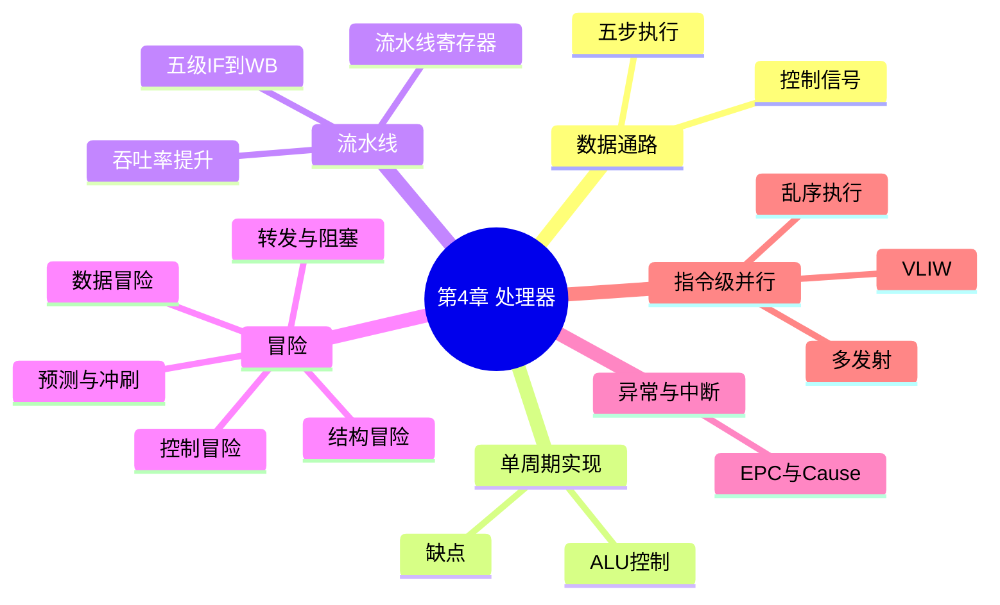

# 第 4 章 处理器

> **一句话导读**:这一章拆开 CPU 的外壳:指令在 CPU 里是怎么被"取、译、算、存"的?为什么 CPU 要像工厂流水线一样工作?冒险(hazard)是什么、怎么解决?这是**全书最难也最核心**的一章,拿下它,你就真正"懂计算机"了。
>
> **对应教材**:第 4 章「处理器(The Processor)」

---

## 一、本章思维导图

```
第4章 处理器
│
├── 4.1 数据通路(datapath)
│   ├── 部件:PC、指令存储器、加法器、寄存器组、ALU、数据存储器
│   │         符号扩展器、移位器
│   ├── 通用五步:取指 → 译码 → 执行 → 访存 → 写回
│   └── 各指令的路径:add(R型)、lw、sw、beq、j
│
├── 4.2 单周期实现(最简单的CPU)
│   ├── 特点:一条指令一个时钟周期
│   ├── 控制信号:RegDst/RegWrite/ALUSrc/ALUOp/MemRead/MemWrite
│   │            /MemtoReg/Branch/Jump
│   ├── ALU控制:ALUOp + funct → 具体运算
│   ├── 主控单元:纯组合逻辑(真值表)
│   └── 致命缺点:周期 = 最慢指令(lw),浪费
│
├── 4.3 流水线(pipelining)★
│   ├── 思想:像洗车流水线,指令重叠执行
│   ├── 五级:IF → ID → EX → MEM → WB
│   ├── 流水线寄存器:IF/ID、ID/EX、EX/MEM、MEM/WB
│   ├── 加速的是吞吐率(每条指令的时间不变!)
│   └── 加速比 ≈ 级数(理想),实际打折
│
├── 4.4 冒险(hazards)★★本章最难点
│   ├── 结构冒险:部件不够用(如单存储器)
│   ├── 数据冒险:后面指令要用前面的结果
│   │   ├── 解决1:转发(forwarding)——把结果"抄近路"
│   │   │   ├── 场景:EX/MEM 转发(ALU结果直接送)
│   │   │   └── 场景:MEM/WB 转发(访存结果)
│   │   └── 解决2:阻塞(stall)+ 气泡(bubble)
│   │       └── load-use 冒险:转发也不够,必须停1拍
│   └── 控制冒险:分支方向未定
│       ├── 解决:尽早判断分支(ID段)+ 预测不跳
│       └── 猜错代价:冲刷(flush)误取的指令
│
├── 4.5 异常与中断
│   ├── 异常(内部)/ 中断(外部)统称 exception
│   ├── EPC:保存出错指令地址
│   ├── Cause:记录异常原因
│   ├── 向量中断:固定入口的处理程序
│   └── 处理流程:保存 → 跳转处理 → 恢复(eret)
│
├── 4.6 指令级并行(ILP)
│   ├── 多发射(multiple issue):每周期发射多条指令
│   ├── 静态多发射:VLIW(编译器排好)
│   ├── 动态多发射:乱序执行、寄存器重命名、推测执行
│   └── CPI = 1/发射宽度(理想)
│
└── 4.7 谬误与陷阱
    ├── 流水线不是越深越好(收益递减、功耗大)
    ├── 纯汇编未必最快(编译器+乱序执行很强)
    └── 分支预测失败的代价巨大
```

### Mermaid 版(可渲染)



---

## 二、学习目标

1. 说出指令执行的通用五步,以及各步用到的数据通路部件。
2. 能画出(或描述)lw、sw、beq 在单周期数据通路中的完整路径。
3. 能默写控制信号表(RegDst/ALUSrc/MemtoReg/RegWrite/MemRead/MemWrite/Branch/ALUOp)。
4. 理解 ALU 控制:ALUOp + funct 如何决定 ALU 做什么。
5. 能画出流水线的多时钟周期图(时空图)。
6. **会找数据冒险**,并判断:哪种用转发解决、哪种必须阻塞。
7. 理解转发单元和冒险检测单元的工作原理。
8. 理解控制冒险与"预测不跳 + 冲刷"。
9. 能区分异常与中断,说出 EPC、Cause 的作用。
10. 知道多发射、VLIW、乱序执行、寄存器重命名的基本思想。

---

## 三、核心名词先混个脸熟

| 名词 | 一句话 |
|---|---|
| 数据通路(datapath) | CPU 里"干活"的部件:寄存器组、ALU、存储器等 |
| 控制器(control) | 产生控制信号、指挥数据通路的部件 |
| 单周期(single-cycle) | 每条指令固定用 1 个时钟周期的实现 |
| 流水线(pipelining) | 多条指令重叠执行的实现技术 |
| 流水线寄存器 | 各级之间的"隔板",保存级间传递的数据 |
| 冒险(hazard) | 流水线中导致下条指令无法正确执行的情况 |
| 转发(forwarding) | 把结果抄近路直接送给需要的级 |
| 气泡(bubble) | 插入流水线的"空指令"(什么都不做) |
| 阻塞(stall) | 让流水线停一拍 |
| load-use 冒险 | lw 后紧跟使用该值的指令,必须阻塞 |
| 控制冒险 | 分支结果未知导致后续取指不确定 |
| 冲刷(flush) | 丢弃误取的指令,换成气泡 |
| 异常(exception) | 指令执行中的意外事件(内部) |
| 中断(interrupt) | 外部设备发来的事件 |
| EPC | 保存异常指令地址的寄存器 |
| Cause | 记录异常原因的寄存器 |
| 多发射(multiple issue) | 一个时钟周期发射多条指令 |
| VLIW | 超长指令字,编译器静态排好并行 |
| 乱序执行(out-of-order) | 硬件动态重排指令执行顺序 |
| 寄存器重命名 | 消除假依赖(WAW/WAR)的技术 |
| 推测(speculation) | 提前执行"猜"的指令,猜错回滚 |

---

## 四、分节精讲

### 4.1 数据通路:CPU 的"器官"

**通用五步**(任何指令都是这五步的子集):

1. **取指(IF, Instruction Fetch)**:PC → 指令存储器,取出指令;PC 自增 4。
2. **译码(ID, Instruction Decode)**:读寄存器组,识别指令。
3. **执行(EX, Execute)**:ALU 运算(算数、算地址、比分支)。
4. **访存(MEM, Memory Access)**:只有 lw/sw 用:读写数据存储器。
5. **写回(WB, Write Back)**:结果写回寄存器。

**数据通路部件清单(与五步对应):**

| 部件 | 用途 |
|---|---|
| PC(程序计数器) | 存下一条指令地址 |
| 指令存储器 | 存程序(机器码) |
| 加法器(+4) | PC = PC + 4 |
| 寄存器组(register file) | 32 个寄存器,同时支持"读 2 个 + 写 1 个" |
| 符号扩展器(sign extend) | 16 位立即数 → 32 位 |
| ALU | 算术/逻辑运算 |
| 数据存储器 | 存数据(lw/sw 用) |
| 移位器(shift left 2) | 分支偏移量 ×4、j 地址 ×2 |

**各指令走哪条路(考试画图题):**

- **R 型(add)**:取指 → 读 rs、rt → ALU 算 → 写回 rd。不访存。
- **lw**:取指 → 读基址寄存器 → ALU 算地址(基址+符号扩展的偏移)→ 数据存储器读出 → 写回 rt。
- **sw**:取指 → 读基址 + 读数据(rt)→ ALU 算地址 → 写入数据存储器。**不写回寄存器**。
- **beq**:取指 → 读 rs、rt → ALU 做减法比相等 → 结果控制 PC。
- **j**:取指 → 用指令的 26 位地址拼接出目标地址 → 更新 PC。

### 4.2 单周期实现:第一版 CPU

**思想**:整个 CPU 用一个超长时钟周期,每条指令**一个周期**内完成。周期长度 = 最慢指令(lw:取指+读寄存器+ALU+访存+写回)的时间。

**控制信号表(必背,考试大题):**

| 信号 | 作用 | R型 | lw | sw | beq |
|---|---|---|---|---|---|
| RegDst | 写 rd(1)还是 rt(0) | 1 | 0 | × | × |
| ALUSrc | ALU 第二操作数:寄存器(0)还是立即数(1) | 0 | 1 | 1 | 0 |
| MemtoReg | 写回数据来自 ALU(0)还是存储器(1) | 0 | 1 | × | × |
| RegWrite | 是否写寄存器 | 1 | 1 | 0 | 0 |
| MemRead | 是否读数据存储器 | 0 | 1 | 0 | 0 |
| MemWrite | 是否写数据存储器 | 0 | 0 | 1 | 0 |
| Branch | 是否分支 | 0 | 0 | 0 | 1 |
| ALUOp(2位) | ALU 做什么 | 10 | 00 | 00 | 01 |

**ALU 控制(ALUOp + funct 两级译码):**

| ALUOp | 含义 | 结合 funct 的结果 |
|---|---|---|
| 00 | 加法(lw/sw 算地址) | 加 |
| 01 | 减法(beq 比较) | 减 |
| 10 | 由 funct 决定 | 100000→加,100010→减,100100→与,100101→或,101010→小于置位 |

- 主控单元 = **纯组合逻辑**(真值表直接实现,不需要状态)。
- ❓ 为什么 ALU 要两级译码?因为 R 型指令有 6 种运算,1 位 ALUOp 不够表达;分成"大类(ALUOp)+ 细分(funct)"让主控单元简单规整(原则 1)。

**单周期的致命缺点**:时钟周期被最慢指令拖死(其他指令都在"等"lw 的时间);且加法器、存储器等部件每条指令只用一小段时间,其余时间闲着 → 违反"加速大概率事件"。

### 4.3 流水线:像洗车场一样工作 ★

#### 4.3.1 思想

把指令执行分成 5 级,像**洗车流水线**:第 i 条指令在"冲洗"时,第 i−1 条在"擦干"……**同一时刻 5 条指令处于不同阶段**。

```
五级:IF(取指)→ ID(译码)→ EX(执行)→ MEM(访存)→ WB(写回)
```

- **流水线寄存器(IF/ID、ID/EX、EX/MEM、MEM/WB)**:级与级之间的"隔板",把本级的结果(指令、数据、控制信号)锁存起来传给下一级。它们的存在让各级能"各干各的",互不干扰。
- 💡 大白话:流水线寄存器像传送带上的托盘——每道工序完成后,把半成品放托盘上传给下一道工序,自己立刻接下一个活儿。

#### 4.3.2 性能:加速的是"吞吐率"

- 单周期:5 条指令要 5 个长周期;流水线:5 条指令约 9 个短周期(5 级),之后**每周期流出一条指令**。
- 理想加速比 ≈ **级数(5 倍)**。为什么不是精确 5 倍:① 各级耗时不平衡(周期=最慢级);② 流水线寄存器有开销;③ 冒险会打乱节奏。
- ⚠️ 易错点:流水线**不缩短单条指令的时间**(反而略增),它提高的是**单位时间完成的指令数**(吞吐率)。

#### 4.3.3 图形化表示(两种图都要会画)

**单时钟周期图**:画出某一时刻每级在做什么。

**多时钟周期图(时空图)**:横轴时间(周期),纵轴指令,每行一条指令的推进:

```
周期:        1   2   3   4   5   6   7   8   9
lw $10,20($1) IF  ID  EX  MEM WB
sub $11,$2,$3     IF  ID  EX  MEM WB
```

### 4.4 冒险:流水线的三只拦路虎 ★★

#### 4.4.1 结构冒险(structural hazard)

**原因**:硬件部件不够用,两条指令同时抢一个部件。
**经典例子**:指令和数据共用**同一个存储器** → 第 i 条取指和 lw 的访存撞车。
**解决**:指令和数据分开存储(哈佛结构),或把部件"复制"多份。现在处理器普遍通过独立的一级指令/数据 cache 规避。

#### 4.4.2 数据冒险(data hazard)★

**原因**:后面的指令要用前面指令**还没写回**的结果。

经典序列(教材原例):

```asm
sub  $2, $1, $3      # ①
and  $12, $2, $5     # ② 需要 $2 的新值
or   $13, $6, $2     # ③ 需要 $2 的新值
add  $14, $2, $2     # ④ 需要 $2 的新值
sw   $15, 100($2)    # ⑤ 需要 $2 的新值
```

- ②紧跟①:①的 ALU 结果在**EX 结束后**就有,但还要走 MEM、WB 才写寄存器,②等不及 → **转发**解决。
- ③④⑤隔得远:①的结果此时已在 **MEM/WB 段**,同样转发。
- **转发(forwarding / bypassing)**:把 ALU 结果或访存结果**抄近路**直接送进 ALU 的输入,不等写回寄存器。加一个**转发单元** + 两个多路选择器(ForwardA/ForwardB)。
  - **EX/MEM 转发**:结果来自前一条指令的 EX 段(解决场景一)。
  - **MEM/WB 转发**:结果来自更早指令的 MEM/WB 段(解决场景二)。
- 💡 大白话:转发像"厨房直接递菜"——菜炒好了直接从灶台递到出餐口,不用先端回仓库(寄存器)再取出来。

**load-use 冒险:转发救不了,必须阻塞!**

```asm
lw   $s0, 20($t1)    # ① 数据要到 MEM 结束后才有
and  $t2, $s0, $t3   # ② 在 EX 段就要用 $s0 → 差一拍!
```

- lw 的结果最快要到 **MEM 结束**才出现,而②在**自己的 EX 段**就要用 → 时间上差一个周期,**转发也够不着**。
- 解决:**冒险检测单元(hazard detection unit)** 检测到这种情况 → 让②(以及后随指令)**阻塞(stall)一个周期**,插入一个**气泡(bubble,即空操作)**;同时配合 MEM/WB 转发。
- 检测条件:`ID/EX.MemRead 为真` 且 `(ID/EX.rt == IF/ID.rs 或 IF/ID.rt)` → stall。
- 时空图(阻塞 + 转发):

```
周期:            1   2   3   4   5   6   7   8
lw $s0,20($t1)   IF  ID  EX  MEM WB
and $t2,$s0,$t3      IF  ID  泡  EX  MEM WB   ← 在ID多停1拍
```

- ⚠️ 易错点:考试常问"哪些冒险转发解决、哪些必须阻塞"。口诀:**ALU 结果滞后 1~2 条指令 → 转发;load 结果紧跟使用 → 阻塞 + 转发**。

#### 4.4.3 控制冒险(control hazard)★

**原因**:分支指令(beq/bne)的**跳不跳还不知道**,后面的取指怎么办?

**解决三步走**:
1. **提前判断**:把分支判断从 MEM 段**提前到 ID 段**(加一个小比较器),代价减到只猜错 1 条指令;
2. **预测**:默认**预测分支不跳**(大概率事件:多数分支不跳),按 PC+4 顺序取指;
3. **猜错了就冲刷(flush)**:把误取的指令在 IF/ID 寄存器里**改成气泡**(把控制信号清零),代价 = 浪费 1 个周期。

- 💡 大白话:像堵车时的导航——先按"直行"往前开(预测不跳),到路口发现该转弯(猜错),只好倒回一个身位(冲刷)。更高级的处理器有"历史记录"帮助预测(2 位预测器,见第 6 章硬件多线程前后文)。

#### 4.4.4 指令集设计必须配合流水线(呼应第 2 章)

- 所有指令**等长**(32 位)→ 取指和译码才能流水;
- 指令格式**规整**(三种)→ 译码简单;
- 只有 lw/sw **访存** → MEM 级统一;
- **分支延迟槽(branch delay slot)**:老 MIPS 让分支后紧跟的那条指令"无论如何都执行",抵消冲刷代价——历史设计,如今大多已不用,了解即可。

### 4.5 异常与中断

**术语**(本书统称 exception):
- **异常(exception)**:CPU **内部**的意外——算术溢出、未定义指令、系统调用(syscall)。
- **中断(interrupt)**:来自 CPU **外部**的事件——I/O 设备请求、键盘、网络。

**处理机制(MIPS 风格):**
1. 保存现场:出错的指令地址存入 **EPC**(Exception Program Counter,异常程序计数器);
2. 记录原因:原因码写入 **Cause** 寄存器;
3. 跳转到**固定入口**(向量中断,如 MIPS 的 0x8000 0180)执行异常处理程序;
4. 处理完用 `eret`/`mfc0` 从 EPC 恢复,继续执行。

- ❓ 什么是**向量中断(vectored interrupt)**?异常类型直接决定跳转地址(每种异常一个固定入口)。好处:不用先判断类型再跳,响应快。
- ⚠️ 易错点:EPC 存的是**出错指令的地址**。如果是分支延迟槽里的指令出错,EPC 要存分支指令的地址(为了能正确返回)——细节考点。

### 4.6 指令级并行(ILP):更狠的提速

单流水线到头后,进一步**每个周期发射(issue)多条指令**:

- **多发射(multiple issue)**:理想 CPI = 1/发射宽度(每周期发 2 条 → CPI 0.5)。
- **静态多发射 / VLIW(超长指令字)**:由**编译器**把能并行的指令打包成一条长指令,硬件简单但编译器难(要分析依赖、排指令)。
- **动态多发射 / 乱序执行(out-of-order execution)**:硬件在运行中自己找"能并行执行"的指令,**打乱顺序执行**(但提交按序,保证结果正确)。配套技术:
  - **寄存器重命名(register renaming)**:消除"假依赖"(两条指令用同一个寄存器但数据无关),多准备一批物理寄存器给它们"换名字"。
  - **推测执行(speculation)**:分支没定之前就"猜着执行",猜错回滚。
  - (旁注:Tomasulo 算法——历史上第一台乱序执行的 IBM 360/91 的经典方案,考试了解思想即可。)
- 💡 大白话:动态多发射像**餐厅后厨的经理**——单子上 5 道菜,经理发现两道菜都用"3 号锅"但互不影响,就另拿一口锅(重命名)同时炒(乱序),上菜顺序仍按单子(按序提交)。

### 4.7 谬误与陷阱

1. **陷阱:流水线级数不是越深越好。** 每级拆分产生额外的流水线寄存器开销;级数深了,一次预测失败的代价更大,功耗也更高(Pentium 4 的 31 级超深流水线是著名反例)。
2. **谬误:手写汇编一定比编译器快。** 现代编译器 + 乱序执行已经非常强,人肉排指令往往不如编译器;真正的性能在算法。
3. **陷阱:用峰值吞吐率评价处理器。** 冒险、cache 缺失会让实际吞吐远低于"每周期 N 条"的理论值。
4. **陷阱:忽略分支预测失败的代价。** 深流水线 + 高发射宽度下,一次猜错可能浪费几十条指令的"坑位"。

---

## 五、名词解释汇总表

| 名词 | 英文 | 解释 |
|---|---|---|
| 数据通路 | datapath | 执行指令的运算部件(寄存器组、ALU、存储器) |
| 控制器 | control unit | 产生控制信号的部件 |
| 单周期实现 | single-cycle implementation | 每条指令一个长时钟周期 |
| 流水线 | pipelining | 多条指令重叠执行 |
| 流水线寄存器 | pipeline register | 级间锁存器,传递中间结果 |
| 结构冒险 | structural hazard | 硬件部件被两条指令同时争用 |
| 数据冒险 | data hazard | 后续指令等待前序指令的数据 |
| 转发 | forwarding / bypassing | 结果抄近路直送 ALU 输入 |
| load-use 冒险 | load-use hazard | lw 结果紧跟使用,必须阻塞 |
| 阻塞 | stall | 流水线停一个或多个周期 |
| 气泡 | bubble | 插入流水线的空操作 |
| 控制冒险 | control hazard | 分支方向未定引发的取指问题 |
| 冲刷 | flush | 丢弃误取的指令 |
| 分支预测 | branch prediction | 猜测分支方向,错了再纠正 |
| 异常 | exception | CPU 内部意外事件 |
| 中断 | interrupt | 外部设备事件 |
| EPC | Exception PC | 保存异常指令地址 |
| Cause | — | 保存异常原因码 |
| 向量中断 | vectored interrupt | 异常类型直接映射到处理入口 |
| 多发射 | multiple issue | 每周期发射多条指令 |
| VLIW | Very Long Instruction Word | 编译器静态打包的超长指令字 |
| 乱序执行 | out-of-order execution | 硬件动态重排执行顺序 |
| 寄存器重命名 | register renaming | 用物理寄存器消除假依赖 |
| 推测执行 | speculation | 提前执行猜测路径的指令 |
| 分支延迟槽 | branch delay slot | 分支后恒执行的指令位(老 MIPS) |

---

## 六、公式速查

| 公式 | 说明 |
|---|---|
| 单周期执行时间 = IC × 最长指令时间 | 单周期性能 |
| 流水线理想加速比 ≈ 级数 | 五级 ≈ 5 倍 |
| 流水线执行时间 ≈ (IC + 级数 − 1) × 周期 | 首条"灌满"后每周期一条 |
| CPI 理想 = 1 / 发射宽度 | 多发射 |
| 异常代价 = 预测失败率 × 冲刷代价 | 控制冒险成本 |

---

## 七、易混淆概念对比

| 对比 | 区别一句话 |
|---|---|
| 数据通路 vs 控制器 | 干活的 vs 指挥的(合起来是 CPU) |
| 单周期 vs 多周期 vs 流水线 | 每条指令 1 个长周期 / 1 条指令分多个周期执行 / 多条指令重叠执行 |
| 结构冒险 vs 数据冒险 vs 控制冒险 | 抢部件 / 等数据 / 等分支方向 |
| 转发 vs 阻塞 | 抄近路(不损失时间)vs 停下来(损失周期) |
| 气泡 vs 冲刷 | 插入空操作(阻塞)vs 把已取指令变成空操作(丢弃) |
| 异常 vs 中断 | 内部事件 vs 外部设备事件 |
| EPC vs Cause | 存"在哪出错" vs 存"为什么出错" |
| 静态多发射 vs 动态多发射 | 编译器排指令(VLIW)vs 硬件乱序执行 |
| 真依赖 vs 假依赖(WAW/WAR) | 数据真相关(必须等)vs 寄存器冲突(重命名可消) |
| 延迟槽 vs 冲刷 | 编译器填指令抵消代价 vs 硬件丢弃误取指令 |

---

## 八、自测题

1. (简答)指令执行的通用五步是什么?哪一步只有 lw/sw 才做?
2. (填表)填出 lw、beq 的控制信号(RegDst、ALUSrc、MemtoReg、RegWrite、MemRead、MemWrite、Branch、ALUOp)。
3. (简答)ALUOp=10 时,ALU 控制如何决定具体运算?举 funct=101010 的例子。
4. (画图)画出流水线的多时钟周期图(前 5 周期):lw、add、beq、sw、sub 依次进入流水线。
5. (冒险)找出下面代码的所有数据冒险,并说明解决方式:
   ```
   sub  $2, $1, $3
   and  $12, $2, $5
   or   $13, $6, $2
   add  $14, $2, $2
   sw   $15, 100($2)
   ```
6. (冒险)为什么 `lw $s0, 20($t1)` 后紧跟 `and $t2, $s0, $t3` 必须阻塞一拍?冒险检测单元如何检测?
7. (简答)转发解决的是什么?转发不了的是什么?各举一个例子。
8. (简答)控制冒险怎么解决?为什么默认预测"不跳"?
9. (简答)异常和中断的区别?EPC 和 Cause 各存什么?
10. (简答)什么是寄存器重命名?它消除什么依赖?
11. (简答)为什么流水线不是越深越好?
12. (计算)五级流水线,周期 2ns;程序有 1000 条指令,无冒险。求总执行时间与理想加速比(对比单周期:每指令 10ns)。

### 参考答案

1. 取指(IF)、译码/读寄存器(ID)、执行(EX)、访存(MEM)、写回(WB)。MEM 只有 lw/sw 才做。
2. lw:RegDst=0、ALUSrc=1、MemtoReg=1、RegWrite=1、MemRead=1、MemWrite=0、Branch=0、ALUOp=00;beq:RegDst=×、ALUSrc=0、MemtoReg=×、RegWrite=0、MemRead=0、MemWrite=0、Branch=1、ALUOp=01。
3. ALUOp=10 表示"看 funct":funct=100000→加、100010→减、100100→与、100101→或、101010→小于置位(slt)。两级译码让主控简单规整。
4.
```
周期:          1   2   3   4   5
lw            IF  ID  EX  MEM WB
add               IF  ID  EX  MEM
beq                   IF  ID  EX
sw                        IF  ID
sub                           IF
```
5. ②对①:EX/MEM 转发;③对①:MEM/WB 转发;④对①:MEM/WB 转发(两个源都来自 $2);⑤对①:MEM/WB 转发(sw 的写数据端口)。
6. lw 的数据要到 MEM 结束才有,而 and 在自己的 EX 段就要用,时间上差一拍,转发够不着 → 必须 stall 一拍 + 转发。检测:冒险检测单元发现 `ID/EX.MemRead=1` 且 `ID/EX.rt` 等于 `IF/ID.rs` 或 `IF/ID.rt`,就插入气泡、阻塞一拍。
7. 转发解决"结果已算出但还没写回寄存器"的滞后(sub→and);转发不了的是 load-use(数据还没算出来,如 lw→and),必须阻塞。转发像抄近路,但近路上也得有"货"才行。
8. ① 分支判断提前到 ID 段;② 预测不跳(多数分支确实不跳,加速大概率事件);③ 猜错则冲刷误取指令(变气泡),代价 1 周期。
9. 异常来自 CPU 内部(溢出、未定义指令、syscall),中断来自外部设备(I/O)。EPC 存出错指令的地址,Cause 存异常原因码。
10. 寄存器重命名:给指令分配额外的物理寄存器"换名",消除 WAW(写后写)、WAR(读后写)这类"假依赖"(只是撞了寄存器名字,数据并无先后关系),让更多指令能并行/乱序执行。
11. ① 级数越多,流水线寄存器开销越大、时钟周期被寄存器延迟拖累;② 预测失败/冒险的代价变大;③ 功耗上升。收益递减(Pentium 4 的 31 级是反例)。
12. 流水线:(1000 + 5 − 1) × 2ns = 2008 ns;单周期:1000 × 10ns = 10000 ns;加速比 = 10000/2008 ≈ 4.98 ≈ 5 倍。

---

## 九、本章小结

- **数据通路是骨架**:五步(IF/ID/EX/MEM/WB)贯穿所有指令,控制信号表是"大脑"。
- **流水线是灵魂**:重叠执行,加速吞吐率;五级是理解一切现代 CPU 的起点。
- **冒险是必修课**:数据冒险 → 转发/阻塞;控制冒险 → 提前判断 + 预测 + 冲刷。能把任意一段代码的冒险分析清楚,这章就通了。
- **再往上走**:多发射 + 乱序 + 推测 = 现代高性能 CPU 的配方。

**下一章** → [05-第5章-存储器层次结构.md](05-第5章-存储器层次结构.md):CPU 那么快,内存那么慢,中间靠什么救场?
