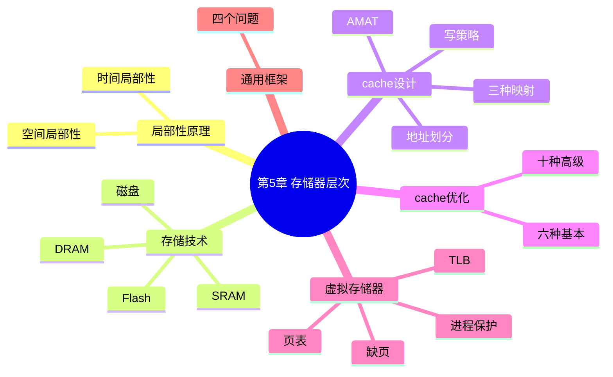

# 第 5 章 大容量和高速度:开发存储器层次结构

> **一句话导读**:CPU 很快,内存很慢(差两个数量级!)——计算机靠"又快又小 + 又慢又大"的金字塔结构让程序感觉"内存既快又大"。本章讲清楚 cache(缓存)和虚拟存储器这两大魔法。
>
> **对应教材**:第 5 章「大容量和高速度:开发存储器层次结构(Large and Fast: Exploiting Memory Hierarchy)」

---

## 一、本章思维导图

```
第5章 存储器层次结构
│
├── 5.1 局部性原理(整个层次结构的基石!)
│   ├── 时间局部性:刚访问的,很可能再访问
│   └── 空间局部性:隔壁的,很可能也要访问
│
├── 5.2 存储器技术四兄弟
│   ├── SRAM:6个晶体管/位,快,贵 → cache
│   ├── DRAM:1晶体管+电容/位,慢,需刷新 → 主存
│   ├── Flash:非易失,擦写寿命有限 → SSD/U盘
│   └── 磁盘:机械转动,最慢最便宜 → 大容量存储
│
├── 5.3 cache 基础
│   ├── 结构:块(block)= 标记(tag)+ 数据 + 有效位
│   ├── 地址划分:标记 | 索引 | 块内偏移
│   ├── 命中(hit)/ 缺失(miss)
│   ├── 三种映射方式:
│   │   ├── 直接映射:每块只有一个位置
│   │   ├── 全相联:任意位置(要全比一遍)
│   │   └── 组相联:N路,折中(最常用)
│   ├── 写策略:写直达(+写缓冲)/ 写回(脏位)
│   │            写分配 / 非写分配
│   ├── AMAT = 命中时间 + 缺失率 × 缺失代价
│   └── 6 种基本优化(块大/cache大/相联度高/多级/
│        读优先/索引免翻译)
│
├── 5.4 cache 的高级优化(10 种,按目标分类)
│   ├── 降命中时间:小而简单、路预测
│   ├── 增带宽:流水线化、多bank、关键字优先
│   ├── 降缺失代价:合并写缓冲、多级cache
│   ├── 降缺失率:编译器优化(循环交换、分块)
│   └── 并行:硬件预取、编译器预取
│
├── 5.5 虚拟存储器 ★
│   ├── 动机:让程序觉得"独享大内存" + 隔离进程
│   ├── 页(page)与页表(page table)
│   ├── 地址转换:虚拟地址 → 物理地址
│   ├── TLB(快表):页表的 cache
│   ├── 缺页(page fault):到磁盘取页,代价巨大
│   └── 保护:每个进程独立页表,非法访问报错
│
├── 5.6 存储器层次的通用框架(四个问题)
│   ├── Q1 块放哪?(映射策略)
│   ├── Q2 如何找到块?(标记+索引)
│   ├── Q3 缺失替换谁?(LRU/随机)
│   └── Q4 写怎么办?(写直达/写回)
│
└── 5.7 谬误与陷阱
    ├── 缺失率低 ≠ 性能好(还要看缺失代价/命中时间)
    ├── cache 越大不一定越快(命中时间变长)
    └── 峰值带宽 ≠ 实际带宽(现实受多因素限制)
```

### Mermaid 版(可渲染)



---

## 二、学习目标

1. 用例子解释时间局部性和空间局部性。
2. 说出 SRAM/DRAM/Flash/磁盘 的特点与用途分工。
3. **会做 cache 地址划分**:给定容量、块大小、相联度,算出标记/索引/偏移位数(必考)。
4. 对比三种映射方式(直接/全相联/组相联)的优缺点。
5. 解释写直达、写回、写分配的含义与搭配。
6. **会算 AMAT**(必考)。
7. 说出 6 种基本优化与 10 种高级优化的分类。
8. 描述虚拟地址到物理地址的转换流程(TLB 命中与缺失)。
9. 解释缺页、TLB、页表的作用。
10. 用"四个问题"框架描述任意一级存储层次。

---

## 三、核心名词先混个脸熟

| 名词 | 一句话 |
|---|---|
| 局部性(locality) | 程序访问数据的规律性(时间上/空间上) |
| 块(block) | cache 与主存之间传输的最小单位 |
| 标记(tag) | 记录"这块装的是主存哪一块"的信息 |
| 索引(index) | 地址中决定"去哪个 cache 位置找"的字段 |
| 有效位(valid bit) | 标记该 cache 块是否有有效数据 |
| 命中/缺失(hit/miss) | 要的数据在/不在 cache 里 |
| 缺失率(miss rate) | 缺失次数 ÷ 访问次数 |
| 直接映射(direct mapped) | 每块主存块只有一个 cache 位置可放 |
| 全相联(fully associative) | 主存块可放任意 cache 位置 |
| 组相联(set associative) | 折中:N 路,每组 N 个位置 |
| 写直达(write-through) | 写 cache 时同时写主存 |
| 写回(write-back) | 只写 cache,替换出去时才写主存(脏位) |
| 写分配(write allocate) | 写缺失时先把块取进 cache |
| AMAT | 平均访存时间 = 命中时间 + 缺失率 × 缺失代价 |
| LRU | 最近最少使用替换策略 |
| 页(page) | 虚拟存储中固定大小的块(典型 4KB) |
| 页表(page table) | 虚拟页号 → 物理页号 的映射表 |
| TLB | 页表的 cache(快表) |
| 缺页(page fault) | 页不在主存,要去磁盘取 |
| 脏位(dirty bit) | 标记块是否被改过(写回用) |
| 预取(prefetching) | 提前把可能要用的块取来 |

---

## 四、分节精讲

### 5.1 局部性原理:一切的前提

- **时间局部性(temporal locality)**:刚访问过的数据,很快很可能再次访问(循环里的变量、函数调用)。
- **空间局部性(spatial locality)**:访问一个数据后,它**附近**的数据很可能也要访问(数组顺序遍历、顺序执行的指令)。
- 层次结构能成功,正是因为程序有局部性:把"最近常用的一小片"放在高层,大部分访问就命中了(八大思想第 7 条)。
- 💡 大白话:像学生写作业——桌面(cache)上只放当前要用的几本书,大部分书在书架(内存),更不常用的在图书馆(磁盘)。写作业时 90% 的时间都在桌面拿书。

### 5.2 存储器技术:四种材料,四种分工

| 技术 | 每 bit 电路 | 速度 | 价格 | 易失性 | 用途 |
|---|---|---|---|---|---|
| SRAM | 6 个晶体管 | 最快 | 最贵 | 易失 | cache |
| DRAM | 1 晶体管+1 电容 | 慢 | 便宜 | 易失(需刷新) | 主存 |
| Flash | 浮栅管 | 较慢 | 较便宜 | **非易失** | SSD、U 盘 |
| 磁盘 | 机械盘片 | 最慢 | 最便宜 | 非易失 | 大容量备份 |

- ❓ 为什么 cache 用 SRAM 而主存用 DRAM?SRAM 快但太贵,只能小容量;DRAM 密度高、便宜,可做大容量。**快和便宜不可兼得 → 分层**。
- ⚠️ 易错点:DRAM 的电容会漏电,**必须周期性刷新(refresh)**;Flash 擦写次数有限(约 10 万次),会"磨损"。

### 5.3 cache 基础

#### 5.3.1 结构与地址划分

cache 按**块(block,也叫行 line)**组织,一块通常 16~64 字节。主存也按同样大小的块划分。要访问某地址:

```
32位地址 = [标记 tag] [索引 index] [块内偏移 offset]
```

- **索引**决定"去 cache 的哪个位置找";
- **标记**验证"这个位置放的是不是我要的那一块";
- **偏移**定位块内第几个字节。

**计算示例(必会)**:
> 32 位地址,64KB 直接映射 cache,块大小 16 字节。
> 块数 = 64KB ÷ 16B = 4096 = 2¹² → **索引 12 位**;
> **偏移 = log₂16 = 4 位**;**标记 = 32 − 12 − 4 = 16 位**。

#### 5.3.2 三种映射方式(必考对比)

| 方式 | 规则 | 硬件 | 缺失率 | 查找 |
|---|---|---|---|---|
| 直接映射 | 主存块 i 只能放 cache 的 (i mod 块数) 号位 | 最简单 | 最高(冲突多) | 只查 1 个位置 |
| 全相联 | 任意位置 | 最复杂(全比较) | 最低 | 同时比所有标记 |
| **N 路组相联** | 每组 N 个位置,块 i 放 (i mod 组数) 组内任一路 | 折中 | 折中 | 组内比 N 个 |

- 💡 大白话:直接映射=每本书有**固定书架格**;全相联=书能放**任何一格**(找起来要把所有格看一遍);组相联=每本书固定到某一**排**,排内 N 格随便放——现实中主流的折中方案。
- 替换策略:直接映射没得选;组相联/全相联用 **LRU(最近最少使用)** 或随机。

#### 5.3.3 写策略(常考)

- **写直达(write-through)**:每次写 cache **同时写主存**。优点:简单、数据一致;缺点:写很慢 → 配一个**写缓冲(write buffer)**:先丢进缓冲,CPU 继续跑,缓冲慢慢写主存。
- **写回(write-back)**:只写 cache,给块标**脏位(dirty bit)**;该块被替换出去时才写回主存。优点:减少写主存次数;缺点:实现复杂、断电丢数据。
- **写缺失时**:把块取进 cache 再写 = **写分配(write allocate)**;直接写主存不取块 = **非写分配**。常见搭配:**写回 + 写分配**(利用局部性),写直达 + 非写分配(简单)。

#### 5.3.4 性能:AMAT 公式(必考)

```
AMAT = 命中时间 + 缺失率 × 缺失代价
(Average Memory Access Time,平均访存时间)
```

- 例:命中时间 1ns,缺失率 5%,缺失代价 100ns → AMAT = 1 + 0.05×100 = **6ns**。
- 减小缺失率的收益 = 减少的缺失次数 × 缺失代价;优化命中时间则**每次访问**都受益——两条路径要权衡。
- 带多级 cache 的扩展(了解):AMAT = T₁ + 缺失率₁ × (T₂ + 缺失率₂ × 主存代价)。

#### 5.3.5 六种基本优化(记住"动什么参数、换什么代价")

1. **增大块** → 降缺失率(空间局部性);块过大 → 缺失代价上升、块数变少冲突变多。
2. **增大 cache** → 降缺失率;但命中时间变长、成本变高。
3. **提高相联度** → 降缺失率;命中时间变长、硬件变贵。
4. **多级 cache** → 降低"缺失代价"(一级小快,二级大兜底)。
5. **读缺失优先于写** → 写缓冲满时,读别等写。
6. **索引 cache 时避免地址翻译**(如用虚拟地址的低位直接索引,高位做标记)→ 降命中时间。

### 5.4 cache 的十种高级优化(按目标分类记忆)

| 目标 | 优化 | 说明 |
|---|---|---|
| 缩短命中时间 | ① 小而简单的 cache | 一级 cache 要小,否则比二级还慢 |
| | ② 路预测(way prediction) | 猜是组内哪一路,先读出来再说 |
| 增加带宽 | ③ 流水线化 cache 访问 | 访问拆多级,提高吞吐 |
| | ④ 多 bank cache | 组/块分散到多个存储体,并行读 |
| | ⑤ 关键字优先 | 先送出要的那个字,其余后补 |
| 降低缺失代价 | ⑥ 合并写缓冲 | 缓冲里相邻的写合并成一次 |
| | ⑦ 多级 cache | 见上 |
| 降低缺失率 | ⑧ 编译器优化 | 循环交换(按行访问)、分块(blocking) |
| 并行 | ⑨ 硬件预取 | 猜测访问模式提前取块 |
| | ⑩ 编译器预取 | 编译器插入预取指令 |

💡 大白话:**分块(blocking)**优化——矩阵乘法按"一小块一小块"算,让小块数据常驻 cache,是编译器优化的经典例子,理解它就知道"为什么写代码的顺序影响速度"。

### 5.5 虚拟存储器 ★

#### 5.5.1 动机

1. 让程序以为**独享一个巨大的地址空间**(虚拟地址空间);
2. **保护**:每个进程有自己的地址空间,互相看不到、踩不到;
3. 让主存成为磁盘的"cache"(程序可以比内存大)。

#### 5.5.2 机制:页与页表

- 内存按固定大小的**页(page,典型 4KB)**划分,磁盘上的程序也按页存放。
- **页表(page table)** 记录:虚拟页号 → 物理页号(或"不在主存")。页表存在**主存**里,每个进程一份。
- **地址转换**:

```
虚拟地址 = [虚拟页号] [页内偏移]
   ↓ 查页表
物理地址 = [物理页号] [页内偏移](偏移不变!)
```

- ⚠️ 易错点:页内偏移在转换中**保持不变**,只有页号被替换。
- **缺页(page fault)**:要访问的页不在主存(要去磁盘取)→ 触发异常,OS 从磁盘换入该页(代价 = 数百万周期!所以缺页要极少发生,靠大页 + 好的替换策略)。
- **保护**:页表项带访问权限位(读/写/执行),非法访问(如写只读页)触发异常;每个进程独立页表,天然隔离。
- 虚拟存储的写策略用**写回**(脏位标记改过的页,换出时写回磁盘);另加**引用位(use bit)** 帮助 LRU 替换。

#### 5.5.3 TLB(快表):页表的 cache

- 每次访存都查页表 = 每次访存多一次主存访问,太慢!→ 给页表配一个小 cache,叫 **TLB(Translation Lookaside Buffer)**。
- TLB 里存"最近用过的"页表项(虚拟页号 → 物理页号),典型 16~512 项,全相联或组相联。
- **访存完整流程(必背)**:

```
CPU 给出虚拟地址
   ↓
① 查 TLB(同时用索引字段查 cache)
   ├─ TLB 命中 → 得到物理地址 → 访问 cache
   └─ TLB 缺失 → 查内存页表(可能缺页 → OS 处理)
        → 换入 TLB,再重试
```

- ❓ TLB 缺失和缺页有什么区别?TLB 缺失只是"页表项不在快表里"(去内存查页表,几~几十周期);**缺页**是"页根本不在内存里"(去磁盘取,几百万周期)。层级不同,别混。
- ⚠️ 易错点:TLB 是"**页表条目的 cache**",cache 是"**数据的 cache**",两者作用对象不同,可以同时存在、同时工作。

### 5.6 通用框架:存储器层次的四个问题(简答万能框架)

任何一级层次结构(寄存器↔cache、cache↔主存、主存↔磁盘)都回答四个问题:

| 问题 | 常见答案 |
|---|---|
| Q1 块放在哪? | 直接映射 / 全相联 / 组相联 |
| Q2 如何找到块? | 索引定位 + 标记比对(虚拟存储:页表;TLB:专用硬件) |
| Q3 缺失时替换哪块? | LRU / 随机(直接映射没得选) |
| Q4 写如何处理? | 写直达 / 写回(主存↔磁盘几乎总用写回) |

📌 考点提示:用这四问描述"cache"或"虚拟存储器"是经典简答题,套框架即可拿满分。

### 5.7 谬误与陷阱

1. **陷阱:缺失率低 ≠ 性能好。** 还要看缺失代价和命中时间——AMAT 才是综合指标;小 cache 缺失率虽高但命中时间短,可能比大 cache 更快。
2. **陷阱:cache 越大越好。** 大 cache 命中时间变长、功耗变大,一级 cache 尤其要小。
3. **陷阱:用峰值带宽宣传存储器性能。** 实际带宽受访问模式、bank 冲突、刷新等影响,远低于峰值。
4. **陷阱:磁盘"寻道时间"被忽略。** 顺序访问与随机访问磁盘速度差两个数量级,评估磁盘性能必须算上寻道。

---

## 五、名词解释汇总表

| 名词 | 英文 | 解释 |
|---|---|---|
| 时间局部性 | temporal locality | 访问过的数据近期会再访问 |
| 空间局部性 | spatial locality | 数据附近的数据近期会访问 |
| SRAM | Static RAM | 6 管/位,快而贵,用作 cache |
| DRAM | Dynamic RAM | 1 管 1 容/位,慢而便宜,需刷新,用作主存 |
| 块/行 | block / line | cache 与主存交换的最小单位 |
| 标记 | tag | 标识 cache 块对应哪个主存块 |
| 索引 | index | 定位 cache 位置的地址字段 |
| 有效位 | valid bit | 该块数据是否有效 |
| 命中率/缺失率 | hit/miss rate | 命中(缺失)访问占全部访问的比例 |
| 命中时间 | hit time | 命中时访问 cache 的时间 |
| 缺失代价 | miss penalty | 缺失后从下一级取块的时间 |
| 直接映射 | direct mapped | 每主存块只有一个 cache 位置 |
| 全相联 | fully associative | 主存块可放任意位置 |
| 组相联 | set associative | 每组 N 路,折中方案 |
| 写直达 | write-through | 写 cache 同步写主存 |
| 写缓冲 | write buffer | 暂存待写主存数据的队列 |
| 写回 | write-back | 仅写 cache,替换时写回 |
| 脏位 | dirty bit | 标记块被修改过 |
| LRU | Least Recently Used | 替换最久未用的块 |
| AMAT | Average Memory Access Time | 平均访存时间指标 |
| 页 | page | 虚拟存储的固定大小块(4KB) |
| 页表 | page table | 虚拟页号→物理页号映射 |
| 缺页 | page fault | 页不在主存,需从磁盘取 |
| TLB | Translation Lookaside Buffer | 页表项的 cache(快表) |
| 引用位 | use/reference bit | 帮助 LRU 替换的标记 |
| 预取 | prefetching | 提前取入可能用到的块 |
| 分块 | blocking | 编译器/程序员的 cache 优化技术 |

---

## 六、公式速查

| 公式 | 说明 |
|---|---|
| 块数 = cache 容量 ÷ 块大小 | 直接映射设计 |
| 索引位数 = log₂(块数 / 组数) | 组相联除以路数 |
| 偏移位数 = log₂(块大小) | 字节单位 |
| 标记位数 = 地址位 − 索引位 − 偏移位 | 地址划分 |
| **AMAT = 命中时间 + 缺失率 × 缺失代价** | 核心公式 |
| cache 总存储 = 块数 × (数据 + 标记 + 有效位 + 脏位) | 求 cache 实际面积 |
| 多级:AMAT = T₁ + 缺₁ × (T₂ + 缺₂ × T₃) | 两级扩展 |

---

## 七、易混淆概念对比

| 对比 | 区别一句话 |
|---|---|
| 时间局部性 vs 空间局部性 | 同一数据再次访问 vs 邻近数据随后访问 |
| SRAM vs DRAM | 6 管快而贵 vs 1 管 1 容慢而便宜(要刷新) |
| cache vs 主存 | 小而快(SRAM)vs 大而慢(DRAM),cache 是主存的缓存 |
| 直接映射 vs 组相联 | 1 路 vs N 路;冲突多 vs 折中 |
| 写直达 vs 写回 | 每次写都更新主存 vs 替换时才写回(配脏位) |
| 写分配 vs 非写分配 | 写缺失先取块 vs 直接写主存 |
| TLB vs 页表 | 页表条目的 cache vs 完整映射表(在主存) |
| TLB 缺失 vs 缺页 | 快表没条目(查页表,快)vs 页不在主存(读磁盘,极慢) |
| 虚拟地址 vs 物理地址 | 程序眼中的地址 vs 真实内存地址 |
| 页 vs 块 | 虚拟存储的传输单位 vs cache 的传输单位 |
| 命中时间 vs 缺失代价 | 每次命中都付 vs 缺失才付 |
| 缺失率 vs 缺失次数 | 比例 vs 绝对次数(优化收益看后者) |

---

## 八、自测题

1. (概念)举例说明时间局部性和空间局部性。
2. (计算)32 位地址,直接映射 cache 容量 32KB,块大小 16 字节。求:块数、索引位数、偏移位数、标记位数。
3. (计算)64KB 直接映射 cache、块 16B 的 cache,除数据外还要存多少标记+有效位?(给出总 bit 数)
4. (计算)命中时间 2ns,缺失率 10%,缺失代价 200ns,求 AMAT。若把缺失率降到 5%,收益多少?
5. (简答)三种映射方式各有什么优缺点?现实中为什么常用组相联?
6. (简答)写直达和写回的区别?各配什么机制?各有什么利弊?
7. (简答)描述一次访存的完整流程:虚拟地址 → … → 数据(考虑 TLB 和 cache)。
8. (简答)TLB 缺失和缺页有什么区别?
9. (简答)什么是脏位?它在写回策略中的作用?
10. (简答)用"四个问题"框架描述 cache 这一级。
11. (计算)程序访问 1000 次,960 次命中,求缺失率;若每次缺失代价 50ns,总缺失代价占多少时间?

### 参考答案

1. 时间局部性:循环变量 i 每轮都要读;空间局部性:顺序遍历数组 A[0]、A[1]、A[2]…,访问 A[i] 后接着访问 A[i+1]。
2. 块数 = 32KB/16B = 2048 = 2¹¹ → 索引 11 位;偏移 = log₂16 = 4 位;标记 = 32−11−4 = 17 位。
3. 块数 = 64KB/16B = 4096;每块:标记 16 位 + 有效位 1 位 = 17 位 → 总 = 4096×17 = 69632 bit ≈ 8.5KB(数据本身 64KB)。
4. AMAT = 2 + 0.10×200 = 22ns;降到 5%:AMAT = 2 + 0.05×200 = 12ns,收益 10ns(收益 = 减少的缺失率 × 缺失代价)。
5. 直接映射:硬件最简单、命中时间短,但冲突缺失多;全相联:缺失率最低,但要同时比所有标记,硬件最贵;组相联折中:缺失率接近全相联、硬件接近直接映射,是性价比之王。
6. 写直达:每次写都更新主存,简单一致,但写流量大 → 用写缓冲吸收;写回:只写 cache 并标脏位,替换时才写主存,写次数少但实现复杂、需处理一致性。
7. CPU 给虚拟地址 → 查 TLB(命中得物理页号;缺失查页表,若缺页由 OS 从磁盘调入并更新页表/TLB)→ 物理地址 → 查 cache(命中取数;缺失从主存取块换入)→ 数据送达。
8. TLB 缺失:快表里没有该页表项 → 去主存查页表,几到几十周期;缺页:页根本不在主存 → 去磁盘读,数百万周期,由 OS 处理。
9. 脏位标记"该块自装入后被写过"。写回策略中:替换时若脏位=1,必须先写回下一级;若干净(没改过)直接丢弃即可,省一次写。
10. Q1:直接映射/组相联/全相联;Q2:索引定位 + 标记比对;Q3:LRU 或随机(直接映射无需选择);Q4:写直达或写回。
11. 缺失率 = 40/1000 = 4%;总缺失代价 = 40 × 50ns = 2000ns。

---

## 九、本章小结

- **局部性是因,层次结构是果**:时间+空间局部性让"小 cache + 大主存"的组合接近"又快又大"的理想。
- **cache 三件套**:地址划分(标记/索引/偏移)、三种映射、两种写策略——合起来就能设计一个 cache。
- **AMAT 是评价一切 cache 优化的尺子**。
- **虚拟存储器 = 把主存当磁盘的 cache**:页表做映射、TLB 加速、缺页兜底、顺带实现进程隔离。

**下一章** → [06-第6章-并行处理器.md](06-第6章-并行处理器.md):多核时代,性能从哪里来?
