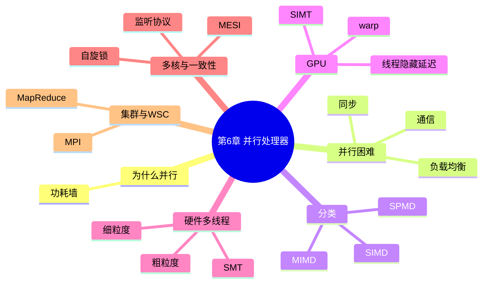

# 第 6 章 从客户端到云的并行处理器

> **一句话导读**:单核已经到极限(功耗墙),计算机进入"人多力量大"时代。这一章讲清楚:为什么并行能加速、为什么并行有天花板(Amdahl 定律)、多核/GPU/集群各自怎么干活。
>
> **对应教材**:第 6 章「从客户端到云的并行处理器(Parallel Processors from Client to Cloud)」

---

## 一、本章思维导图

```
第6章 并行处理器
│
├── 6.1 为什么走向并行
│   ├── 功耗墙(第1章)+ 单核 ILP 挖尽
│   └── 方向:显式并行(程序自己拆分)
│
├── 6.2 Amdahl 定律 ★(并行的天花板)
│   ├── 加速比 = 1 / [(1−P) + P/N]
│   ├── P = 可并行部分占比,N = 处理器数
│   └── 推论:串行部分决定极限,核再多也白搭
│
├── 6.3 并行编程的三大困难
│   ├── 同步(synchronization):步调要一致
│   ├── 通信(communication):数据要共享
│   └── 负载均衡(load balancing):活要分得匀
│
├── 6.4 并行硬件分类(Flynn)
│   ├── SISD:单指令单数据(传统单核)
│   ├── SIMD:单指令多数据(向量机、GPU)
│   ├── MISD:罕见,基本不存在
│   └── MIMD:多指令多数据(多核)
│       └── SPMD:MIMD 上"同一程序、不同数据"
│
├── 6.5 向量架构与 GPU
│   ├── 向量机:一条指令算一整排数据
│   ├── GPU:SIMT 模型(线程块、warp)
│   ├── GPU 用"海量线程切换"隐藏访存延迟
│   └── GPU vs CPU:核多而简单 vs 核少而强
│
├── 6.6 硬件多线程(在一个核里藏多个线程)
│   ├── 细粒度:每条指令轮换线程
│   ├── 粗粒度:长暂停(访存)时才换
│   └── 同时多线程 SMT:同周期多线程共占发射槽
│
├── 6.7 多核处理器与缓存一致性 ★
│   ├── 共享内存多处理器(UMA)
│   ├── 一致性问题:两个核的 cache 各存一份
│   ├── 监听协议(snooping):总线广播 + 写无效
│   └── MESI 状态:Modified/Exclusive/Shared/Invalid
│   └── 同步:原子操作(ll/sc)+ 自旋锁
│
├── 6.8 集群与仓库级计算机(WSC)
│   ├── 消息传递(message passing)、MPI
│   ├── WSC:海量廉价服务器 + 网络
│   ├── MapReduce:映射 + 归约
│   └── 关键指标:每瓦性能、PUE
│
└── 6.9 谬误与陷阱
    ├── 忽略 Amdahl 定律的串行瓶颈
    ├── 峰值性能 ≠ 实际性能(通信开销!)
    └── 并行提升的是吞吐率,不是单任务响应时间
```

### Mermaid 版(可渲染)



---

## 二、学习目标

1. 解释为什么计算机行业从单核转向多核。
2. **会算 Amdahl 定律**:给定可并行比例和核数,求加速比与极限(必考)。
3. 说出并行编程的三大困难。
4. 解释 Flynn 分类(SISD/SIMD/MIMD)与 SPMD 的关系。
5. 解释 GPU 与 CPU 的架构差异,以及 GPU 如何隐藏访存延迟。
6. 对比三种硬件多线程(细粒度/粗粒度/SMT)。
7. 解释缓存一致性问题,描述监听协议和 MESI 状态。
8. 解释为什么需要原子操作和自旋锁。
9. 对比共享内存(多核)与消息传递(集群)两种并行方式。
10. 说出 MapReduce 的基本思想。

---

## 三、核心名词先混个脸熟

| 名词 | 一句话 |
|---|---|
| 显式并行 | 程序(人/编译器)自己拆分的并行 |
| Amdahl 定律 | 串行部分决定并行加速上限的定律 |
| 同步(synchronization) | 让各线程步调一致(锁等) |
| 负载均衡(load balance) | 把工作量均分给各处理器 |
| SIMD | 一条指令同时算多个数据 |
| MIMD | 多个处理器各跑各的指令流 |
| SPMD | 同一程序、不同数据(编程模型) |
| SIMT | GPU 的"单指令多线程"执行模型 |
| warp | GPU 中一起执行的一组线程(32 个) |
| 线程块(thread block) | GPU 调度的基本单元 |
| 硬件多线程 | 一个核同时保存多个线程的现场 |
| SMT | 同时多线程:同周期发射多线程的指令 |
| 共享内存多处理器 | 多核共享同一地址空间 |
| 缓存一致性(cache coherence) | 保证各核看到一致的共享数据 |
| 监听协议(snooping) | 通过总线监听维护一致性 |
| 写无效(write invalidate) | 某核写块时让其他核的副本失效 |
| MESI | 缓存块的四种状态协议 |
| 原子操作(atomic) | 不可被中途打断的操作(第2章 ll/sc) |
| 自旋锁(spin lock) | 反复检查锁变量直到拿到的锁 |
| 消息传递(message passing) | 并行单元靠收发消息通信 |
| MPI | 消息传递编程接口标准 |
| 仓库级计算机(WSC) | 数据中心规模的计算机 |
| MapReduce | "映射+归约"的大数据编程模型 |
| PUE | 数据中心电源使用效率指标 |

---

## 四、分节精讲

### 6.1 为什么走向并行

- 第 1 章的**功耗墙**断了"提高主频"的路;第 4 章的**指令级并行(ILP)** 已接近挖尽(单核内能并行的指令就那么多)。
- 于是行业转向:**在一个芯片里放多个核(multicore)**,靠**显式并行**(程序把任务拆给多个核)提升性能。
- 代价:并行编程难得多——程序员/编译器要自己管理任务的拆分与协作。

### 6.2 Amdahl 定律 ★:并行的天花板

**公式(必背):**

```
加速比 = 1 / [(1 − P) + P/N]
P = 可并行的部分所占比例
N = 处理器(核)数量
```

- **极限**:N → ∞ 时,加速比 → **1/(1−P)**。串行部分 1−P 是永远的天花板!
- 例(必会):程序 60% 可并行(P=0.6):
  - 4 核:1/(0.4 + 0.6/4) = 1/0.55 ≈ **1.82 倍**
  - 8 核:1/(0.4 + 0.6/8) = 1/0.475 ≈ **2.11 倍**
  - 无穷核:1/0.4 = **2.5 倍**——100 核也只有 2.5 倍,其余全浪费!
- 💡 大白话:10 个人搬 100 箱货,其中 40 箱必须"一个人签收"(串行),剩下 60 箱随便分。哪怕雇 1000 个人,签收那 40 箱的时间省不掉,总时间最多缩短到 2.5 倍。
- ⚠️ 易错点:P 是**可并行部分的时间占比**,不是"代码行数占比"。加速比按**时间**算。

### 6.3 并行编程的三大困难

1. **同步(synchronization)**:线程间要"对齐节奏"(如生产消费、临界区互斥)→ 锁、屏障。同步开销大,且易死锁。
2. **通信(communication)**:线程间要交换数据 → 通信延迟远大于计算,分布式系统里更是数量级之差。
3. **负载均衡(load balancing)**:任务分不匀,快的核干等慢的核(木桶效应)。

### 6.4 并行硬件分类:Flynn 分类法

| 类别 | 全称 | 说明 | 例子 |
|---|---|---|---|
| SISD | 单指令流单数据流 | 传统串行单核 | 老式 CPU |
| SIMD | 单指令流多数据流 | 一条指令同时算一排数据 | 向量机、GPU、SSE |
| MISD | 多指令流单数据流 | 罕见,基本无实例 | — |
| MIMD | 多指令流多数据流 | 各处理器跑各自的指令 | 多核、集群 |

- **SPMD(Single Program Multiple Data)**:一种**编程模型**——所有处理器跑**同一份程序**,但各自处理**不同的数据**(如各自处理数组的一段)。它通常跑在 MIMD 硬件上,却写出 SIMD 的效果。
- ⚠️ 易错点:SIMD/MIMD 是**硬件分类**;SPMD 是**编程模型**,不是硬件类别。选择题常挖坑。

### 6.5 向量架构与 GPU

#### 6.5.1 向量机(传统 SIMD)

- 用**向量寄存器**一次装一排数据(如 64 个双精度数),一条向量指令把整排一次算完。
- 优点:取指/译码开销摊薄到几十个数据上;访存模式规整(整块连续读)。
- 现代 CPU 的 **SSE/AVX** 就是"寄存器内的 SIMD"(呼应第 3 章子字并行)。

#### 6.5.2 GPU:数据并行的王者 ★

- **用途**:图形渲染 = 海量像素的**同一种运算** → 天然数据并行。后扩展到通用计算(GPGPU,如 CUDA)。
- **执行模型 SIMT(单指令多线程)**:程序员写一个**核函数(kernel)**,交给成千上万个**线程**跑,每个线程处理不同数据。硬件把相邻线程打包成 **warp(32 个线程一组)**,一组一组地"同一条指令、不同数据"执行——像 SIMD,但程序员看到的是线程。
- **调度**:GPU 把计算组织成**线程块(thread block)**,块分到各个流多处理器上执行。
- **GPU 如何隐藏访存延迟?** GPU 核不做大 cache、不搞乱序执行,而是**靠海量线程**:一个 warp 等内存时,硬件瞬间切换到另一个 warp 继续算——**用"换线程"代替"等"**。
- 💡 大白话:CPU 像少数几个"高手厨子"(大 cache、乱序执行,擅长应对复杂多变的菜);GPU 像几千个"切菜工",每人只会一刀切,但架不住人多——一个工人去拿菜的工夫,立刻换下一个工人切。

#### 6.5.3 GPU vs CPU(常考对比)

| | CPU | GPU |
|---|---|---|
| 核数 | 少(几个~几十) | 多(几千) |
| 单核能力 | 强(乱序、大 cache、高主频) | 弱(简单、顺序) |
| 擅长 | 复杂控制流、任务并行 | 海量数据并行 |
| 隐藏延迟 | cache + 乱序执行 | 海量线程切换 |

### 6.6 硬件多线程:一个核里"分身"

一个核同时保存**多个线程的现场**(PC、寄存器),遇到暂停立刻换线程干:

| 方式 | 切换时机 | 特点 |
|---|---|---|
| 细粒度(fine-grained) | **每条指令**之间轮换 | 能隐藏所有短暂停(如访存),但可能拖慢单线程 |
| 粗粒度(coarse-grained) | 只在**长暂停**(如二级 cache 缺失)时切换 | 切换开销大(要排空流水线),但平时不打扰 |
| 同时多线程(SMT) | **同一周期内**多个线程的指令混着发射 | 充分利用超标量的空槽,利用率最高 |

- 价值:**隐藏访存/分支的暂停**,把流水线的空槽填满——用"别人的活"填"我的等待"。
- 现实:Intel 的**超线程(Hyper-Threading)** 就是双线程 SMT。

### 6.7 多核处理器与缓存一致性 ★

#### 6.7.1 共享内存多处理器

- 多个核共享**同一个物理地址空间**(共享内存,UMA:统一内存访问),通过读写共享变量协作。
- 每个核有自己的私有 cache → **缓存一致性问题(cache coherence)**:核 A 改了共享变量 x(在自己的 cache 里),核 B 的 cache 里还存着 x 的旧值 → 两个核看到的世界不一致!

#### 6.7.2 监听协议(snooping)与写无效

- **监听协议**:所有核通过**总线/广播网络**互相监听对方的访存行为;某核要写一个块时,广播通知,其他核把该块的副本**作废(写无效, write invalidate)**;之后谁再读,发现无效就从"最新拥有者"那里取。
- **MESI 协议**(最经典,四个状态):

| 状态 | 含义 |
|---|---|
| M(Modified,已修改) | 本 cache 有**最新且独占**的副本,和主存不一致 |
| E(Exclusive,独占) | 本 cache 独占,但和主存一致 |
| S(Shared,共享) | 多个 cache 都有副本,都和主存一致 |
| I(Invalid,无效) | 本副本作废,不可用 |

- 💡 大白话:图书馆一本书(memory 里的数据)被借给一个学生,他做了批注(Modified)——其他学生再借,必须先拿他那份"带批注的"复印(从 Modified 者取),他手里的旧复印件就作废(Invalid)。

#### 6.7.3 同步:原子操作与自旋锁

- 多核同步的基础是**原子操作**(第 2 章的 ll/sc):保证"读-改-写"不被打断。
- **自旋锁(spin lock)**:共享变量 lock=0 表示空闲。拿锁:`ll` 读 lock;是 0 就 `sc` 写 1,成功则进临界区;失败或被占就**原地打转(自旋)**重试。用完写回 0 释放。
- ⚠️ 陷阱:自旋锁在"争用激烈"时会浪费大量总线带宽;且锁设计不好会**死锁**。

### 6.8 集群与仓库级计算机(WSC):并行到云端

- **集群(cluster)**:通过网络把大量独立计算机(节点)连起来协同工作。节点间**没有共享内存**,靠**消息传递(message passing)** 通信,编程标准是 **MPI**。
- **仓库级计算机(Warehouse Scale Computer)**:数据中心规模的"一台计算机"——数万台廉价服务器 + 交换机 + 存储,追求**每瓦性能**(能耗是钱!)和**PUE**(电源使用效率,总耗电/IT设备耗电,越接近 1 越好)。
- **MapReduce(大数据编程模型)**:把大规模数据处理拆成两步:
  1. **Map(映射)**:每台机器对本地数据做同一处理,产出"键-值"对;
  2. **Reduce(归约)**:把相同键的值汇总。
  - 例子:数单词——Map 阶段每台机器数自己文件的单词,Reduce 阶段把同一个单词的计数加总。
- 💡 大白话:MapReduce 像"全校统计运动服尺码":每个班主任(Map)统计本班的尺码表,教务处(Reduce)把各班同尺码的人数加起来。

### 6.9 谬误与陷阱

1. **陷阱:忽略 Amdahl 定律。** 只盯着"可并行部分"堆核数,串行 10% 的程序上限就是 10 倍,再多核都是摆设。
2. **谬误:峰值性能等于实际性能。** 通信、同步、负载不均让实际加速远低于"核数×单核峰值"。
3. **陷阱:用"每秒浮点运算峰值"比机器。** 达到峰值需要极端规整的访问模式,真实程序远达不到。
4. **陷阱:并行提升的是吞吐率,不是单任务的响应时间。** 100 个任务分给 100 核很快,但"一个任务"可能根本拆不开——单任务延迟不降反升(通信开销)。

---

## 五、名词解释汇总表

| 名词 | 英文 | 解释 |
|---|---|---|
| Amdahl 定律 | Amdahl's Law | 加速比上限 = 1/(1−P) |
| 显式并行 | explicit parallelism | 由程序员/编译器拆分的并行 |
| Flynn 分类 | Flynn's taxonomy | 按指令流/数据流把计算机分 SISD/SIMD/MISD/MIMD |
| SIMD | Single Instruction, Multiple Data | 一条指令算多个数据 |
| MIMD | Multiple Instruction, Multiple Data | 各处理器独立执行 |
| SPMD | Single Program, Multiple Data | 同程序、异数据的编程模型 |
| SIMT | Single Instruction, Multiple Threads | GPU 的执行模型 |
| warp | — | GPU 中同步执行的一组线程(32) |
| 线程块 | thread block | GPU 调度单位 |
| 硬件多线程 | hardware multithreading | 一个核同时保存多线程现场 |
| 同时多线程 | SMT | 同周期发射多线程指令 |
| 共享内存多处理器 | shared-memory multiprocessor | 多核共享一个地址空间 |
| 缓存一致性 | cache coherence | 各核看到的共享数据保持一致 |
| 监听协议 | snooping protocol | 总线监听 + 写无效 |
| MESI | — | Modified/Exclusive/Shared/Invalid 状态协议 |
| 原子操作 | atomic operation | 不可中断的读改写(ll/sc) |
| 自旋锁 | spin lock | 反复尝试直到拿到锁 |
| 消息传递 | message passing | 靠收发消息协作(集群) |
| MPI | Message Passing Interface | 消息传递编程标准 |
| 仓库级计算机 | WSC | 数据中心级计算机 |
| MapReduce | — | 映射+归约的分布式编程模型 |
| PUE | Power Usage Effectiveness | 数据中心总耗电 ÷ IT 设备耗电 |

---

## 六、公式速查

| 公式 | 说明 |
|---|---|
| **加速比 = 1 / [(1−P) + P/N]** | Amdahl 定律 |
| 加速比极限 = 1 / (1−P)(N→∞) | 串行天花板 |
| P = 可并行部分时间 ÷ 总时间 | P 的定义 |
| 实际性能 ≤ min(峰值, Amdahl 上限) | 综合约束 |

---

## 七、易混淆概念对比

| 对比 | 区别一句话 |
|---|---|
| SIMD vs MIMD | 硬件分类:一条指令算多数据 vs 多处理器各干各的 |
| SPMD vs SIMD | 编程模型(程序层面)vs 硬件类别 |
| SIMT vs SIMD | GPU 的线程视角 vs 传统向量机视角 |
| 多核 vs GPU | 核少而强(任务并行)vs 核多而弱(数据并行) |
| 细粒度 vs 粗粒度多线程 | 每条指令轮换 vs 长暂停才换 |
| SMT vs 粗粒度多线程 | 同周期并行发射 vs 暂停时整核切换 |
| 共享内存 vs 消息传递 | 多核(同一地址空间)vs 集群(收发消息) |
| 缓存一致性 vs 缓存缺失 | 多核间副本一致 vs 单核内没命中 |
| TLB vs MESI | 地址翻译的 cache vs 一致性的状态协议 |
| 原子操作 vs 自旋锁 | 硬件提供的不可打断操作 vs 用原子操作实现的软件锁 |
| 加速比 vs 吞吐率 | 单任务提速倍数 vs 单位时间任务数 |
| 响应时间 vs 加速比 | 绝对时间 vs 相对倍数 |

---

## 八、自测题

1. (计算)程序 75% 可并行。求 4 核、16 核的加速比,以及核数无限时的极限。
2. (概念)Amdahl 定律的核心结论是什么?为什么它是"并行的天花板"?
3. (简答)并行编程有哪三大困难?各举一例。
4. (简答)用 Flynn 分类法说明 SISD、SIMD、MIMD,并说明 SPMD 属于哪一类。
5. (简答)GPU 和 CPU 的架构差异?GPU 靠什么隐藏访存延迟?
6. (简答)三种硬件多线程(细粒度/粗粒度/SMT)的切换时机有何不同?
7. (简答)什么是缓存一致性问题?监听协议如何解决?写无效是什么意思?
8. (简答)MESI 四个状态各表示什么?
9. (简答)什么是自旋锁?它依赖什么硬件特性?
10. (简答)多核(共享内存)与集群(消息传递)的本质区别?
11. (简答)MapReduce 的两个阶段各做什么?举一个例子。
12. (概念)为什么"峰值性能"不等于实际性能?

### 参考答案

1. 4 核:1/(0.25 + 0.75/4) = 1/0.4375 ≈ 2.29 倍;16 核:1/(0.25 + 0.75/16) = 1/0.2969 ≈ 3.37 倍;极限:1/0.25 = 4 倍。
2. 加速比 = 1/[(1−P)+P/N];串行部分 1−P 无法被核数消除,N→∞ 时上限为 1/(1−P)。串行 1%,上限就是 100 倍——再堆核也突破不了。
3. 同步:线程要互相等(锁/屏障,易死锁);通信:共享/传输数据有延迟(分布式下更甚);负载均衡:任务分不匀,快的等慢的。
4. SISD:单指令单数据(传统串行);SIMD:单指令多数据(向量机/GPU);MIMD:多指令多数据(多核)。SPMD 是**编程模型**(同程序异数据),不是硬件类别,通常跑在 MIMD 硬件上。
5. CPU:核少而强(乱序执行、大 cache、高主频),擅长复杂控制流;GPU:几千个简单核,擅长海量数据并行。GPU 靠**海量线程切换**隐藏访存延迟——一个 warp 等内存就换另一个 warp 上,不用大 cache 和乱序。
6. 细粒度:每条指令之间轮换(隐藏短暂停);粗粒度:仅在长暂停(如 L2 缺失)时切换(切换代价大);SMT:同一周期内多个线程的指令同时发射,填满超标量空槽。
7. 问题:各核私有 cache 存了同一共享数据的副本,一个核改了自己副本,其他核读旧值。监听协议:写时广播,其他核把该块的副本作废(写无效);之后谁读谁从最新处取。
8. M:本副本最新且独占(与主存不一致);E:独占且与主存一致;S:多副本、与主存一致;I:副本已作废。
9. 自旋锁:用共享变量标记锁状态,拿不到锁就原地循环重试。依赖**原子操作**(ll/sc 或等价物)保证"检查并置位"不被别的核插进来。
10. 多核共享同一物理内存(共享地址空间),通过共享变量协作,要解决一致性;集群节点各自有内存,靠网络消息传递(MPI)协作,天然无一致性问题但有通信延迟。
11. Map:各机器对本地数据做同样处理产出键值对(如各数各的文件里的单词);Reduce:按键汇总(如同单词计数相加)。
12. 峰值假设所有部件满负荷、数据规整;实际受 Amdahl 串行部分、通信/同步开销、负载不均、访存延迟限制,远达不到峰值。

---

## 九、本章小结

- **Amdahl 定律是并行的宪法**:先算串行部分,再决定值不值得并行。
- **谱系**:核内(ILP、SMT)→ 片内(多核、GPU)→ 机间(集群)→ 仓库级(WSC),并行尺度逐级放大,通信代价也逐级放大。
- **两个基本功**:多核的缓存一致性(MESI),和并行的三大困难(同步/通信/负载均衡)。

**辅助学习** → [07-附录-逻辑设计基础.md](07-附录-逻辑设计基础.md):补上第 4 章需要的电路基础(0 基础必读)。
