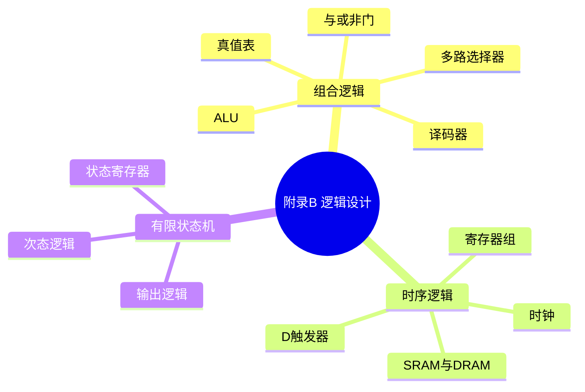

# 附录 B 逻辑设计基础(0 基础必读)

> **一句话导读**:第 4 章的数据通路图里全是与门、触发器、多路选择器——这一篇用最少的篇幅把它们讲明白。**学第 4 章之前,先花半天读这篇**,数据通路就不再是天书。
>
> **对应教材**:附录 B「逻辑设计基础(The Basics of Logic Design)」

---

## 一、本章思维导图

```
附录B 逻辑设计基础
│
├── 组合逻辑(无记忆:输出只看当前输入)
│   ├── 基本门:与 AND / 或 OR / 非 NOT(能组合出一切)
│   ├── 真值表:穷举输入输出
│   ├── 布尔代数:化简逻辑表达式
│   ├── 译码器(decoder):n位输入 → 2^n 路输出选1
│   ├── 多路选择器(MUX):从多路输入选1路输出
│   └── ALU = 加法器 + 逻辑运算 + MUX 选择
│
├── 时序逻辑(有记忆:输出还看历史状态)
│   ├── 时钟(clock):节拍,边沿触发
│   ├── D 触发器:时钟沿到来 → D 存入 Q
│   ├── 寄存器 = 一排 D 触发器(PC 就是寄存器)
│   ├── 寄存器组:读2写1 + 写使能(第4章主角)
│   ├── SRAM:电平触发(小容量缓存)
│   └── DRAM:边沿触发(大容量主存)
│
├── 有限状态机(FSM):时序逻辑的"大脑"
│   ├── 三件套:状态寄存器 + 次态逻辑 + 输出逻辑
│   ├── 工作方式:时钟沿 → 按当前状态+输入 更新状态
│   └── 用途:控制器(第4章)、cache 控制(附录D)
│
└── 与全书的关系
    ├── 数据通路 = 组合逻辑 + 时序逻辑
    └── 控制器 = 有限状态机
```

### Mermaid 版(可渲染)



---

## 二、学习目标

1. 会写与/或/非门的真值表,会化简简单逻辑表达式。
2. 理解译码器(decoder)和多路选择器(MUX)的作用。
3. 理解时钟与边沿触发,会描述 D 触发器的行为。
4. 理解寄存器组的"读 2 写 1"接口(第 4 章数据通路的基础)。
5. 区分 SRAM(电平触发)与 DRAM(边沿触发)。
6. 说出有限状态机(FSM)的三件套和工作方式。
7. 理解"数据通路 = 组合 + 时序,控制器 = FSM"这个关系。

---

## 三、核心名词先混个脸熟

| 名词 | 一句话 |
|---|---|
| 组合逻辑 | 输出只取决于当前输入,没有记忆 |
| 时序逻辑 | 输出取决于输入和内部状态,有记忆 |
| 真值表 | 穷举所有输入组合及其输出 |
| 译码器(decoder) | 把 n 位输入翻译成 2ⁿ 路中选 1 路 |
| 多路选择器(MUX) | 用选择信号从多路输入中选 1 路 |
| 时钟(clock) | 周期性跳变的信号,节拍器 |
| 边沿触发 | 只在时钟跳变瞬间采样 |
| D 触发器 | 时钟沿到来时把 D 存入 Q |
| 寄存器(register) | 一组 D 触发器,存多位数据 |
| 写使能(write enable) | 控制"写不写"的信号 |
| 寄存器组(register file) | 32 个寄存器的阵列,读 2 写 1 |
| SRAM | 电平触发的存储(小容量、快) |
| DRAM | 边沿触发的存储(大容量、需刷新) |
| 有限状态机(FSM) | 状态 + 输入 → 新状态 + 输出的控制模型 |
| 状态寄存器 | FSM 中保存当前状态的部分 |

---

## 四、分节精讲

### 4.1 组合逻辑:没有记忆的电路

**三种基本门**(理论上能搭出任何数字电路):

| 门 | 符号 | 真值表 | 大白话 |
|---|---|---|---|
| 与 AND | A·B | 1·1=1,其余=0 | 两个开关都开,灯才亮 |
| 或 OR | A+B | 0+0=0,其余=1 | 任一开关开,灯就亮 |
| 非 NOT | Ā | 0↔1 | 取反 |

- **真值表**:把输入的所有组合和对应输出列成表,是描述和设计组合逻辑的基本工具。
- **布尔代数**:用代数法则化简表达式(如 A+A·B = A),让电路更小更快。
- **译码器(decoder)**:输入 n 位二进制,输出 2ⁿ 根线,**恰好 1 根为 1**——像"点名",点到谁谁响应。第 4 章里用来选寄存器。
- **多路选择器(MUX,multiplexer)**:输入多路数据 + 1 个**选择信号**,输出被选中的那一路。**数据通路里到处都是它**(选择 ALU 的输入来源、选择写回数据等)。
- **ALU**:把加法器、与门、或门等的结果全部算出来,再用一个 MUX 按控制信号**挑一个**输出——"全算好,再选择",简单粗暴但通用。

💡 大白话:组合逻辑像**自动售货机**:投币(输入)立刻掉饮料(输出),不记得你上次买了什么。

### 4.2 时序逻辑:有记忆的电路

**时钟(clock)**:周期性在 0/1 之间跳变的信号。电路只在**跳变瞬间(边沿)**更新状态——所以整个系统"步调一致",这就是第 1 章"时钟周期"的物理来源。

**D 触发器(D flip-flop)**:1 位的记忆单元。**时钟沿到来时,把输入 D 的值存入 Q**;其他时间 Q 保持不变。

```
D ──→ |D触发器| ──→ Q
        ↑时钟沿
```

- **寄存器** = 32 个 D 触发器排一排,共用一个时钟和写使能 → 一次存 32 位。**PC 就是一个寄存器**。
- **寄存器组(register file)**:第 4 章的核心部件,接口是:
  - 输入:**两个读寄存器号(各 5 位)** + **一个写寄存器号** + **32 位写数据** + **写使能**;
  - 输出:**两个 32 位读数据**。
  - 可以**同时**读两个寄存器、写一个寄存器(这就是第 4 章数据通路"读 rs、rt,写 rd"的硬件支撑)。
- **SRAM**:以**电平**触发方式存储(类似锁存器),快、贵 → 小容量 cache 用它。
- **DRAM**:以**边沿**触发方式存储,慢、便宜、要刷新 → 主存用它(第 5 章)。

⚠️ 易错点:组合逻辑"输入变输出立刻变";时序逻辑"输出只在时钟沿才变"。判断一个部件是哪类,就看它**要不要时钟**。

### 4.3 有限状态机(FSM):时序逻辑的"大脑"

**三件套**:

```
输入 → [次态逻辑] → [状态寄存器] → [输出逻辑] → 输出
              ↑________|  (当前状态)
```

1. **状态寄存器**:存"当前状态"(如取指态、执行态);
2. **次态逻辑(组合)**:根据"当前状态 + 输入"算出**下一个状态**;
3. **输出逻辑(组合)**:根据"当前状态(+输入)"产生输出信号。

**工作方式**:每个时钟沿,状态寄存器更新为新状态 → 输出随之变化。

- **用途**:第 4 章的**控制器**本质上就是一个 FSM(多周期实现/异常处理都要它);附录 D 还用 FSM 控制 cache。
- 💡 大白话:FSM 像**电梯**:状态=楼层,输入=按键,次态逻辑=决定下一层,输出=开门/移动。它"记得自己在几楼"——这就是"有记忆"。

### 4.4 与全书的关系(一句话打通)

```
数据通路(datapath)= 组合逻辑(ALU、MUX、译码器)
                    + 时序逻辑(寄存器、寄存器组、存储器)
控制器(control)    = 有限状态机(FSM)
两者合起来        = CPU(第4章的全部内容)
```

---

## 五、名词解释汇总表

| 名词 | 英文 | 解释 |
|---|---|---|
| 组合逻辑 | combinational logic | 无记忆电路,输出只由当前输入决定 |
| 时序逻辑 | sequential logic | 有记忆电路,输出还与历史状态有关 |
| 真值表 | truth table | 穷举输入组合与输出的表 |
| 译码器 | decoder | n 位输入 → 2ⁿ 选 1 输出 |
| 多路选择器 | multiplexer (MUX) | 按选择信号从多路输入选一路 |
| 时钟 | clock | 系统节拍信号 |
| 边沿触发 | edge-triggered | 仅在时钟跳变沿采样输入 |
| D 触发器 | D flip-flop | 1 位存储:沿到来时 D→Q |
| 寄存器 | register | 一组 D 触发器组成的多位存储 |
| 写使能 | write enable | 允许写入的控制信号 |
| 寄存器组 | register file | 多寄存器的读写阵列(读2写1) |
| SRAM | Static RAM | 电平触发存储,快而贵 |
| DRAM | Dynamic RAM | 边沿触发存储,慢而便宜,需刷新 |
| 有限状态机 | FSM | 状态+输入驱动跳转的控制模型 |
| 次态逻辑 | next-state logic | FSM 中计算下一状态的组合逻辑 |
| 输出逻辑 | output logic | FSM 中产生输出的组合逻辑 |

---

## 六、易混淆概念对比

| 对比 | 区别一句话 |
|---|---|
| 组合逻辑 vs 时序逻辑 | 无记忆 vs 有记忆;不需要时钟 vs 需要时钟 |
| 译码器 vs 多路选择器 | 1 路激活"选地址" vs 多路输入"选数据" |
| 锁存器(latch) vs 触发器(flip-flop) | 电平敏感(整个高电平都透传)vs 边沿触发(只在沿上采样) |
| SRAM vs DRAM | 电平触发快而贵 vs 边沿触发慢而便宜 |
| 状态寄存器 vs 普通寄存器 | 存 FSM 当前状态 vs 存普通数据(本质同是触发器) |
| 次态逻辑 vs 输出逻辑 | 决定"下一个状态" vs 决定"当前输出" |

---

## 七、自测题

1. (真值表)写出 2 输入与门、或门、异或门的真值表。
2. (化简)用布尔代数化简 A + A·B。
3. (概念)3 位译码器有几根输出线?任意时刻有几根为 1?
4. (概念)4 选 1 MUX 需要几根选择信号线?
5. (概念)描述 D 触发器在时钟沿前后的行为。
6. (概念)寄存器组"读 2 写 1"接口:哪些输入、哪些输出?
7. (概念)FSM 由哪三部分组成?各起什么作用?
8. (判断)ALU 是组合逻辑还是时序逻辑?PC 呢?
9. (概念)为什么需要时钟?
10. (概念)第 4 章的控制单元可以看作什么?(提示:FSM)

### 参考答案

1. 与:00→0,01→0,10→0,11→1;或:00→0,其余→1;异或:00→0,01→1,10→1,11→0。
2. A + A·B = A·(1+B) = A(吸收律:只要 A 为 1,结果必为 1)。
3. 8 根输出线;恰好 1 根为 1。
4. log₂4 = 2 根。
5. 时钟沿到来瞬间:D 的值被"锁存"进 Q;沿过后 Q 保持不变直到下一个沿(即使 D 再变也不影响 Q)。
6. 输入:读寄存器号 1、读寄存器号 2(各 5 位)、写寄存器号(5 位)、写数据(32 位)、写使能;输出:读数据 1、读数据 2(各 32 位)。可同时读 2 个、写 1 个。
7. 状态寄存器(存当前状态)+ 次态逻辑(按当前状态和输入算下一状态)+ 输出逻辑(按状态产生输出)。
8. ALU 是组合逻辑(输出即时跟随输入);PC 是时序逻辑(寄存器,时钟沿才更新)。
9. 让所有有状态部件在统一节拍下更新,避免信号先后到达造成混乱——系统按"心跳"步调一致地前进。
10. 有限状态机(FSM):当前状态=取指/译码/执行…,输入=指令的 opcode,输出=各控制信号。

---

## 八、本章小结

- **组合逻辑搭"运算",时序逻辑存"状态",FSM 做"指挥"**——这就是全部数字电路的三大件。
- 学完这篇,第 4 章的数据通路图应该能看懂每个部件了:寄存器组(读2写1)、ALU(组合逻辑+MUX)、PC(寄存器)、控制器(FSM)。

**复习冲刺** → [08-全书公式与名词速查卡.md](08-全书公式与名词速查卡.md)
