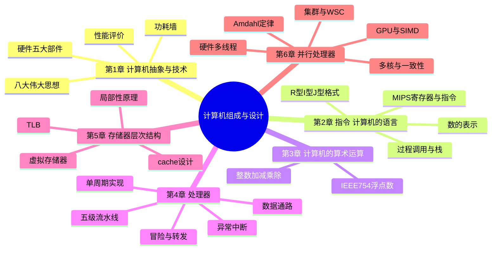

# 《计算机组成与设计:硬件/软件接口》0 基础教辅

> 基于经典黑皮书 **Patterson & Hennessy《Computer Organization and Design: The Hardware/Software Interface》**(MIPS 版,第 4/5 版中文版)编写的完整自学教辅。
>
> 目标:让一个 **0 基础小白**,不依赖课堂、不需要先修课,也能全面掌握这本书的知识体系。

---

## 一、这套教辅是什么、怎么用

### 1.1 内容组织

| 文件 | 内容 |
|---|---|
| `README.md`(本文件) | 全书导览、学习路线、使用方法 |
| `01-第1章-计算机抽象与技术.md` | 计算机全貌、性能评价 |
| `02-第2章-指令-计算机的语言.md` | MIPS 指令集(本书核心) |
| `03-第3章-计算机的算术运算.md` | 加减乘除与浮点数 |
| `04-第4章-处理器.md` | CPU 数据通路与流水线(本书核心) |
| `05-第5章-存储器层次结构.md` | cache 与虚拟存储器 |
| `06-第6章-并行处理器.md` | 多核、GPU、集群 |
| `07-附录-逻辑设计基础.md` | 附录 B 精讲(0 基础必读) |
| `08-全书公式与名词速查卡.md` | 全部公式、MIPS 指令表、名词总索引 |

### 1.2 每章的统一结构

每章都按照同一个模板编写,方便你形成学习习惯:

1. **本章思维导图** —— 先看骨架,再学血肉(提供树形图和 Mermaid 图,后者可在 Typora / VS Code / GitHub 中直接渲染)
2. **学习目标** —— 学完这章你应该能回答哪些问题
3. **核心名词先混个脸熟** —— 带着名词去读,不会迷路
4. **分节精讲** —— 每个知识点都配:
   - 💡 **大白话注解**:用生活化比喻解释难点
   - ⚠️ **易错点**:初学者最常踩的坑
   - ❓ **常见疑问**:自问自答,深挖一层
   - 📌 **考点提示**:考试/面试常考的位置
5. **名词解释汇总表** —— 一章一张表,复习利器
6. **公式速查** —— 本章所有公式
7. **易混淆概念对比** —— 长得像但不一样的概念
8. **自测题(含答案)** —— 检验自己是否真的掌握
9. **本章小结** —— 两三句话收尾

### 1.3 符号约定

- 所有专业名词首次出现时附英文原文,如:流水线(pipelining)——本书是翻译版,记住英文对你读原版、查资料都大有好处
- `$s0` 这类写法表示 MIPS 寄存器;`lw`、`add` 表示 MIPS 指令

---

## 二、全书总思维导图

### 树形图(任何地方都能看)

```
计算机组成与设计(硬件/软件接口)
│
├── 第1章 计算机抽象与技术 —— 「站在山顶看全貌」
│   ├── 计算机系统的分层抽象(应用 → 软件 → 硬件)
│   ├── 八大伟大思想(摩尔定律/抽象/加速大概率事件/并行/流水线/预测/存储器层次/冗余)
│   ├── 硬件五大部件(输入/输出/存储器/运算器/控制器)
│   ├── 性能评价:CPU时间 = 指令数 × CPI × 时钟周期
│   └── 功耗墙与向多处理器的历史转折
│
├── 第2章 指令:计算机的语言 —— 「学会说计算机的母语」
│   ├── 指令集(ISA)与 MIPS 体系
│   ├── 操作数:寄存器($s0-$s7、$t0-$t9、$sp、$ra……)
│   ├── 算术指令 / 访存指令(lw、sw)/ 立即数
│   ├── 数的表示:二进制、补码、符号扩展
│   ├── 机器语言:R型 / I型 / J型 三种指令格式
│   ├── 逻辑运算与移位、分支与跳转
│   ├── 过程调用:栈、jal/jr、调用约定
│   ├── 寻址方式、原子操作(同步)
│   └── 程序的一生:编译 → 汇编 → 链接 → 装载
│
├── 第3章 计算机的算术运算 —— 「计算机怎么做数学」
│   ├── 整数加减法与溢出检测
│   ├── 乘法与除法(硬件如何实现)
│   └── 浮点数:IEEE 754 标准(单精度/双精度/舍入)
│
├── 第4章 处理器 —— 「CPU 的内部解剖」
│   ├── 数据通路:寄存器组、ALU、存储器如何协作
│   ├── 单周期实现(最简单的 CPU 设计)
│   ├── 流水线:五级(取指/译码/执行/访存/写回)
│   ├── 三类冒险:结构冒险/数据冒险/控制冒险
│   │   └── 解决手段:转发(forwarding)、阻塞(stall)、预测
│   ├── 异常与中断
│   └── 指令级并行:多发射、乱序执行
│
├── 第5章 存储器层次结构 —— 「快与大的平衡术」
│   ├── 局部性原理(时间局部性/空间局部性)
│   ├── 存储器技术:SRAM/DRAM/闪存/磁盘
│   ├── cache:直接映射/全相联/组相联、写策略
│   ├── cache 性能:AMAT 公式、十种优化
│   ├── 虚拟存储器:页表、TLB、缺页
│   └── 通用框架:块放哪?如何找?替换谁?怎么写?
│
├── 第6章 并行处理器 —— 「多核时代的生存法则」
│   ├── Amdahl 定律与并行加速的极限
│   ├── SIMD / MIMD / SPMD 分类
│   ├── 向量机与 GPU(SIMT 模型)
│   ├── 硬件多线程(细粒度/粗粒度/同时多线程)
│   ├── 多核处理器与缓存一致性(监听协议)
│   └── 集群与仓库级计算机(WSC)、MapReduce
│
└── 附录(本书配套)
    ├── 附录A 汇编器、链接器与 SPIM 模拟器
    ├── 附录B 逻辑设计基础(0 基础必读,见 07 号文件)
    ├── 附录C GPU 专题
    └── 附录D 映射控制到硬件(FSM 控制 cache)
```

### Mermaid 思维导图(在 Typora / VS Code / GitHub 中可渲染成图)



---

## 三、0 基础学习路线(建议)

> 核心原则:**先搭骨架,再填血肉;每章先看思维导图,再读精讲,最后用自测题检验。**

### 阶段 0:热身(半天)

- 读 `07-附录-逻辑设计基础.md` 的第 1、2 节(什么是与或非门、什么是时钟)。
- 不要求全懂,只求知道"逻辑电路是搭积木"这件事。

### 阶段 1:建立全局观(约 2 天)——第 1 章

- 目标:能说出"计算机分哪几层、硬件有哪几大件、什么叫性能"。
- 检验:会算 CPU 执行时间 = 指令数 × CPI × 时钟周期。

### 阶段 2:学会计算机的语言(约 1~2 周)——第 2 章 ★最重要

- 目标:能手写 MIPS 汇编程序(循环、分支、过程调用),能读懂机器码格式。
- 建议:边学边在 **SPIM / MARS 模拟器**上跑书上的例子(免费软件,网上搜 MARS MIPS simulator)。
- 这章是全书的根基,第 3~5 章都建立在这章之上,**值得花最多时间**。

### 阶段 3:计算机怎么做数学(约 3~4 天)——第 3 章

- 目标:理解补码、溢出、IEEE 754 浮点格式,会手工做浮点加减。
- 这章相对独立,学累了第 2 章可以穿插学习换换脑子。

### 阶段 4:CPU 的内部解剖(约 1~2 周)——第 4 章 ★最重要

- 目标:理解五级流水线、三类冒险、转发和阻塞的原理,能画出流水线时空图。
- 建议:先复习 `07-附录-逻辑设计基础.md` 的寄存器和 FSM 部分,否则数据通路图会看不懂。

### 阶段 5:存储的魔法(约 1 周)——第 5 章

- 目标:理解局部性、cache 三种映射方式、写策略、TLB 和虚拟存储。
- 检验:会算 AMAT,会做 cache 地址划分(标记/索引/偏移)。

### 阶段 6:走向并行(约 3~4 天)——第 6 章

- 目标:理解 Amdahl 定律、SIMD/MIMD、多核一致性、GPU 与 CPU 的区别。
- 这章偏概念,压力比第 2、4 章小,适合收尾。

### 阶段 7:冲刺复习

- 用 `08-全书公式与名词速查卡.md` 过一遍全部公式和名词,再回看每章的自测题。

---

## 四、版本说明(第 4 版 vs 第 5 版)

本教辅以 **第 5 版(中文版)** 章节结构为蓝本,同时兼容第 4 版。两个版本主要差异:

| 差异点 | 第 4 版 | 第 5 版 |
|---|---|---|
| GPU 内容 | 附录 C | 并入第 6 章 |
| 第 6 章名称 | 并行与存储器层次?(以实际书为准) | 从客户端到云的并行处理器 |
| 指令集 | 均为 MIPS | 均为 MIPS |
| 章节数 | 6 章 + 附录 | 6 章 + 附录 |

> 无论你手头是哪一版,按本教辅的六章顺序学习都成立:第 4/5 版在核心内容(第 1~5 章)上几乎一致。

---

## 五、给小白的三句忠告

1. **不要跳读第 2 章。** 这本书的一切(算术、CPU、存储)都建立在"指令"之上,第 2 章不扎实,后面全是空中楼阁。
2. **公式不要死背,要会"讲故事"。** 比如 CPI 是什么?是一条指令平均要花几个时钟周期——把这个故事讲出来,公式自然就记住了。
3. **动手胜过一切。** 装一个 MARS 模拟器跑 MIPS 代码;画一张流水线时空图;手算一次 cache 地址划分。做一遍,胜过读十遍。

---

**现在,从第 1 章开始吧 → [01-第1章-计算机抽象与技术.md](01-第1章-计算机抽象与技术.md)**
