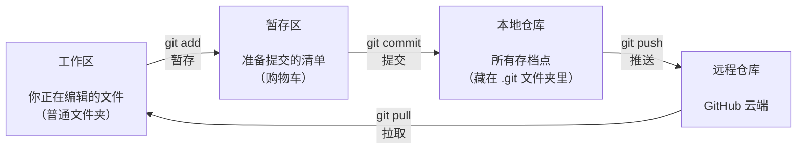

# 第 1 章　Git 与 GitHub 是什么

## 1.1 先讲一个大家都遇到过的痛苦

写代码（或者写文档、做设计）时，你是不是经常遇到这些情况：

- 改了几百行代码，第二天发现改坏了，**却回不去了**
- 想试试新想法，又怕弄乱现有代码，于是复制出 `项目-副本`、`项目-最终版`、`项目-最终版2`……
- 和同学/同事合作，两人改了同一个文件，**后保存的把先保存的覆盖了**
- 电脑硬盘坏了 / 文件误删，**几个月的心血没了**

这些问题都有一个共同的解决方案：**版本控制**。

## 1.2 Git 是什么

**Git 是一个「版本控制工具」**，安装在你自己的电脑上，专门负责记录文件的每一次修改。

可以把它想象成两个东西的结合：

1. **游戏存档系统**：每完成一段工作就「存个档」，以后任何时刻都可以读档回到过去
2. **云盘的历史版本功能**：但不是只记一个文件，而是记录整个项目文件夹的所有变化

Git 的核心能力：

| 能力 | 说明 |
|------|------|
| 记录历史 | 每次「提交」都是一个存档点，带时间、作者、说明 |
| 随时回退 | 任何存档点都可以恢复回来 |
| 分支开发 | 开一条独立「平行线」做实验，不影响主线 |
| 合并改动 | 把不同人的改动安全地合在一起，自动检测冲突 |

> **注意**：Git 和「编程」没有必然关系。写论文、做设计稿、写小说，任何文本文件都可以用 Git 管理版本。

## 1.3 GitHub 是什么

**GitHub 是一个「网站」**（https://github.com），专门用来**存放 Git 仓库**，让代码（或其他文件）可以：

- **备份在云端**：电脑丢了代码还在
- **多人协作**：大家把代码推到同一个地方，互相拉取
- **公开分享**：全世界有上亿开发者在这里开源代码，你可以免费学习和使用
- **项目管理**：提需求（Issues）、做审查（Pull Request）、跑自动化（Actions）

**一句话总结它们的关系**：

| 名称 | 是什么 | 装在哪里 |
|------|--------|----------|
| Git | 版本控制**工具**（软件） | 你的电脑上 |
| GitHub | 存放 Git 仓库的**网站** | 云端 |

Git 是工具，GitHub 是平台。Git 不会因为你不用 GitHub 而失去价值，但没有 Git，GitHub 无从谈起。类似的平台还有 GitLab、Gitee（国内），原理都一样，学会 GitHub 之后全部通用。

## 1.4 你的代码在几个「地方」之间流动

理解下面这张图，就理解了 Git 工作的核心原理：

四个「地方」，三种角色：

| 区域 | 通俗理解 | 你在里面做什么 |
|------|----------|----------------|
| **工作区** | 你正在编辑的文件 | 正常写代码、改文件 |
| **暂存区** | 购物车 | 挑好这次要「存档」的文件 |
| **本地仓库** | 你电脑上的存档记录 | 存放所有历史版本 |
| **远程仓库** | GitHub 云端 | 备份 + 与别人同步 |

> 很多新手的第一道坎就是「为什么不能一步到位，非要 add 又 commit？」——因为 Git 允许你**挑选**要保存的内容：这次改了 5 个文件，但只想先存档其中 2 个，暂存区就是干这个用的。养成习惯后你会爱上这个设计。

## 1.5 必须掌握的 10 个名词

| 名词 | 英文 | 通俗解释 |
|------|------|----------|
| 仓库 | Repository (Repo) | 一个项目的「档案室」，包含所有文件 + 所有历史 |
| 提交 | Commit | 一次存档，包含改动内容、作者、时间、说明 |
| 分支 | Branch | 一条独立的开发线，类似「平行宇宙」 |
| 主分支 | main | 默认的主线，通常存放稳定代码 |
| 远程 | Remote | 云端仓库的地址，默认叫 `origin` |
| 克隆 | Clone | 把云端仓库完整复制一份到本地 |
| 推送 | Push | 把本地的新存档上传到云端 |
| 拉取 | Pull | 把云端的新存档下载到本地 |
| 合并 | Merge | 把一条分支的改动并入另一条分支 |
| 拉取请求 | Pull Request (PR) | 请求别人把你的改动合并进主线（协作核心） |

## 1.6 一个典型的使用场景

假设你和两个朋友合作一个课程设计：

1. 你把项目创建成 GitHub 仓库，**push** 上去
2. 朋友 A 和 B 各自 **clone** 到电脑上开发
3. A 写好了登录功能，**push** 上去，并发起一个 **Pull Request**
4. 你和 B 在网页上**审查**代码，没问题就点**合并**
5. B 每天开工前先 **pull** 一下，同步别人的改动
6. 答辩前一周，你们用 **分支** 并行开发「演示 PPT」和「修 bug」，互不干扰

整个流程没有一次「文件传来传去」，没有一次「覆盖了别人的代码」。这就是 Git + GitHub 的日常。

## 1.7 本章小任务

- [ ] 打开 https://github.com 随便逛逛，感受一下「世界上最大的代码托管平台」
- [ ] 找到你听过的开源项目（比如 VS Code：github.com/microsoft/vscode），点一下右上角的 **Star** 收藏它

**下一章**：装好 Git、注册 GitHub 账号，把准备工作一次性做完。
