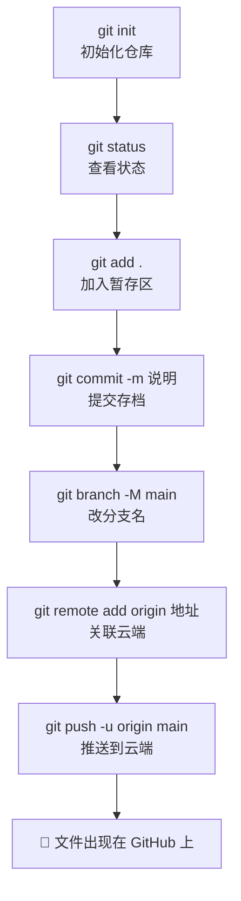

# 第 4 章　把代码上传到 GitHub

> 本章目标：把电脑里已有的项目文件夹，上传到 GitHub 仓库。**这是 GitHub 使用中最重要的一个技能**，请务必跟着做一遍。

## 4.1 场景设定

假设你电脑里有一个项目文件夹 `D:\code\my-website`，里面有一些网页文件：

```
my-website/
├── index.html
├── style.css
└── images/
    └── logo.png
```

现在你想把它传到 GitHub 上：既能备份，又能分享给别人。**总共 6 条命令，逐条来。**

## 4.2 第 1 步：进入项目文件夹

右键 `my-website` 文件夹，选 **Git Bash Here**（或在 Git Bash 里用 `cd` 命令进入）。

> Git 的很多命令只对「当前所在的文件夹」生效，所以每次操作前都要确认自己**在项目文件夹里**。

## 4.3 第 2 步：初始化本地仓库

```bash
git init
```

作用：把这个普通文件夹变成「Git 管理的文件夹」。执行后：

- 文件夹里会悄悄生成一个隐藏的 `.git` 文件夹（存所有历史记录的地方）
- 看到输出 `Initialized empty Git repository...` 就是成功

> 如果看不到 `.git` 文件夹：Windows 资源管理器默认隐藏以点开头的文件，勾选「查看 → 隐藏的项目」就能看到。**不要手动删它**，删了历史就没了。

## 4.4 第 3 步：查看当前状态

```bash
git status
```

你会看到类似输出：

```
On branch master

No commits yet

Untracked files:
  (use "git add <file>..." to include in what will be committed)
        index.html
        style.css
        images/
```

**解读**：

- `No commits yet`：还没有任何存档
- `Untracked files`（未跟踪文件）：Git 发现这几个文件，但还没开始记录它们——它们现在就像「门口排队但没进档案室」

> `git status` 是最常用的命令，**任何时候不知道自己在哪，先敲它**。它会告诉你：有哪些新文件、改了哪些文件、下一步该干什么。

## 4.5 第 4 步：暂存文件

```bash
git add .
```

作用：把当前文件夹里的**所有**文件加入「暂存区」（购物车）。最后的 `.` 表示「当前文件夹的全部内容」。

再敲一次 `git status`，变化如下：

```
Changes to be committed:
  (use "git restore --staged <file>..." to unstage)
        new file:   index.html
        new file:   style.css
        new file:   images/logo.png
```

`Changes to be committed` = 这些文件已在购物车里，随时可以结账（提交）。

**只想暂存某个文件？**

```bash
git add index.html
```

## 4.6 第 5 步：提交（存档）

```bash
git commit -m "首次提交：网站初始版本"
```

作用：把暂存区的内容正式存档，`-m` 后面引号里是这次存档的**说明文字**（提交信息）。

成功后输出类似：

```
[master (root-commit) 8f3a2b1] 首次提交：网站初始版本
 3 files changed, 128 insertions(+)
```

- `8f3a2b1` 是这次提交的编号（提交 ID，以后回退时用）
- `3 files changed` 表示 3 个文件发生了变化

**提交信息怎么写？** 给未来的自己（和协作者）看：说明这次「做了什么」。对比：

```bash
git commit -m "aaa"                          # ❌ 毫无信息量
git commit -m "新增首页和样式文件，完成页面框架"  # ✅ 一看就懂
```

> 新手常见错误：`git commit` 忘了加 `-m`，会进入一个奇怪的 Vim 编辑界面出不来。**解决办法：按 Esc，输入 `:q!` 回车退出，重新用带 -m 的命令提交。**

## 4.7 第 6 步：关联远程仓库

先到 GitHub 网页上，按第 3 章的方法创建一个**空仓库**（这次**不要勾选** Add a README file——两边都有内容会导致推送冲突），然后：

```bash
git branch -M main
git remote add origin git@github.com:你的用户名/仓库名.git
```

逐条解释：

- `git branch -M main`：把本地主分支改名为 `main`（Git 旧版本默认叫 master，GitHub 现在统一用 main，改一下保持一致）
- `git remote add origin 地址`：告诉本地仓库「我的云端在哪个地址」，并给这个地址起个别名叫 `origin`（起源）。以后说 `origin` 就指你的 GitHub 仓库

> **地址从哪复制？** 仓库主页 → 绿色 Code 按钮 → **SSH** 标签 → 复制那一串 `git@github.com:...` 地址。

验证关联是否成功：

```bash
git remote -v
```

应输出两行：

```
origin  git@github.com:你的用户名/仓库名.git (fetch)
origin  git@github.com:你的用户名/仓库名.git (push)
```

## 4.8 第 7 步：推送到 GitHub

```bash
git push -u origin main
```

作用：把本地仓库的所有存档上传到云端。`-u` 是「记住这次对应关系」，**之后日常推送只需敲 `git push` 三个单词**。

成功的输出类似：

```
Enumerating objects: 5, done.
Counting objects: 100% (5/5), done.
Writing objects: 100% (5/5), 2.1 KiB | 2.1 MiB/s, done.
To github.com:你的用户名/仓库名.git
 * [new branch]      main -> main
```

**去 GitHub 网页刷新仓库页面**——你的文件全部出现在云端了！

## 4.9 完整流程回顾

六条命令，记住这个流程：



## 4.10 本节常见报错

| 报错 | 原因 | 解决 |
|------|------|------|
| `fatal: not a git repository` | 不在项目文件夹里执行命令 | 右键项目文件夹选 Git Bash Here 再执行 |
| `error: remote origin already exists` | 重复执行了 remote add | 用 `git remote set-url origin 新地址` 修改，或不管它直接 push |
| `! [rejected] main -> main (fetch first)` | 云端已有本地没有的内容（比如建仓库时勾了 README） | 先 `git pull origin main --allow-unrelated-histories`，解决提示的冲突后再 push |
| `Permission denied (publickey)` | SSH 密钥没配好 | 回第 2 章 2.4 节重配，或改用 HTTPS 地址（需用 Personal Access Token 当密码） |
| `Everything up-to-date` | 本地没有新提交 | 正常提示，说明云端已经是最新的 |

## 4.11 本章小任务

- [ ] 找一个自己电脑里的小项目（或新建一个文件夹写几个文件），按 4.2 ~ 4.8 完整走一遍
- [ ] 在 GitHub 网页上确认文件都传上去了
- [ ] 改一个文件，再执行一遍 `git add .` → `git commit` → `git push`，在网页上看到更新

**下一章**：学会每天的标准工作节奏——拉取、修改、提交、推送的完整循环。
