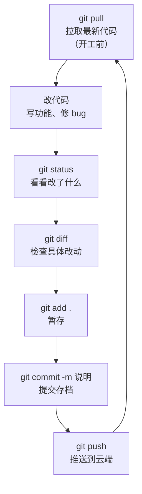

# 第 5 章　日常开发工作流

> 本章目标：掌握「每天打开电脑写代码」的标准流程，形成肌肉记忆。

## 5.1 每日循环：拉取 → 修改 → 提交 → 推送

日常开发就是一个不断重复的循环：



- **一个人开发**时，循环可以简化：改代码 → add → commit → push（pull 和 diff 可以偶尔做）
- **多人协作**时，每一步都不能省，尤其是开工前的 pull

## 5.2 开工前：拉取最新代码

```bash
git pull
```

作用：把云端的最新内容同步到本地。**想象你和队友同时编辑一份文档：你开工前必须先拿到队友昨晚的改动，否则你们会在两个版本上各自修改。**

- 一个人开发：pull 只是把别的电脑上推的内容同步过来，没有也无妨
- 多人开发：**每天开工第一件事就是 pull**，避免「各自改旧版」

输出示例：

```
Already up to date.            # 云端没有新东西
```

或者：

```
Updating 8f3a2b1..3c7d9e5
Fast-forward
 index.html | 4 ++--
 1 file changed, 2 insertions(+), 2 deletions(-)
```

## 5.3 改完代码后：查看状态

```bash
git status
```

这是你「改完一轮代码」后第一个要敲的命令。三种典型输出：

| 输出 | 含义 | 下一步 |
|------|------|--------|
| `Untracked files: 新文件` | 新建的文件，Git 还不认识 | `git add` 加入跟踪 |
| `Changes not staged for commit: modified: 文件名` | 已跟踪的文件被修改了 | `git add` 暂存 |
| `Changes to be committed:` | 文件已暂存，等待提交 | 直接 `git commit` |

> 阅读习惯：输出里有英文提示语，用翻译软件查一次，以后就都认识了。

## 5.4 检查具体改了什么

```bash
git diff
```

作用：显示每个文件**具体哪些行**被改动了。输出中：

- 以 `-` 开头（红色）：被删除的旧内容
- 以 `+` 开头（绿色）：新增的内容

> `git diff` 只显示「工作区 vs 暂存区」的差异。暂存之后想看差异，用 `git diff --staged`。对新手来说，**提交前用 diff 自查一遍**，能避免把调试代码、临时文件误提交。

## 5.5 暂存

```bash
git add .                # 暂存当前文件夹所有改动
git add 文件名            # 只暂存某个文件
git add 文件1 文件2       # 暂存多个文件
```

场景建议：

- 改动都相关（都是同一个功能的）→ `git add .` 一步到位
- 改了 5 个文件但只想提交 2 个 → 逐个 `git add`，其余文件留在工作区

## 5.6 提交

```bash
git commit -m "说明文字"
```

**提交信息规范**（强烈建议从第一天就养成习惯）：

| 前缀 | 含义 | 示例 |
|------|------|------|
| `feat:` | 新功能 | `feat: 新增用户注册接口` |
| `fix:` | 修 bug | `fix: 修复登录按钮点击无响应` |
| `docs:` | 文档 | `docs: 更新 README 安装说明` |
| `refactor:` | 重构（不改功能） | `refactor: 提取公共函数` |
| `style:` | 格式调整 | `style: 统一缩进为 4 空格` |

完整格式：`类型: 一句话说明做了什么`

```bash
git commit -m "fix: 修复登录按钮点击无响应，原因是事件未绑定"
```

> 原则：**一个提交只做一件事**。不要攒了三天杂七杂八的改动一次性提交——将来想回退某一步时会非常痛苦。

## 5.7 推送

```bash
git push
```

因为第 4 章用了 `-u` 建立关联，日常推送就这么简单。完成后去 GitHub 网页刷新，能看到最新的提交。

## 5.8 查看历史

```bash
git log --oneline          # 一行一条的精简历史
git log --oneline --graph  # 带分支线的图形化历史
```

输出示例：

```
3c7d9e5 (HEAD -> main, origin/main) fix: 修复导航栏错位
8f3a2b1 feat: 新增首页
5b1c0d4 首次提交：网站初始版本
```

- 最上面是最新的提交
- 每行开头那串字符是提交 ID，第 6 章「回退」要用
- `HEAD` 表示你当前所在的位置

## 5.9 一个完整的工作日示例

假设你 9:00 开工，写一个「用户登录功能」：

```bash
# 9:00 开工，同步队友昨晚的改动
git pull

# 9:05 ~ 11:00 写代码：新建 login.html，修改 index.html 加登录入口
# 11:00 查看状态
git status
# 输出：login.html 是新文件，index.html 被修改

# 11:02 检查改动没问题
git diff

# 11:05 暂存并提交
git add .
git commit -m "feat: 新增用户登录页面，并在首页加入口"

# 11:06 推送到云端
git push

# 14:00 下午继续：发现登录页有个 bug，修好后
git add login.html
git commit -m "fix: 修复登录表单密码框无法输入的问题"
git push
```

一天的工作 = 若干次「add → commit → push」的小循环 + 开工时的一次 pull。

## 5.10 只改了一半、突然要切去做别的事怎么办

```bash
git stash        # 把当前未提交的改动「藏起来」，工作区恢复干净
# ... 去做别的事，做完提交回来 ...
git stash pop    # 把藏起来的改动取回来继续改
```

> 常见场景：改到一半，突然要紧急修一个 bug。stash 能把半成品暂时收进抽屉，等修完 bug 再取出来继续。

## 5.11 本章小任务

- [ ] 按 5.9 的节奏完整走一个「小循环」：pull → 改文件 → status → diff → add → commit → push
- [ ] 用 `git log --oneline` 看到自己今天的所有提交
- [ ] 用 `git stash` 藏一次改动，再用 `git stash pop` 取回来

**下一章**：各种「后悔药」——改错了、提交错了，如何安全地回退。
