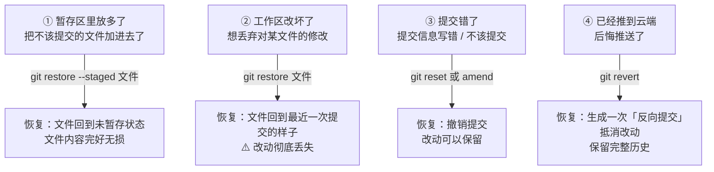

# 第 6 章　版本回退与撤销（后悔药大全）

> 本章目标：搞懂「改错了怎么办」。按「错误发生的位置」分四层，一层比一层重，逐层认识。

## 6.1 后悔药地图

错误可能发生在四个层级，各有各的解药：



## 6.2 第 ① 层：从暂存区拿出来（最安全）

场景：`git add .` 手快了，把调试文件也加进了购物车。

```bash
git restore --staged 文件名
```

再看 `git status`，该文件回到 `Changes not staged` 状态。

- **影响**：只是「从购物车拿出来」，文件内容**一个字都不会少**
- 想全部拿出来：`git restore --staged .`

## 6.3 第 ② 层：丢弃工作区修改（内容会丢！）

场景：今天的修改越改越乱，想彻底回到「最近一次提交」时的样子。

```bash
git restore 文件名        # 丢弃单个文件的修改
git restore .             # 丢弃所有文件的修改
```

> ⚠️ **这条命令会彻底删除你未提交的修改，无法找回**。执行前用 `git diff` 确认一下：这些改动确实不要了吗？
>
> 安全替代方案：先 `git stash` 把改动藏起来，后悔了还能 `git stash pop` 找回。

## 6.4 第 ③ 层：撤销提交（三种力度）

先明确概念：每次提交都有一个**提交 ID**，用 `git log --oneline` 查看（第一列就是）。撤销提交的本质是「把 HEAD 指针移回某个历史位置」。

| 命令 | 提交记录 | 暂存区 | 工作区改动 | 力度 |
|------|----------|--------|-----------|------|
| `git reset --soft 提交ID` | 撤销提交 | 改动留在暂存区 | 完整保留 | 最温柔 |
| `git reset --mixed 提交ID` | 撤销提交 | 改动回到未暂存 | 完整保留 | 默认力度 |
| `git reset --hard 提交ID` | 撤销提交 | 清空 | **彻底删除** | 最暴力 |

### 场景 A：提交信息写错了 → 改一改

```bash
git commit --amend -m "新的提交信息"
```

效果：用新信息覆盖最近一次提交的信息。如果 amend 时不加 `-m`，会进入编辑器修改。

### 场景 B：不该提交的也提交了 → 撤销提交但保留改动

```bash
git reset --soft HEAD~1
```

解释：

- `HEAD~1` = 「当前所在位置的上一次提交」（`~2` 就是上上次）
- `--soft` 撤销提交记录，改动**完整保留**在暂存区，重新 add/commit 即可

### 场景 C：要回到某个历史版本，后面的全部不要了

```bash
git log --oneline           # 先找到目标提交 ID，比如 8f3a2b1
git reset --hard 8f3a2b1
```

> ⚠️ `--hard` 之后的提交和改动**全部消失**。只建议在单人开发、且确定要抛弃一切时使用。

### 补充：已推到云端，如何撤销

如果后悔的提交**已经 push 到 GitHub**：

- **单人仓库**：可以本地 `reset` 后 `git push --force`（强制覆盖云端）。多人仓库**禁止**这样做，会毁掉队友的工作
- **多人仓库**：用安全的 `git revert 提交ID`——它不删除历史，而是生成一次「反向操作」的新提交来抵消那次改动：

```bash
git revert 3c7d9e5
git push
```

## 6.5 后悔药速查表

| 我想…… | 命令 | 风险 |
|--------|------|------|
| 把文件从暂存区拿出来 | `git restore --staged 文件` | 无 |
| 丢弃对某文件的修改 | `git restore 文件` | 改动丢失 |
| 修改最近一次提交信息 | `git commit --amend -m "新信息"` | 无 |
| 撤销最近一次提交、保留改动 | `git reset --soft HEAD~1` | 无 |
| 回到某个历史版本、抛弃之后一切 | `git reset --hard 提交ID` | 高，无法找回 |
| 撤销已推送的提交（多人协作） | `git revert 提交ID` + push | 无 |

## 6.6 实战演练：完整走一遍「犯错→后悔」

1. 在项目里随便改点内容，提交三次：

```bash
git add . && git commit -m "第一次修改"
# 再改点内容
git add . && git commit -m "第二次修改"
# 再改点内容
git add . && git commit -m "第三次修改"
```

2. 用 `git log --oneline` 看到 3 条新提交
3. 发现「第三次修改」不该要，撤销它但保留改动：

```bash
git reset --soft HEAD~1
git status        # 改动还在暂存区
```

4. 重新提交成正确的内容：

```bash
git commit -m "重新提交"
```

5. 体验丢弃工作区修改：

```bash
# 随便改一个文件
git restore 那个文件
git status        # 工作区干净了，改动没了
```

> 这个演练强烈建议亲手做一遍——**在练习中犯错，比在真实项目里犯错便宜得多。**

## 6.7 本章小任务

- [ ] 用 `git log --oneline` 找到自己最早的提交 ID
- [ ] 练习 `git commit --amend` 修改提交信息
- [ ] 练习 `git reset --soft HEAD~1` 撤销提交并确认改动还在
- [ ] 体会一次 `git restore 文件` 丢弃改动的「无法挽回感」

**下一章**：用分支实现「平行开发」——新功能、新实验，都不用怕弄坏主线。
