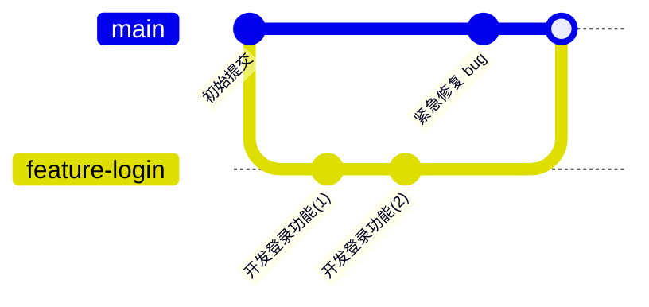

# 第 7 章　分支入门

> 本章目标：理解分支的概念，掌握创建、切换、合并分支，以及解决合并冲突。

## 7.1 什么是分支

**分支 = 一条独立的开发线**，就像「平行宇宙」：

- 在分支上随便折腾，**不影响主线**
- 做成功了，把分支「合并」回主线
- 做失败了，把分支一删，主线毫发无伤

**为什么要用分支？** 没有分支时，你想开发新功能，只能直接改主线代码——改到一半来个紧急 bug 要修，你会进退两难。有了分支：



主线上修 bug 和登录功能的开发**同时进行、互不干扰**，最后再合并。

## 7.2 分支的基本操作

### 查看分支

```bash
git branch
```

输出示例（带 `*` 的是当前所在分支）：

```
* main
  feature-login
```

### 创建分支

```bash
git branch 分支名
```

### 切换分支

```bash
git switch 分支名
# 旧写法：git checkout 分支名（效果相同，Git 教程里常出现，认识即可）
```

### 创建并直接切换过去（最常用）

```bash
git switch -c 分支名
```

> 命名习惯：分支名用小写英文 + 连字符，能看出用途。例：`feature-login`、`fix-navbar-bug`、`docs-update`。

### 删除分支

```bash
git branch -d 分支名     # 已合并的分支用 -d
git branch -D 分支名     # 未合并也要强制删除用 -D（慎用）
```

> 注意：不能删除**自己当前所在**的分支，先 switch 到别的分支再删。

## 7.3 完整示例：开一条分支做新功能

```bash
# 1. 确认在 main 分支且代码最新
git switch main
git pull

# 2. 开新分支开发
git switch -c feature-dark-mode

# 3. 改代码、提交（分支上的提交与主线互不影响）
git add .
git commit -m "feat: 新增深色模式样式"

# 4. 开发完成，推送到云端（第一次推送要 -u）
git push -u origin feature-dark-mode

# 5. 回到 main 分支，把新功能合并进来
git switch main
git merge feature-dark-mode

# 6. 合并成功，删除分支（本地）
git branch -d feature-dark-mode
# 远程分支也删掉（如果不需要了）
git push origin --delete feature-dark-mode

# 7. 把合并结果推送到云端
git push
```

合并时输出 `Fast-forward` 表示「直接快进」（main 上没别的提交，直接把指针移过去）；如果 main 上也有了新提交，Git 会生成一个**合并提交**，两者都保留。

## 7.4 合并冲突：新手必经之路

### 冲突是怎么产生的

两人（或两个分支）修改了**同一文件的同一位置**，Git 无法判断听谁的，就会停下来说：**「你们打一架，谁赢了我再继续。」**

### 动手体验一次冲突（强烈建议亲手做）

**第 1 步：制造冲突。** 在 main 分支上，编辑 `test.txt` 写一行：

```
早餐吃豆浆
```

提交：

```bash
git add test.txt && git commit -m "main 上写豆浆"
```

**第 2 步：开新分支，改同一行：**

```bash
git switch -c conflict-demo
# 编辑 test.txt，把内容改成：
# 早餐吃油条
git add test.txt && git commit -m "分支上写油条"
```

**第 3 步：回到 main 合并，冲突出现：**

```bash
git switch main
git merge conflict-demo
```

输出：

```
Auto-merging test.txt
CONFLICT (content): Merge conflict in test.txt
Automatic merge failed; fix conflicts and then commit the result.
```

**第 4 步：打开 test.txt，看到冲突标记：**

```
<<<<<<< HEAD
早餐吃豆浆
=======
早餐吃油条
>>>>>>> conflict-demo
```

- `<<<<<<< HEAD` 到 `=======` 之间：**当前分支（main）**的内容
- `=======` 到 `>>>>>>> conflict-demo` 之间：**被合并分支**的内容

**第 5 步：手动编辑文件，删掉三行标记，保留想要的内容**，比如决定两个都要：

```
早餐吃豆浆和油条
```

**第 6 步：保存，告诉 Git 冲突已解决：**

```bash
git add test.txt
git commit -m "解决冲突：早餐豆浆油条都吃"
```

> 提交冲突解决时**不要加 -m 以外的花活**，正常提交即可。提交后冲突就翻篇了。

**小技巧**：用 VS Code 打开冲突文件时，冲突区域会高亮，并提供 **Accept Current（接受当前）/ Accept Incoming（接受对方）/ Accept Both（都接受）** 按钮，一键解决，不用手删标记。

### 冲突解决后想反悔

```bash
git merge --abort
```

在提交冲突解决**之前**执行，可以取消本次合并，回到合并前的状态。

## 7.5 分支策略：日常怎么用分支

新手阶段记住两条最简单的规则：

| 分支 | 用途 | 纪律 |
|------|------|------|
| `main` | 只放「能跑、稳定」的代码 | 永远不直接在 main 上开发 |
| `feature-xxx` | 每个新功能 / 每次修复开一条 | 做完就合并回 main，然后删除 |

流程：`main` 上切出新分支 → 开发 → 合并回 `main` → 删分支。这套流程叫「**功能分支工作流**」，是业界最常用的工作流之一。

## 7.6 本章小任务

- [ ] 开一条分支，加一个新功能，合并回 main，删除分支
- [ ] 按 7.4 节亲手制造并解决一次冲突
- [ ] 试试 `git merge --abort` 取消一次合并

**下一章**：把你的分支用「Pull Request」交给别人审查合并——GitHub 协作的灵魂。
