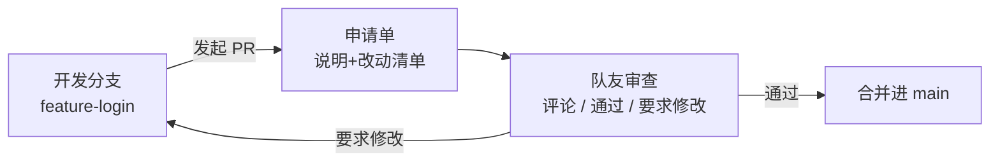
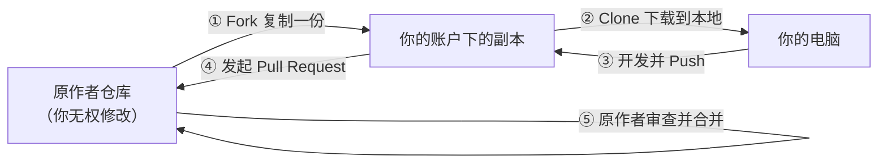

# 第 8 章　协作与 Pull Request

> 本章目标：学会 GitHub 协作的核心玩法——**Pull Request（拉取请求，简称 PR）**，包括团队内部协作和给开源项目贡献代码两条路线。

## 8.1 Pull Request 是什么

**PR = 一份「合并申请单」。**

你在自己的分支上完成了开发，想合并进主分支。你不直接合并，而是发起一份申请：**「我的改动在这里，请求合并，请大家审查。」**



**为什么不直接合并？** 因为：

- 别人的代码，你不敢随便动；**审查**是互相把关
- 大改动要有人**知情、讨论、拍板**
- 所有讨论记录都留在 PR 里，未来回看「当初为什么这么改」一目了然

## 8.2 路线一：同一个仓库里的团队协作

适用场景：一个团队共享一个仓库（比如小组课程设计、公司项目）。

### 完整流程（一步步来）

**第 1 步：创建功能分支并开发**

```bash
git switch main
git pull
git switch -c feature-login
# ... 开发、提交 ...
git push -u origin feature-login
```

**第 2 步：在网页上发起 PR**

1. 打开仓库主页，GitHub 通常会弹出一个黄色提示条：`feature-login had recent pushes`，点击旁边的 **Compare & pull request** 按钮（没有提示条就点 **Pull requests** 标签 → **New pull request**）
2. 确认合并方向：

   - `base:` 要合并**进**的分支 → 选 `main`
   - `compare:` 你**开发**的分支 → 选 `feature-login`

3. 填写申请单：

   - **标题**：一句话说明（如 `feat: 新增用户登录功能`）
   - **正文**：写清楚三件事——**改了什么、为什么这么改、怎么测试**
   - 右侧可以指定 **Reviewers**（请谁审查）和 **Assignees**（谁负责）

4. 点 **Create pull request**

**第 3 步：队友审查（Code Review）**

审查者在 PR 页面的 **Files changed** 标签里逐行看改动：

- 在任意一行代码上点 **+** 号，可以**行内评论**
- 看完点右上角 **Review changes**，三选一：

| 选择 | 含义 |
|------|------|
| Comment | 只评论，不表态 |
| **Approve** | 通过，同意合并 |
| Request changes | 要求修改后才能合并 |

**第 4 步：按意见修改，PR 自动更新**

审查提出意见后，你在本地修改、提交、推送：

```bash
# 还在 feature-login 分支上
git add .
git commit -m "按审查意见：修正变量命名"
git push
```

**PR 页面会自动显示新提交**，无需重新发起。修改完在评论里回一句「已修改，麻烦再看下」，审查者重新 Approve。

**第 5 步：合并**

全部通过后，点 PR 底部的绿色 **Merge pull request** 按钮。

### 合并的三种方式

| 方式 | 效果 | 适合 |
|------|------|------|
| **Create a merge commit** | 生成一个合并提交，保留所有分支提交 | 大团队，想保留完整历史 |
| **Squash and merge** | 把 PR 里的所有提交**压缩成 1 个**再合并 | **新手推荐**，主线历史干净 |
| **Rebase and merge** | 把你的提交「平移」到主线顶端，历史呈一条直线 | 追求极致线性历史 |

> 团队里**统一一种方式**即可。个人项目强烈推荐 Squash and merge：你在功能分支上随意小步提交，合并进主线时只剩一条干净记录。

**第 6 步：合并后清理**

```bash
git switch main
git pull                 # 同步合并后的 main
git branch -d feature-login   # 删本地分支
git push origin --delete feature-login   # 删远程分支（网页合并时勾了 delete branch 则不用）
```

## 8.3 路线二：给别人的开源项目贡献代码（Fork 流程）

适用场景：你想给一个**你没有写权限**的开源项目提改进（修 bug、加文档、加功能）。

核心思路：**你没有权限改别人的仓库，那就先复制一份到自己名下，改完再申请合回去。** 这个「复制一份到自己名下」的操作叫 **Fork**。



### 完整流程

**第 1 步：Fork**

打开原作者仓库主页 → 点右上角 **Fork** 按钮 → **Create fork**。几秒后，你名下多了一个一模一样的仓库副本。

**第 2 步：克隆你自己的副本到本地**

```bash
git clone git@github.com:你的用户名/原作者仓库名.git
cd 原作者仓库名
```

**第 3 步：添加原仓库为「上游」（upstream）**

```bash
git remote add upstream git@github.com:原作者/原作者仓库名.git
git remote -v
```

输出应有 4 行：`origin` 指向**你的副本**（你推送到这里），`upstream` 指向**原作者仓库**（用来同步人家的更新）。

**第 4 步：创建分支，开发，推送**

```bash
git switch -c fix-typo
# ... 修改、提交 ...
git push -u origin fix-typo
```

**第 5 步：发起 Pull Request**

打开**你的副本**仓库主页 → 点 **Pull requests** → **New pull request** → 此时 base 会自动指向原作者仓库，确认无误 → 填写标题和说明 → **Create pull request**。

**第 6 步：等待审查、按意见修改**

和 8.2 节相同：原作者会评论、要求修改，你继续在 `fix-typo` 分支上提交推送，PR 自动更新。**被合并之后，你就正式成为这个开源项目的贡献者了**——这是简历上非常有含金量的一笔。

**第 7 步（日常维护）：保持副本与上游同步**

原作者仓库一直在更新，你的副本会渐渐落后，定期同步：

```bash
git fetch upstream
git switch main
git merge upstream/main
git push origin main
```

## 8.4 PR 的注意事项（提高被合并的概率）

给开源项目提 PR，被拒绝是家常便饭，但做好这几条能显著提高通过率：

- **先看 CONTRIBUTING.md**：很多项目规定了贡献规范（分支命名、提交信息格式），不遵守会直接被拒
- **先提 Issue 再提 PR**：大改动先在 Issues 里和作者讨论「该不该做」，达成共识再动手，避免白干
- **PR 越小越好**：一个 PR 只解决一个问题，几百行的 PR 比几千行的 PR 审查快得多
- **写清楚动机**：正文说清楚「什么问题、你的方案、如何验证」，最好附上效果截图
- **保持礼貌**：开源社区都是志愿者，友好的语气很重要

## 8.5 本章小任务

- [ ] 自己开两个仓库账号不方便的话，就用 8.2 的流程：在分支上开发 → 发 PR → 自己审查自己 → Squash and merge → 清理分支，完整走一遍
- [ ] 找一个小的开源项目（比如某个教程仓库），发现一个错别字，按 8.3 的 Fork 流程发起你人生第一个对外 PR
- [ ] 在 PR 的 Files changed 里给某行代码留一条评论，体验行内评论

**下一章**：GitHub 网页上还有哪些宝藏功能——Issues、Actions、Pages、搜索技巧。
